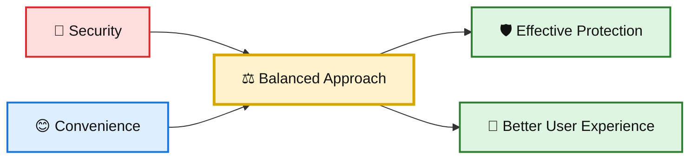
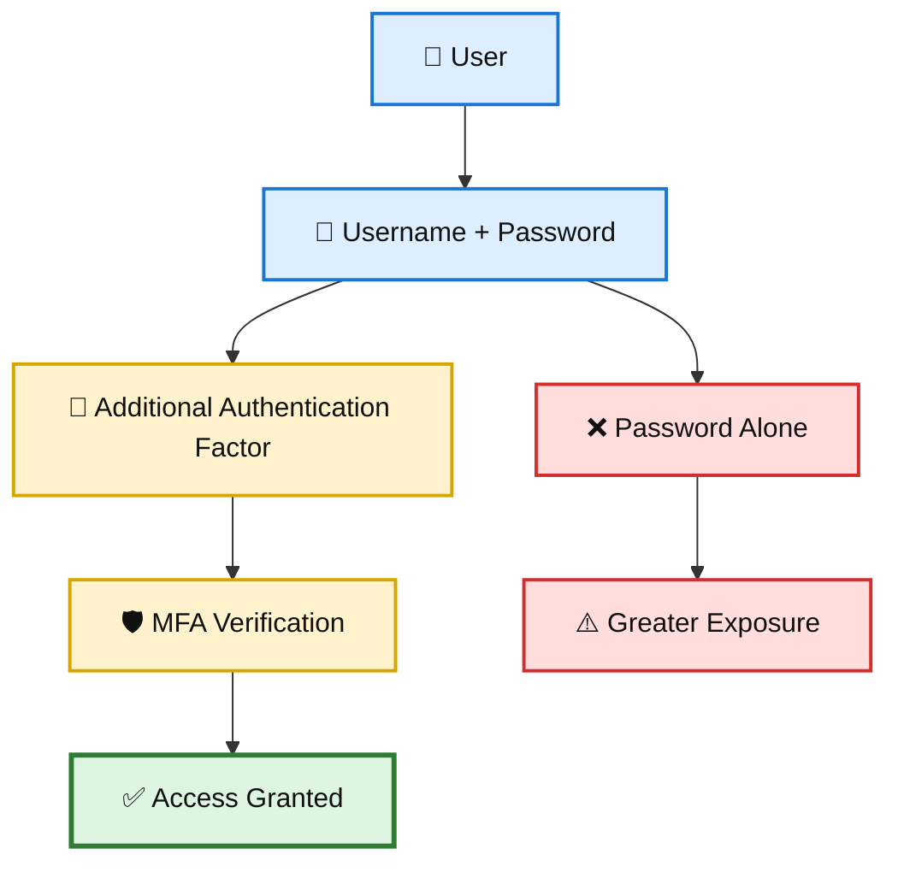
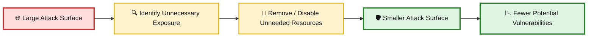
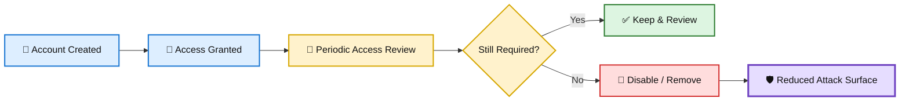
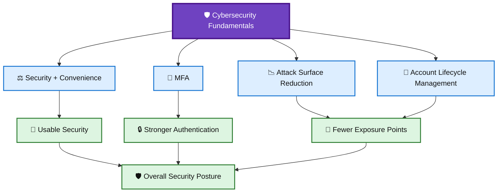

# 🛡️ WATCHTOWER — Quiz 01

> **Quiz 01** — Security, Convenience, MFA, Attack Surface & Account Management

---

## 📋 Quiz Overview

This quiz covers four foundational cybersecurity concepts:

1. ⚖️ Balancing **security and convenience**
2. 🔐 The role of **Multifactor Authentication (MFA)**
3. 🛡️ **Attack surface reduction**
4. 👤 Removing **old and unused accounts**

---

# 🧠 Question 1

### In the context of security and convenience, what does the lesson suggest is crucial?

- [ ] Prioritizing convenience over security
- [x] **Striking the right balance between security and convenience**
- [ ] Ignoring user convenience for maximum security
- [ ] Eliminating convenience for complete security

### ✅ Correct Answer

**Striking the right balance between security and convenience**

### 💡 Why?

Cybersecurity controls need to provide adequate protection without making systems unnecessarily difficult to use. If security becomes excessively inconvenient, users may try to bypass controls or adopt unsafe workarounds.

The goal is therefore to achieve an effective **security–usability balance**.

### 🎨 Concept Diagram

---

# 🔐 Question 2

### What's the role of multifactor authentication in enhancing security?

- [x] **It adds an extra layer of protection beyond usernames and passwords**
- [ ] It complicates user logins
- [ ] It requires users to remember multiple passwords

### ✅ Correct Answer

**It adds an extra layer of protection beyond usernames and passwords**

### 💡 Why?

MFA requires more than one authentication factor. Even if an attacker obtains a user's password, an additional factor can help prevent unauthorized access.

Common authentication factors include:

- 🧠 **Something you know** — password or PIN
- 📱 **Something you have** — phone, security key, authenticator device
- 👆 **Something you are** — fingerprint or other biometric

### 🎨 MFA Protection Diagram

---

# 🛡️ Question 3

### Why is minimizing the attack surface important in cybersecurity?

- [ ] It simplifies network management
- [ ] It increases the complexity of cybersecurity
- [x] **It reduces potential points of vulnerability**
- [ ] It encourages users to install more software

### ✅ Correct Answer

**It reduces potential points of vulnerability**

### 💡 Why?

The **attack surface** represents the collection of possible entry points that an attacker could potentially exploit.

Reducing unnecessary:

- 🌐 Network exposure
- 🖥️ Services
- 📦 Applications
- 👤 Accounts
- 🔓 Open ports
- ☁️ Publicly exposed resources

can reduce the number of opportunities available to an attacker.

### 🎨 Attack Surface Reduction Diagram

---

# 👤 Question 4

### Which key task is mentioned as essential for cybersecurity in the lesson?

- [ ] Allowing users to manage software installations
- [x] **Cleaning up old, unused accounts**
- [ ] Continuously adding new devices to the network

### ✅ Correct Answer

**Cleaning up old, unused accounts**

### 💡 Why?

Old or unused accounts can become security risks, especially when they retain active permissions or access to systems.

Regular account cleanup supports:

- 🔐 Access control
- 👤 Identity management
- 🛡️ Least privilege
- 🧹 Attack-surface reduction
- 🚨 Reduced opportunity for unauthorized access

This is commonly connected to **account lifecycle management**: accounts should be created, maintained, reviewed, disabled, and removed according to their actual business need.

### 🎨 Account Lifecycle Diagram

---

# 📚 Key Takeaways

| # | Concept | Key Point |
|---|---|---|
| 1 | ⚖️ Security vs Convenience | Effective security should balance protection with usability. |
| 2 | 🔐 MFA | Adds an additional authentication layer beyond passwords. |
| 3 | 🛡️ Attack Surface | Reducing unnecessary exposure reduces potential vulnerability points. |
| 4 | 👤 Account Cleanup | Removing unused accounts helps reduce unnecessary access and exposure. |

---

## 🧩 Security Concepts Connection

---

## 📝 Quick Revision

> **Remember:**  
> **Balance → Authenticate → Minimize → Clean Up**
>
> ⚖️ Balance security with convenience  
> 🔐 Strengthen authentication with MFA  
> 🛡️ Minimize the attack surface  
> 🧹 Clean up old and unused accounts

---

**Repository:** `WATCHTOWER`  
**Quiz:** `Quiz 01`  
**Focus:** Cybersecurity Fundamentals
