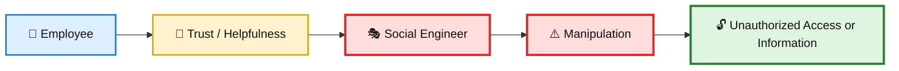
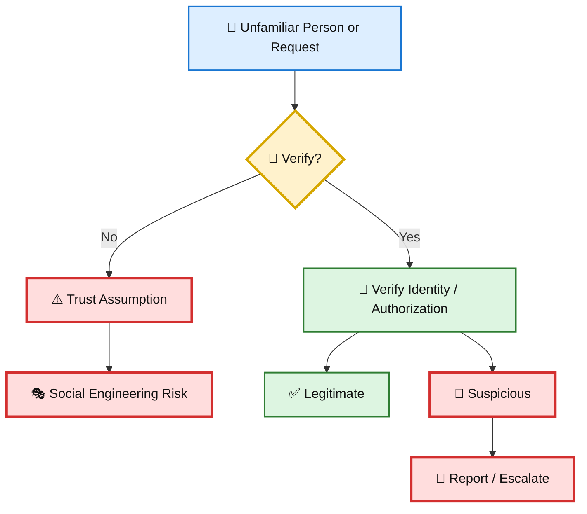
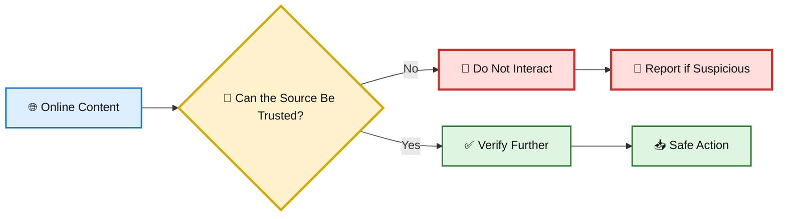
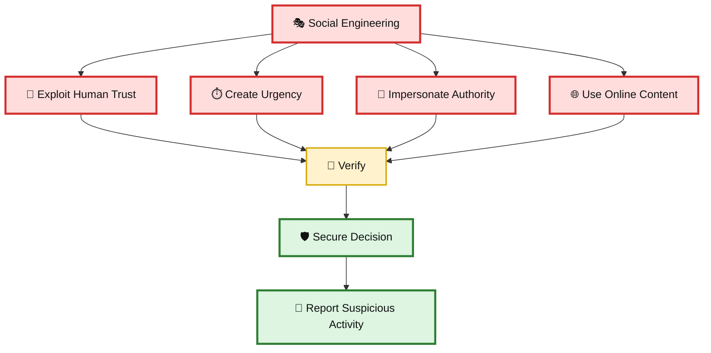

# 🛡️ WATCHTOWER — Quiz 02

> **Quiz 02** — Social Engineering

---

## 📋 Quiz Overview

This quiz covers three key concepts related to social engineering:

1. 👤 Human trust as a security risk
2. 🧠 How to make employees more cautious
3. 🛡️ Discouraging unsafe trust in online content

---

# 👤 Question 1

### What is one of the key risks associated with social engineering in cybersecurity?

- [ ] Inadequate physical security measures
- [x] **Employees trusting and helping individuals when they shouldn't**
- [ ] Over-reliance on technology

### ✅ Correct Answer

**Employees trusting and helping individuals when they shouldn't**

### 💡 Why?

Social engineering attacks exploit human behavior rather than relying only on technical vulnerabilities.

Attackers may use:

- 🤝 Trust and helpfulness
- 🎭 Impersonation
- ⏱️ Urgency
- 👔 Authority
- 🗣️ Persuasion

An employee may unintentionally provide access, information, or assistance to an unauthorized person because the request appears legitimate.

### 🎨 Human Trust as an Attack Surface

---

# 🧠 Question 2

### What approach is suggested to train employees to be more cautious in social engineering scenarios?

- [ ] Encourage them to always trust newcomers
- [x] **Reinforce a security penetration tactic involving diverse individuals**
- [ ] Avoid discussing security vulnerabilities with employees
- [ ] Discourage employees from questioning the legitimacy of external requests

### ✅ Correct Answer

**Reinforce a security penetration tactic involving diverse individuals**

### 💡 Why?

The key lesson is to reinforce awareness that social engineering can involve different types of people and approaches.

Employees should avoid making assumptions based on appearance, role, familiarity, or confidence. Instead, they should:

- 🔎 Verify identities and requests
- 🪪 Check authorization
- ❓ Question unusual requests
- 🚨 Report suspicious behavior
- 🛡️ Follow established security procedures

The goal is to move from **“trust first”** to **“verify first.”**

### 🎨 Trust → Verification

---

# 🛡️ Question 3

### Which of the following is a critical aspect of discouraging trust in social engineering scenarios?

- [ ] Emphasizing the importance of rapid response to external requests
- [ ] Allowing employees to download software from unverified sources
- [ ] Encouraging participation in online surveys
- [x] **Discouraging trust in anything found online, including downloads and surveys**

### ✅ Correct Answer

**Discouraging trust in anything found online, including downloads and surveys**

### 💡 Why?

Online content can be used as a vehicle for social engineering. Attackers may use malicious downloads, fake surveys, deceptive links, or convincing websites to manipulate users.

Employees should therefore:

- 🔎 Verify the source before trusting online content
- 📥 Avoid downloading software from unverified sources
- 📝 Treat unexpected surveys and requests cautiously
- 🔗 Be careful with unfamiliar links
- 🚨 Report suspicious activity

The principle is simple: **online content should not automatically be trusted.**

### 🎨 Online Trust Verification

---

# 📚 Key Takeaways

| # | Concept | Key Point |
|---|---|---|
| 1 | 👤 Human Trust | Social engineering exploits trust, helpfulness, authority, and urgency. |
| 2 | 🧠 Awareness | Employees should verify identities and requests instead of making assumptions. |
| 3 | 🛡️ Online Trust | Treat downloads, surveys, links, and other online content cautiously and verify sources. |

---

## 🔐 Social Engineering Defense Model

---

## 📝 Quick Revision

> **Remember:**  
> **Don't Trust Automatically → Verify → Report**
>
> 👤 Be aware that human trust can be exploited  
> 🔎 Verify identities, requests, and sources  
> 🌐 Treat online downloads and surveys cautiously  
> 🚨 Report suspicious activity

---

**Repository:** `WATCHTOWER`  
**Quiz:** `Quiz 02`  
**Focus:** Social Engineering
