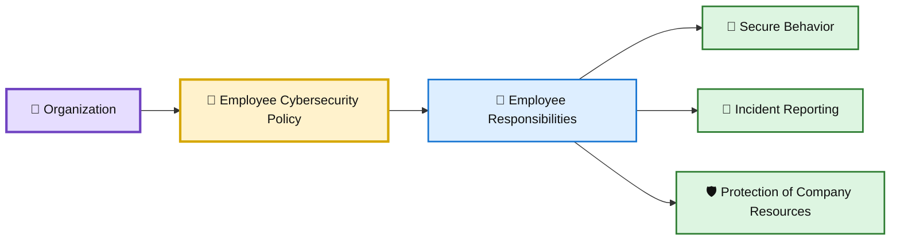
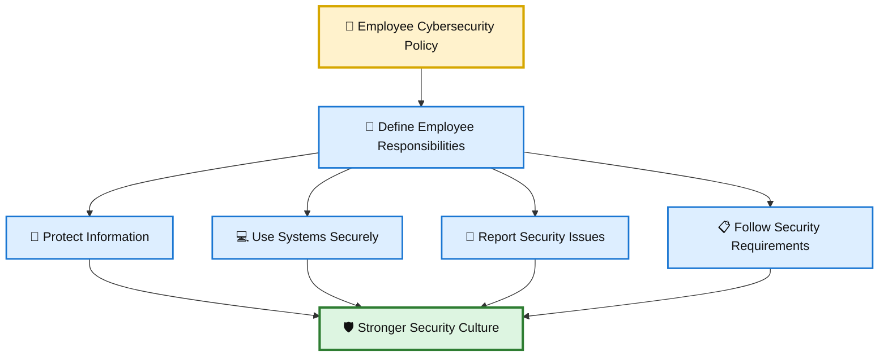
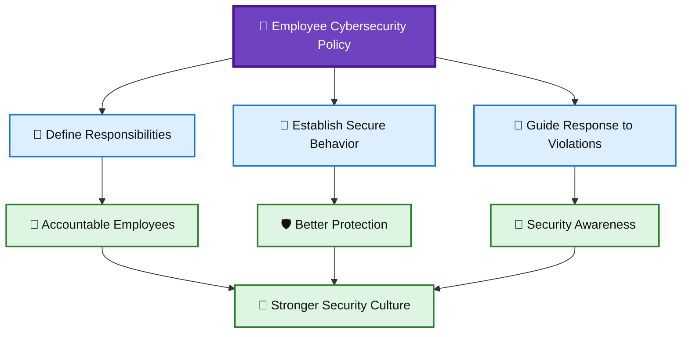

# 🛡️ WATCHTOWER — Quiz 03

> **Quiz 03** — Example Employee Security Policy

---

## 📋 Quiz Overview

This quiz covers three key concepts related to employee cybersecurity policies:

1. 👥 Employee responsibilities regarding cybersecurity
2. 🛡️ The main purpose of an employee cybersecurity policy
3. 🚨 How Helpdesk staff should respond to policy violations

---

# 👥 Question 1

### What is the purpose of an employee cybersecurity policy?

- [x] **To identify the responsibilities of the employees regarding cybersecurity**
- [ ] To outline the company's financial policies
- [ ] To list the company's holiday schedules

### ✅ Correct Answer

**To identify the responsibilities of the employees regarding cybersecurity**

### 💡 Why?

An employee cybersecurity policy establishes what employees are expected to do to protect company information, systems, devices, and accounts.

It helps define:

- 🔐 Security responsibilities
- 👤 Expected employee behavior
- 🚨 Reporting obligations
- 🛡️ Safe handling of company resources

A clear policy ensures employees understand their role in maintaining the organization's security posture.

### 🎨 Employee Responsibility Diagram

---

# 🛡️ Question 2

### What is the MAIN purpose of a company having an employee cybersecurity policy?

- [ ] To outline the process of writing a security policy
- [x] **To identify the responsibilities of employees regarding cybersecurity**
- [ ] To provide resources for employees to learn about cybersecurity
- [ ] To showcase different cybersecurity policies used by other companies

### ✅ Correct Answer

**To identify the responsibilities of employees regarding cybersecurity**

### 💡 Why?

The primary purpose of an employee cybersecurity policy is to establish clear expectations and responsibilities for employees.

It provides a framework for how employees should:

- 🔐 Protect company information
- 💻 Use organizational systems and devices
- 👤 Handle their accounts and credentials
- 🚨 Respond to and report security concerns
- 📜 Follow established security requirements

Training and educational resources can support a security program, but the policy's central purpose is to define the responsibilities and expected behavior of employees.

### 🎨 Policy Purpose Diagram

---

# 🚨 Question 3

### How should Helpdesk staff react when they observe a violation of the security policy by an employee?

- [ ] Ignore it completely
- [ ] Report it to their manager and not intervene on their own
- [x] **Use the opportunity to reinforce the importance of the security policy**

### ✅ Correct Answer

**Use the opportunity to reinforce the importance of the security policy**

### 💡 Why?

A security policy violation should be treated as an opportunity to reinforce secure behavior and improve awareness.

Helpdesk staff can:

- 📢 Remind employees of the applicable security requirement
- 🔐 Explain the security reason behind the policy
- 🤝 Encourage compliance without creating unnecessary hostility
- 🚨 Escalate serious or repeated violations according to company procedures
- 📚 Use recurring issues to identify areas where additional training may be needed

The goal is not simply to punish mistakes. Effective security awareness helps employees understand **why the policy matters** and encourages a stronger security culture.

### 🎨 Security Policy Reinforcement Diagram

---

# 📚 Key Takeaways

| # | Concept | Key Point |
|---|---|---|
| 1 | 👥 Employee Responsibilities | A cybersecurity policy identifies what employees are responsible for regarding security. |
| 2 | 🛡️ Policy Purpose | The main purpose is to define employee cybersecurity responsibilities and expected behavior. |
| 3 | 🚨 Policy Violations | Helpdesk staff should use violations as opportunities to reinforce secure behavior and policy awareness. |

---

## 🧩 Employee Security Policy Connection

---

## 📝 Quick Revision

> **Remember:**  
> **Define → Protect → Reinforce**
>
> 👥 Define employee cybersecurity responsibilities  
> 🔐 Protect company information and systems  
> 🚨 Reinforce the policy when violations occur

---

**Repository:** `WATCHTOWER`  
**Quiz:** `Quiz 03`  
**Focus:** Example Employee Security Policy
