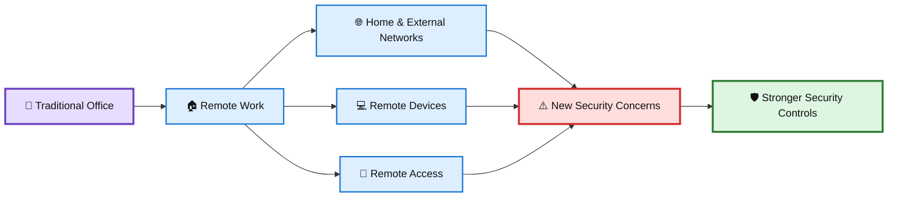
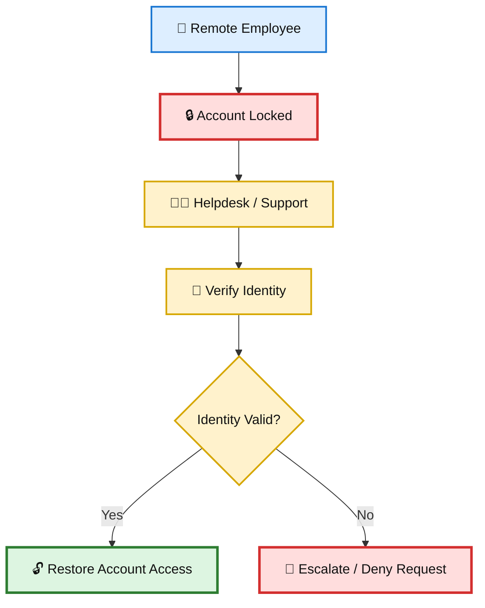
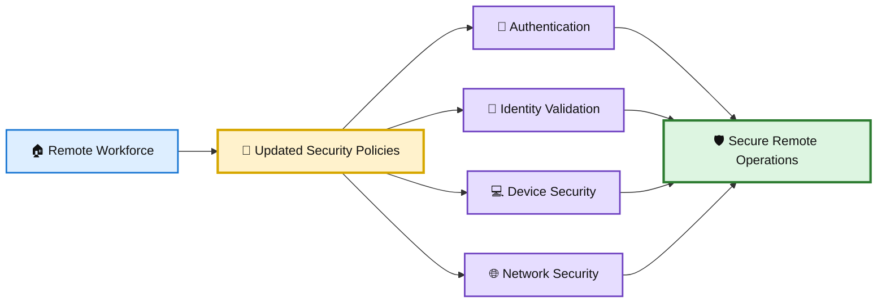
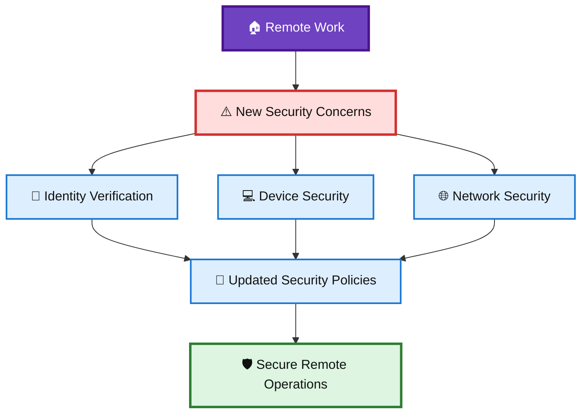

# 🏠 WATCHTOWER — Quiz 04

> **Quiz 04** — Remote Work & Cybersecurity

---

## 📋 Quiz Overview

This quiz covers three key concepts related to remote work and cybersecurity:

1. 🏠 How remote work introduced new cybersecurity concerns
2. 👤 Identity verification for remote employees
3. 🛡️ Updating security policies for remote workers

---

# 🏠 Question 1

### How has the transition from office work to remote work due to a global pandemic affected cybersecurity?

- [ ] It has made cybersecurity easier to manage.
- [ ] It has eliminated the need for cybersecurity.
- [x] **It has introduced new security concerns.**
- [ ] It has not changed cybersecurity in any way.

### ✅ Correct Answer

**It has introduced new security concerns.**

### 💡 Why?

The shift from traditional office environments to remote work expanded the environment that organizations need to secure.

Remote employees may work from:

- 🏠 Home networks
- 💻 Personal or less-controlled devices
- 🌐 Different locations and networks
- 🔐 Remote access environments

These changes introduce additional risks that organizations must address through appropriate security controls and policies.

### 🎨 Remote Work Security Diagram

---

# 👤 Question 2

### What challenge does remote work pose when an employee, like Jane Doe, is locked out of their account?

- [ ] There's no way to unlock the account remotely.
- [ ] The process is the same as if she were in the office.
- [x] **Verifying the employee's identity becomes more difficult.**
- [ ] Remote workers cannot be locked out of their accounts.

### ✅ Correct Answer

**Verifying the employee's identity becomes more difficult.**

### 💡 Why?

When an employee is working remotely, support staff cannot rely on face-to-face verification. Before resetting credentials or restoring account access, the organization needs reliable procedures to confirm that the person requesting access is really the employee.

Important controls can include:

- 🪪 Identity verification
- 🔐 Multi-factor authentication
- 📞 Approved support procedures
- 👤 Account recovery processes
- 🚨 Escalation for suspicious requests

The goal is to restore legitimate access without allowing an attacker to exploit the account-recovery process.

### 🎨 Remote Identity Verification Diagram

---

# 🛡️ Question 3

### What is a critical step that organizations must take in response to the increase in remote workers?

- [ ] Eliminate all cybersecurity policies as they are no longer necessary.
- [x] **Update security policies to include appropriate measures for remote workers and ensure their identity can be validated.**
- [ ] Ban remote work entirely to avoid security issues.

### ✅ Correct Answer

**Update security policies to include appropriate measures for remote workers and ensure their identity can be validated.**

### 💡 Why?

Security policies must evolve with the organization's working environment. As remote work increases, policies should define appropriate security measures for remote employees and provide reliable identity-validation procedures.

Organizations should address:

- 🔐 Remote authentication
- 🪪 Identity verification
- 💻 Device security
- 🌐 Network security
- 📜 Remote-work security policies
- 🚨 Incident reporting and escalation

This allows organizations to support remote work while maintaining an appropriate security posture.

### 🎨 Remote Security Policy Diagram

---

# 📚 Key Takeaways

| # | Concept | Key Point |
|---|---|---|
| 1 | 🏠 Remote Work | Remote work introduces new cybersecurity concerns. |
| 2 | 👤 Identity Verification | Verifying a remote employee's identity can be more difficult. |
| 3 | 🛡️ Security Policies | Organizations should update policies with appropriate remote-work security measures and identity validation. |

---

## 🧩 Remote Work Security Connection

---

## 📝 Quick Revision

> **Remember:**  
> **Recognize → Verify → Update**
>
> 🏠 Recognize the additional risks introduced by remote work  
> 👤 Verify the identity of remote employees before restoring access  
> 🛡️ Update security policies and controls for remote-work scenarios

---

**Repository:** `WATCHTOWER`  
**Quiz:** `Quiz 04`  
**Focus:** Remote Work & Cybersecurity
