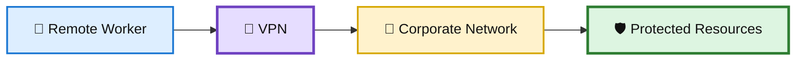
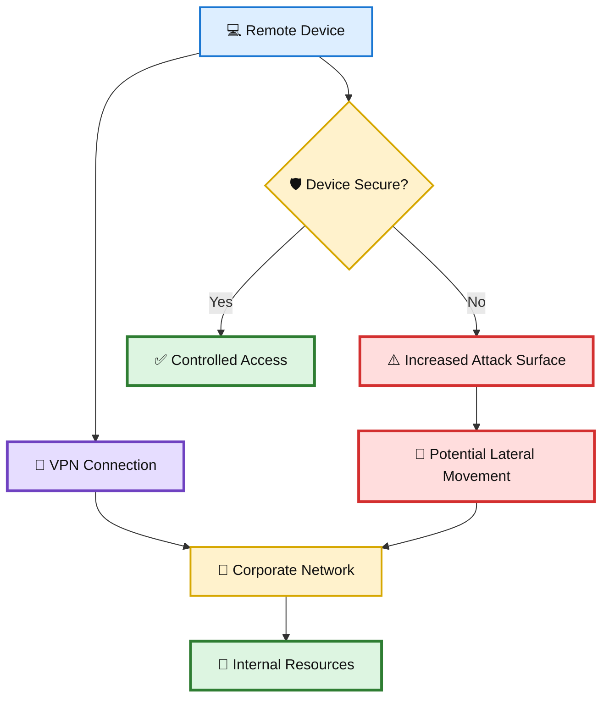
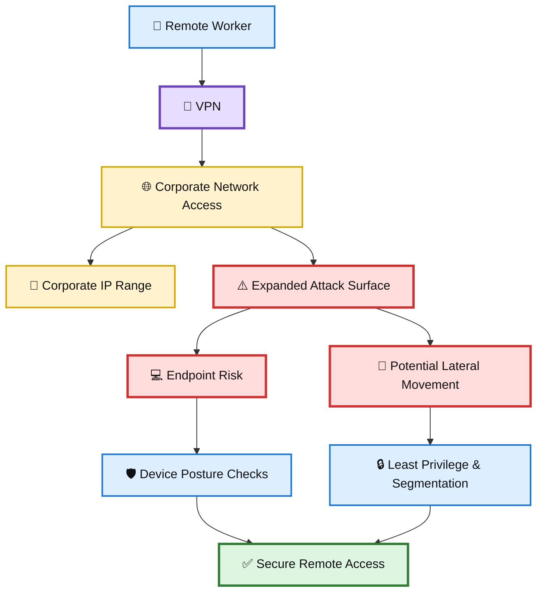

# 🏠 WATCHTOWER — Quiz 05

> **Quiz 05** — Remote Worker VPN

---

## 📋 Quiz Overview

This quiz covers three key concepts related to VPNs and remote-worker security:

1. 🔐 What VPN stands for
2. 🌐 How a Layer 2 VPN makes a remote device appear to be on the corporate network
3. 🛡️ How VPN use can reduce attack surface and security risks

---

# 🔐 Question 1

### What does VPN stand for?

- [x] **Virtual Private Network**
- [ ] Visible Public Network
- [ ] Virtual Public Network

### ✅ Correct Answer

**Virtual Private Network**

### 💡 Why?

VPN stands for **Virtual Private Network**. A VPN creates a protected logical connection across an underlying network, allowing users to securely access resources over a remote connection.

### 🎨 VPN Concept Diagram

---

# 🌐 Question 2

### How does a layer two VPN simulate the experience of a user's device being in the corporate network?

- [ ] It physically transports the user's device to the corporate office.
- [ ] It provides a separate corporate network for remote users.
- [x] **It assigns an IP address within the corporate network address range to the user's device.**

### ✅ Correct Answer

**It assigns an IP address within the corporate network address range to the user's device.**

### 💡 Why?

A Layer 2 VPN can make a remote device appear as though it is connected to the corporate network. One aspect of this is assigning the remote device an IP address from the corporate network address range.

This can provide the remote endpoint with network-level connectivity similar to being physically connected to the corporate environment.

### 🎨 Layer 2 VPN Connectivity Diagram

```mermaid
flowchart LR
    A["💻 Remote Device"] --> B["🌐 Internet"]
    B --> C["🔐 Layer 2 VPN"]
    C --> D["🏢 Corporate Network"]
    D --> E["📍 Corporate IP Address Range"]
    E --> F["🛡️ Internal Resources"]

    classDef device fill:#ddeeff,stroke:#1976d2,stroke-width:2px,color:#111;
    classDef internet fill:#f0f0f0,stroke:#666,stroke-width:2px,color:#111;
    classDef vpn fill:#e6ddff,stroke:#6f42c1,stroke-width:3px,color:#111;
    classDef network fill:#fff2cc,stroke:#d6a700,stroke-width:2px,color:#111;
    classDef resource fill:#ddf5e1,stroke:#2e7d32,stroke-width:3px,color:#111;

    class A device;
    class B internet;
    class C vpn;
    class D,E network;
    class F resource;
```

---

# 🛡️ Question 3

### What is a potential downside of allowing remote users to connect to the corporate network using a VPN?

- [ ] It is more expensive for the organization.
- [ ] It reduces the productivity of remote workers.
- [x] **It increases the attack surface and security risks.**

### ✅ Correct Answer

**It increases the attack surface and security risks.**

### 💡 Why?

Remote VPN access expands the organization's security boundary. If remote endpoints are compromised, poorly secured, or unmanaged, attackers may gain an opportunity to reach corporate resources through the VPN connection.

This is why organizations should combine VPN access with controls such as:

- 🔐 Strong authentication
- 🪪 Identity verification
- 💻 Device posture checks
- 🛡️ Endpoint protection
- 🔒 Least-privilege access
- 🌐 Network segmentation

A VPN provides connectivity, but **VPN connectivity alone does not make a device trustworthy**.

### 🎨 Remote VPN Risk Diagram

---

# 📚 Key Takeaways

| # | Concept | Key Point |
|---|---|---|
| 1 | 🔐 VPN | VPN means **Virtual Private Network**. |
| 2 | 🌐 Layer 2 VPN | A Layer 2 VPN can make a remote device appear to be on the corporate network, including use of the corporate IP address range. |
| 3 | 🛡️ VPN Security Risk | VPN access can expand the attack surface and introduce additional security risks from remote endpoints. |

---

## 🧩 Remote Worker VPN Security Connection

---

## 📝 Quick Revision

> **Remember:**  
> **Connect → Appear → Protect**
>
> 🔐 **Connect** — A VPN provides a protected remote connection.  
> 🌐 **Appear** — A Layer 2 VPN can make the remote device appear to be on the corporate network.  
> 🛡️ **Protect** — VPN access must be supported by endpoint, identity, and network security controls.

---

**Repository:** `WATCHTOWER`  
**Quiz:** `Quiz 05`  
**Focus:** Remote Worker VPN
