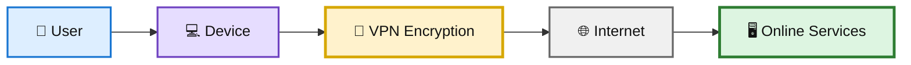
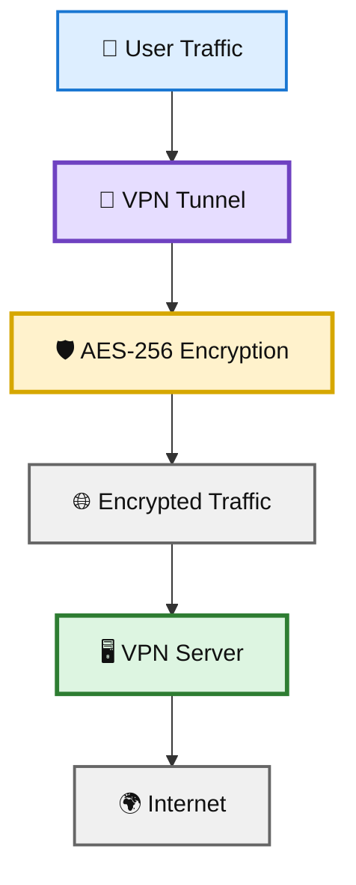
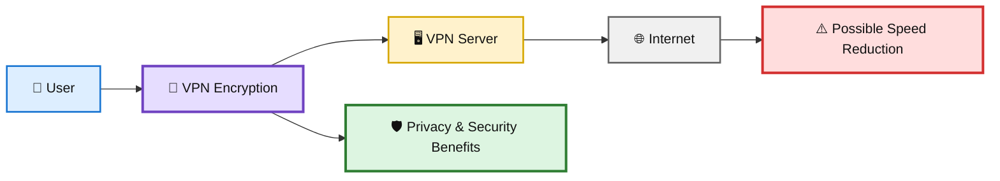
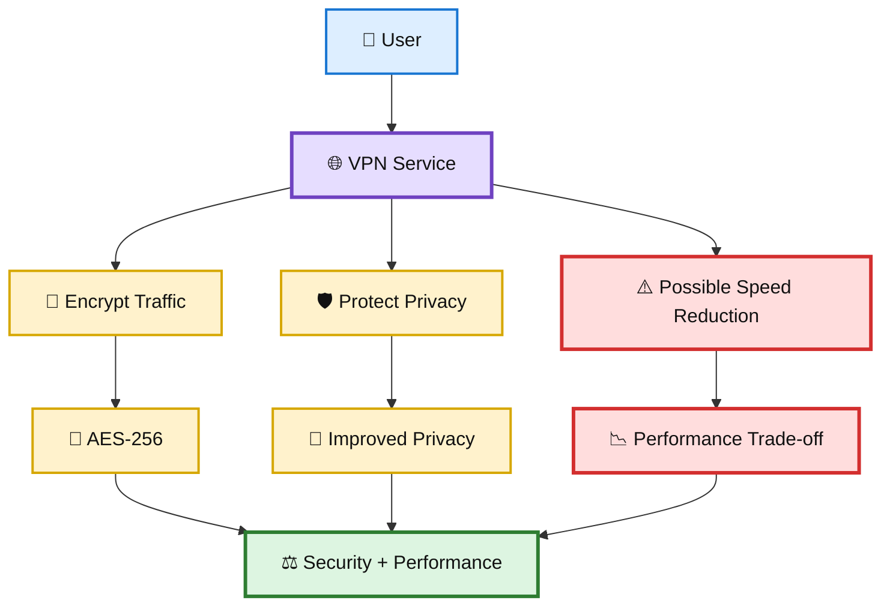

# 🌐 WATCHTOWER — Quiz 06

> **Quiz 06** — Internet VPN Services

---

## 📋 Quiz Overview

This quiz covers three key concepts related to Internet VPN services:

1. 🔐 The primary purpose of a VPN service
2. 🛡️ The encryption standard commonly used by VPN services such as NordVPN
3. ⚠️ A key drawback of using a VPN service

---

# 🔐 Question 1

### What is the primary purpose of a VPN service?

- [ ] To increase internet speed
- [ ] To block ads on websites
- [x] **To encrypt internet traffic and protect user privacy**
- [ ] To store user data for faster browsing

### ✅ Correct Answer

**To encrypt internet traffic and protect user privacy.**

### 💡 Why?

A VPN creates a protected connection between the user's device and the VPN service. One of its primary purposes is to encrypt internet traffic, helping protect sensitive information and improve privacy while using networks such as public Wi-Fi.

A VPN can help protect:

- 🔐 Internet traffic
- 👤 User privacy
- 📡 Data transmitted over untrusted networks
- 🌐 Network activity from local observers

However, a VPN should not be considered a complete cybersecurity solution by itself.

### 🎨 VPN Privacy Diagram

---

# 🛡️ Question 2

### Which encryption standard is commonly used by VPN services like NordVPN?

- [ ] RSA-2048
- [ ] DES-128
- [ ] SHA-512
- [x] **AES-256**

### ✅ Correct Answer

**AES-256**

### 💡 Why?

**AES-256 (Advanced Encryption Standard with a 256-bit key)** is a widely used strong symmetric encryption standard.

VPN services can use AES-256 to protect data transmitted through their encrypted connections. The other options represent different cryptographic concepts:

- 🔐 **AES-256** — symmetric encryption algorithm
- 🔑 **RSA-2048** — asymmetric cryptography commonly used for key exchange or authentication
- #️⃣ **SHA-512** — cryptographic hash function
- ⚠️ **DES** — older encryption standard that is no longer considered suitable for modern strong security

### 🎨 VPN Encryption Diagram

---

# ⚠️ Question 3

### What is one key drawback of using a VPN service?

- [x] **It can reduce internet speed.**
- [ ] It improves access to geo-restricted content.
- [ ] It eliminates all cybersecurity risks.

### ✅ Correct Answer

**It can reduce internet speed.**

### 💡 Why?

VPN traffic is routed through an additional VPN server and is processed through encryption and decryption. This can introduce additional latency and processing overhead, which may reduce the user's internet speed.

The amount of slowdown can depend on factors such as:

- 🌐 Distance to the VPN server
- 🖥️ VPN server load
- 🔐 Encryption and protocol overhead
- 📡 Network conditions
- 💻 Device performance

A VPN therefore provides privacy and security benefits, but those benefits can come with a performance trade-off.

### 🎨 VPN Performance Trade-off Diagram

---

# 📚 Key Takeaways

| # | Concept | Key Point |
|---|---|---|
| 1 | 🔐 VPN Purpose | A VPN can encrypt internet traffic and help protect user privacy. |
| 2 | 🛡️ Encryption | AES-256 is a commonly used strong encryption standard for VPN services. |
| 3 | ⚠️ Drawback | VPN use can reduce internet speed because of encryption and additional network routing. |

---

## 🧩 Internet VPN Services Connection

---

## 📝 Quick Revision

> **Remember:**  
> **Encrypt → Protect → Trade-off**
>
> 🔐 **Encrypt** — VPN services encrypt internet traffic.  
> 🛡️ **Protect** — VPNs can improve privacy when using networks such as public Wi-Fi.  
> ⚠️ **Trade-off** — VPN encryption and additional routing can reduce internet speed.

---

**Repository:** `WATCHTOWER`  
**Quiz:** `Quiz 06`  
**Focus:** Internet VPN Services
