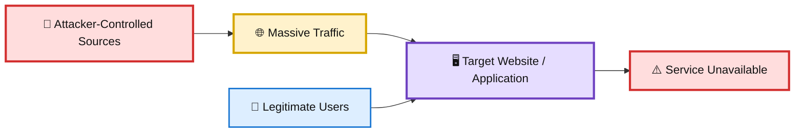
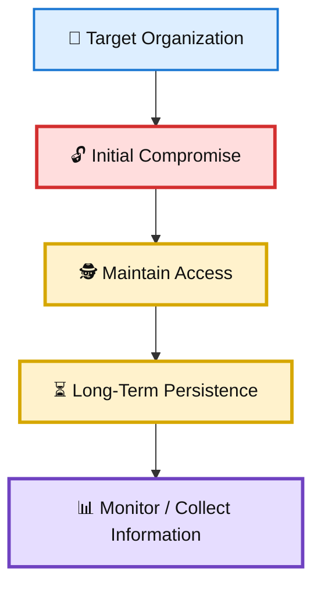
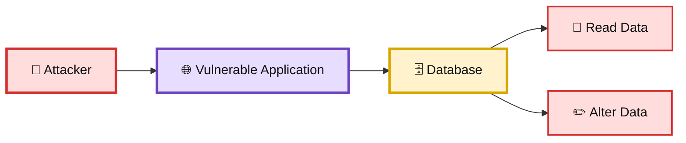
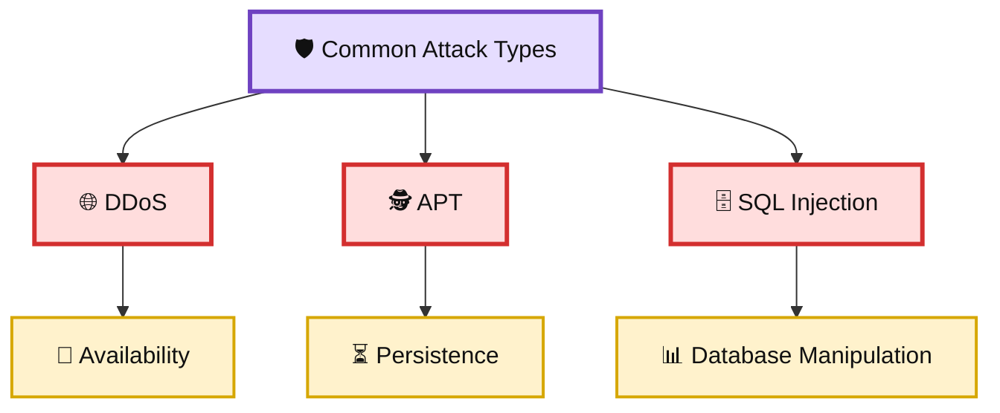

# 🛡️ WATCHTOWER — Quiz 07

> **Quiz 07** — Common Attack Types

---

## 📋 Quiz Overview

This quiz covers three common cybersecurity attack types:

1. 🌐 Distributed Denial of Service (DDoS)
2. 🕵️ Advanced Persistent Threats (APT)
3. 🗄️ SQL Injection

---

# 🌐 Question 1

### What is the primary objective of a distributed denial of service (DDoS) attack?

- [ ] To steal sensitive data from a network
- [ ] To access and modify database tables
- [x] **To make a website or application unavailable by overwhelming it with traffic**
- [ ] To infiltrate a network and establish long-term access

### ✅ Correct Answer

**To make a website or application unavailable by overwhelming it with traffic.**

### 💡 Why?

A DDoS attack attempts to overwhelm a target service with a large volume of traffic or requests. The goal is to consume resources such as bandwidth, server capacity, or application resources so legitimate users cannot access the service normally.

### 🎨 DDoS Attack Concept

---

# 🕵️ Question 2

### What characterizes an advanced persistent threat (APT)?

- [x] **Continuous, long-term access to a network by an attacker**
- [ ] An attack aimed at exhausting a network's bandwidth
- [ ] A method of modifying data in a database

### ✅ Correct Answer

**Continuous, long-term access to a network by an attacker.**

### 💡 Why?

An **Advanced Persistent Threat (APT)** is typically a targeted campaign in which an attacker gains access to a system or network and attempts to maintain that access over an extended period.

APT activity is characterized by:

- 🎯 Targeted attacks
- 🕵️ Stealth and persistence
- ⏳ Long-term access
- 🔍 Reconnaissance and monitoring
- 🗄️ Potential theft or compromise of sensitive information

Unlike a DDoS attack, which primarily focuses on availability, an APT generally focuses on maintaining access and achieving longer-term objectives.

### 🎨 APT Concept

---

# 🗄️ Question 3

### What kind of data manipulation is possible after a successful SQL injection attack?

- [ ] Changing user passwords and access rights
- [x] **Reading and altering data within a database**
- [ ] Modifying CPU and memory usage on a network

### ✅ Correct Answer

**Reading and altering data within a database.**

### 💡 Why?

A **SQL injection** attack exploits weaknesses in an application's handling of database queries. If successful, an attacker may be able to manipulate database queries beyond their intended purpose.

Depending on the application's permissions and database configuration, this can potentially allow an attacker to:

- 📖 Read database records
- ✏️ Alter existing data
- ➕ Insert unauthorized data
- 🗑️ Delete data
- 🔐 Access information that should be protected

Strong input validation, parameterized queries, prepared statements, and appropriate database permissions are important defenses against SQL injection.

### 🎨 SQL Injection Concept

---

# 📚 Key Takeaways

| # | Attack Type | Primary Characteristic |
|---|---|---|
| 1 | 🌐 DDoS | Overwhelms a service with traffic to make it unavailable. |
| 2 | 🕵️ APT | Maintains targeted, long-term access to a network. |
| 3 | 🗄️ SQL Injection | Can allow unauthorized reading or alteration of database data. |

---

## 🧩 Attack Types at a Glance

---

## 📝 Quick Revision

> **Remember:**  
> **DDoS → Disrupt · APT → Persist · SQL Injection → Manipulate**
>
> 🌐 **DDoS** — Targets availability by overwhelming a service.  
> 🕵️ **APT** — Focuses on persistent, long-term access.  
> 🗄️ **SQL Injection** — Exploits vulnerable database queries to potentially read or modify data.

---

**Repository:** `WATCHTOWER`  
**Quiz:** `Quiz 07`  
**Focus:** Common Attack Types
