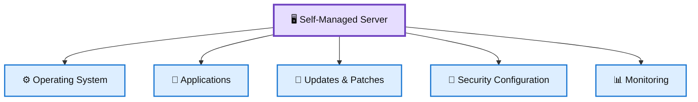
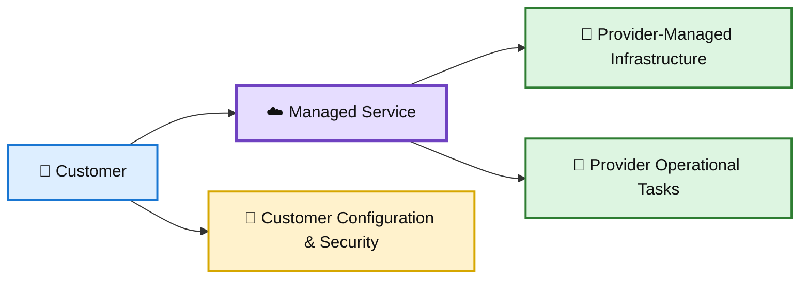
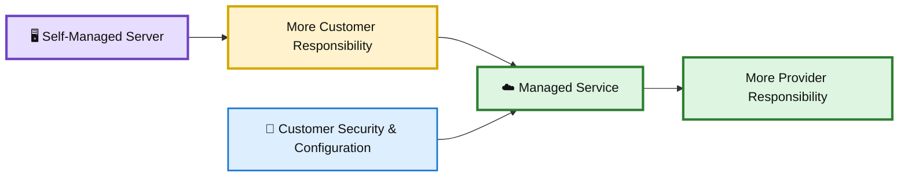
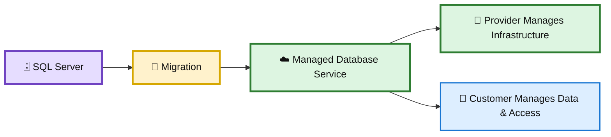
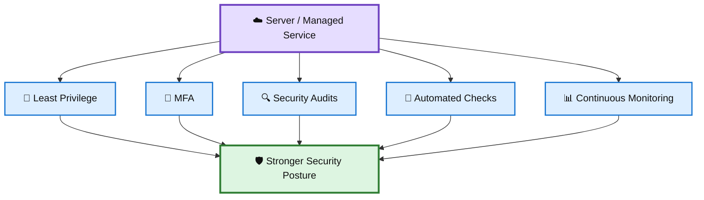
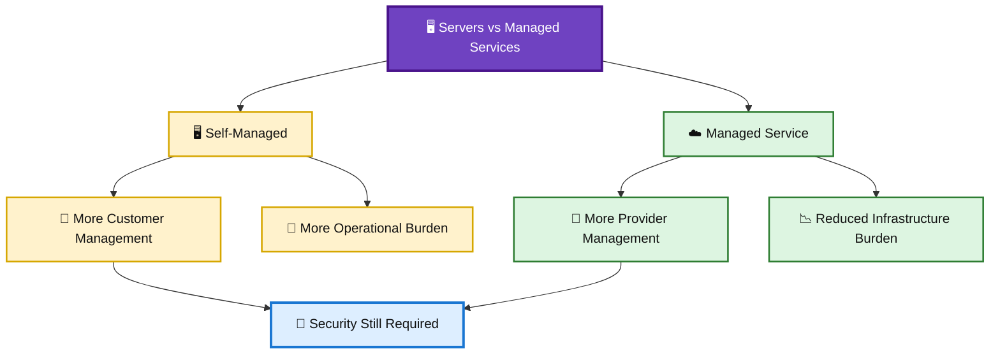

# 🛡️ WATCHTOWER — Quiz 08

> **Quiz 08** — Servers vs Managed Services

---

## 📋 Quiz Overview

This quiz covers five key concepts related to **servers and managed services**:

1. 🖥️ Traditional server management
2. ☁️ Managed cloud services
3. ⚖️ Shared responsibility
4. 🗄️ Database migration to managed services
5. 🔐 Security and operational controls

---

# 🖥️ Question 1

### What is one of the main responsibilities when managing a traditional server?

- [x] **Managing the operating system, applications, updates, and security configuration**
- [ ] Only managing the physical building where the server is located
- [ ] Allowing the cloud provider to manage all software automatically
- [ ] Managing only the application while the operating system is fully managed by the provider

### ✅ Correct Answer

**Managing the operating system, applications, updates, and security configuration**

### 💡 Why?

With a traditional or self-managed server, the organization is responsible for a large portion of the technology stack.

Typical responsibilities include:

- 🖥️ Operating system management
- 🔄 Security patches and updates
- 🧩 Application installation and configuration
- 🔐 Access and security controls
- 📊 Monitoring and maintenance

This gives the organization greater control, but it also creates a greater operational and security burden.

### 🎨 Traditional Server Responsibility

---

# ☁️ Question 2

### What is a key advantage of using a managed cloud service instead of managing the underlying server yourself?

- [ ] The customer becomes responsible for more physical infrastructure
- [x] **The service provider manages more of the underlying infrastructure and operational tasks**
- [ ] The customer must manually replace the provider's physical hardware
- [ ] Managed services eliminate the need for any customer security responsibilities

### ✅ Correct Answer

**The service provider manages more of the underlying infrastructure and operational tasks**

### 💡 Why?

A managed service reduces the amount of infrastructure that the customer has to operate directly.

Depending on the service, the provider may handle areas such as:

- 🖥️ Underlying infrastructure
- 🔧 Hardware maintenance
- 🔄 Platform maintenance
- 📊 Certain operational tasks
- 🛡️ Infrastructure-level security

However, **managed does not mean responsibility-free**. Customers still need to securely configure and use the service.

### 🎨 Managed Service Model

---

# ⚖️ Question 3

### How does the shared responsibility model change when moving from a self-managed server to a managed service?

- [ ] The customer becomes responsible for all physical infrastructure
- [x] **The provider takes responsibility for more of the underlying infrastructure, while the customer retains responsibility for its configuration and use**
- [ ] The customer has no security responsibilities after migration
- [ ] Both the provider and customer become responsible for exactly the same components

### ✅ Correct Answer

**The provider takes responsibility for more of the underlying infrastructure, while the customer retains responsibility for its configuration and use**

### 💡 Why?

The division of responsibility depends on the service being used.

With a self-managed server, the customer typically manages more of the stack. With a managed service, the provider manages more of the underlying infrastructure.

The customer still needs to consider:

- 🔐 Identity and access management
- ⚙️ Secure configuration
- 🗄️ Data protection
- 📊 Monitoring
- 🛡️ Application-level security

### 🎨 Responsibility Shift

---

# 🗄️ Question 4

### An organization wants to migrate a SQL Server database to a managed database service. What is a major benefit of this approach?

- [ ] The organization must continue managing all database infrastructure manually
- [ ] The organization becomes responsible for maintaining the provider's physical servers
- [x] **The managed service reduces the operational burden of maintaining the underlying database infrastructure**
- [ ] The managed service removes the need to secure database access

### ✅ Correct Answer

**The managed service reduces the operational burden of maintaining the underlying database infrastructure**

### 💡 Why?

Moving a database to a managed service can reduce the amount of infrastructure administration required from the customer.

The provider can handle many underlying operational tasks, while the customer focuses on the database workload and its secure configuration.

The customer should still manage and review:

- 🔐 Database access
- 👤 Identity and permissions
- 🗄️ Data protection
- ⚙️ Configuration
- 📊 Monitoring and security requirements

### 🎨 Managed Database Migration

---

# 🔐 Question 5

### Which combination of practices helps maintain security when using servers or managed services?

- [ ] Disabling access controls and relying only on physical security
- [ ] Using shared administrator accounts and avoiding security audits
- [x] **Using least privilege, MFA, security audits, automated checks, and continuous monitoring**
- [ ] Removing logging to reduce the amount of operational data

### ✅ Correct Answer

**Using least privilege, MFA, security audits, automated checks, and continuous monitoring**

### 💡 Why?

Security must remain an ongoing operational process whether infrastructure is self-managed or provided as a managed service.

Important controls include:

- 🔐 **Least privilege** — give users only the access they need
- 🔑 **MFA** — add an additional authentication factor
- 🔍 **Security audits** — identify weaknesses and policy violations
- 🤖 **Automated checks** — detect configuration and security issues consistently
- 📊 **Continuous monitoring** — identify suspicious or abnormal activity

Managed services reduce infrastructure-management responsibilities, but they do not remove the customer's responsibility to configure and use the service securely.

### 🎨 Layered Security Controls

---

# 📚 Key Takeaways

| # | Concept | Key Point |
|---|---|---|
| 1 | 🖥️ Traditional Servers | Customers manage a larger portion of the operating environment. |
| 2 | ☁️ Managed Services | Providers manage more of the underlying infrastructure. |
| 3 | ⚖️ Shared Responsibility | Responsibility shifts, but customers still retain security and configuration duties. |
| 4 | 🗄️ Managed Databases | Managed services reduce the operational burden of maintaining database infrastructure. |
| 5 | 🔐 Security Controls | Least privilege, MFA, audits, automated checks, and monitoring strengthen security. |

---

## 🧩 Servers vs Managed Services

---

## 📝 Quick Revision

> **Remember:**  
> **Self-Managed → More Control & More Responsibility**  
> **Managed Service → Less Infrastructure Management**  
> **Shared Responsibility → Security Still Matters**

🖥️ **Servers** — require significant customer management and maintenance.  
☁️ **Managed Services** — shift more infrastructure responsibilities to the provider.  
⚖️ **Shared Responsibility** — defines what the provider and customer each secure.  
🗄️ **Managed Databases** — reduce infrastructure administration.  
🔐 **Security Controls** — least privilege, MFA, audits, automated checks, and monitoring remain important.

---

**Repository:** `WATCHTOWER`  
**Quiz:** `Quiz 08`  
**Focus:** Servers vs Managed Services
