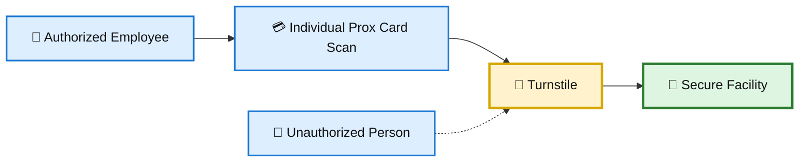
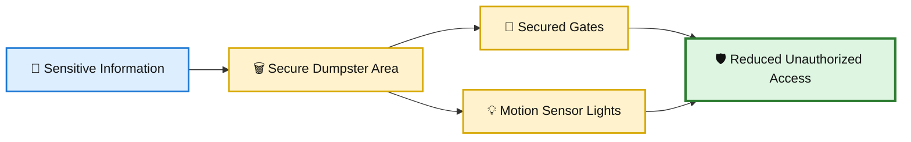
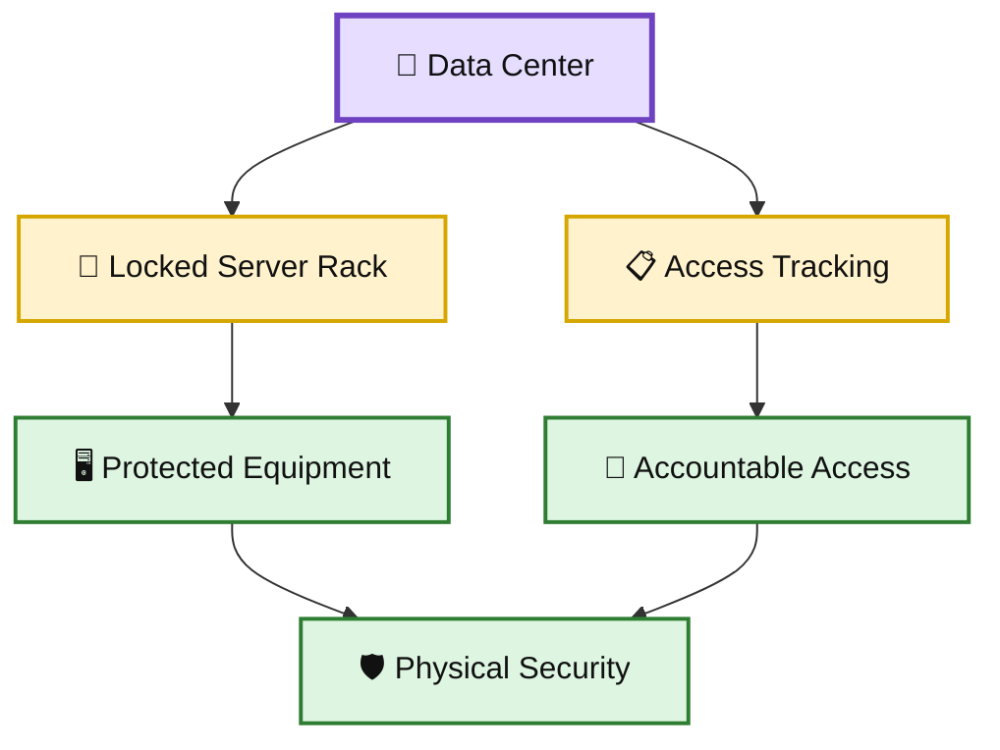
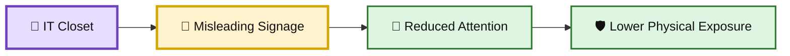
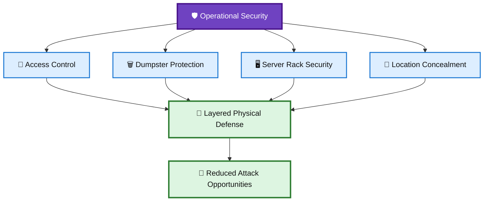

# 🛡️ WATCHTOWER — Quiz 09

> **Quiz 09** — Operational Security

---

## 📋 Quiz Overview

This quiz covers four key concepts related to operational and physical security:

1. 🚪 Preventing tailgating at facility entrances
2. 🗑️ Protecting sensitive information from dumpster diving
3. 🖥️ Securing server racks and controlling data center access
4. 🚧 Using misleading signage to conceal IT equipment locations

---

# 🚪 Question 1

### What is a practical solution to prevent tailgating at the entrance of a facility?

- [x] **Installing turnstiles that require individual prox card scans**
- [ ] Offering free coffee near the entrance to distract potential intruders
- [ ] Encouraging employees to hold doors open for others

### ✅ Correct Answer

**Installing turnstiles that require individual prox card scans**

### 💡 Why?

Turnstiles that require each person to scan an individual access credential help prevent unauthorized people from following an authorized employee into a secured facility.

### 🎨 Tailgating Prevention Diagram

---

# 🗑️ Question 2

### How can sensitive information be protected from being compromised through dumpster diving?

- [x] **Deterrents like motion sensor lights or secured gates around dumpsters**
- [ ] By encouraging employees to take sensitive information home
- [ ] By eliminating all physical documents

### ✅ Correct Answer

**Deterrents like motion sensor lights or secured gates around dumpsters**

### 💡 Why?

Physical deterrents around dumpsters make unauthorized access more difficult and can discourage attempts to retrieve discarded information.

### 🎨 Dumpster Security Diagram

---

# 🖥️ Question 3

### What measures can be taken to secure server racks within a data center or server closet?

- [ ] Leaving the server rack doors open for easy access
- [ ] Decorating server racks to blend in with the office environment
- [x] **Locking the doors of server racks and tracking who accesses the data center**

### ✅ Correct Answer

**Locking the doors of server racks and tracking who accesses the data center**

### 💡 Why?

Locked server racks provide a physical barrier against unauthorized access, while access tracking provides accountability and helps identify who entered restricted areas.

### 🎨 Server Rack Security Diagram

---

# 🚧 Question 4

### How can misleading signage contribute to the physical security of IT equipment in less secure locations?

- [ ] By accurately labeling IT closets to ensure everyone knows where they are
- [ ] By using signs that indicate the presence of high-value items to deter thieves
- [x] **By disguising IT closets with signs indicating they are something less interesting or accessible, such as a locked, out-of-order bathroom**

### ✅ Correct Answer

**By disguising IT closets with signs indicating they are something less interesting or accessible, such as a locked, out-of-order bathroom**

### 💡 Why?

Misleading signage can reduce attention toward sensitive IT locations by making them appear less interesting or less accessible to unauthorized individuals.

### 🎨 Concealment Strategy Diagram

---

# 📚 Key Takeaways

| # | Concept | Key Point |
|---|---|---|
| 1 | 🚪 Tailgating | Individual credential scans at turnstiles help prevent unauthorized entry. |
| 2 | 🗑️ Dumpster Diving | Secured dumpster areas and physical deterrents reduce unauthorized access. |
| 3 | 🖥️ Server Racks | Locked racks and access tracking protect critical equipment. |
| 4 | 🚧 Misleading Signage | Concealment can reduce attention toward sensitive IT locations. |

---

## 🧩 Operational Security Connection

---

## 📝 Quick Revision

> **Remember:**  
> **Control → Secure → Conceal**
>
> 🚪 Control physical access  
> 🖥️ Secure critical equipment  
> 🚧 Conceal sensitive locations

---

**Repository:** `WATCHTOWER`  
**Quiz:** `Quiz 09`  
**Focus:** Operational Security
