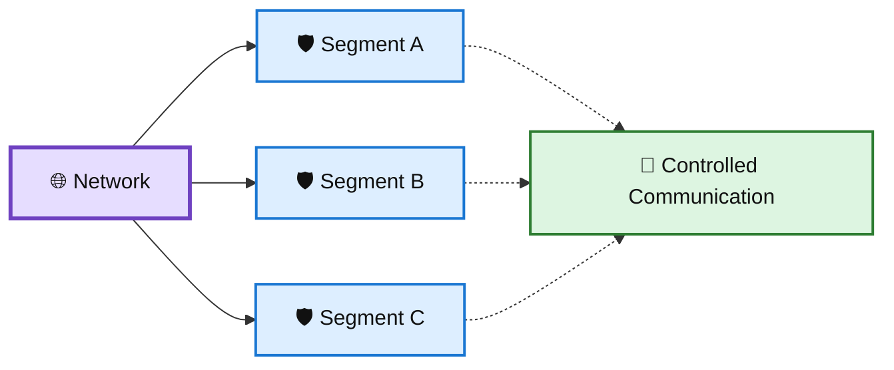
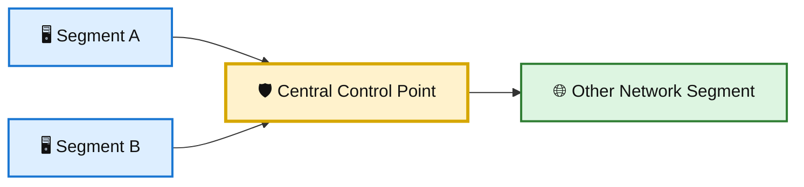
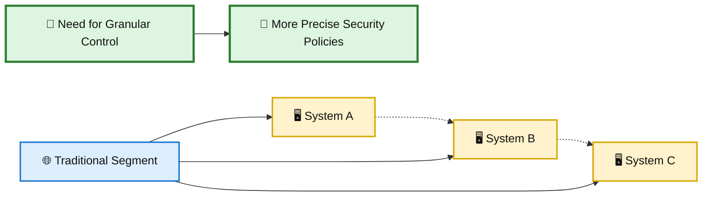
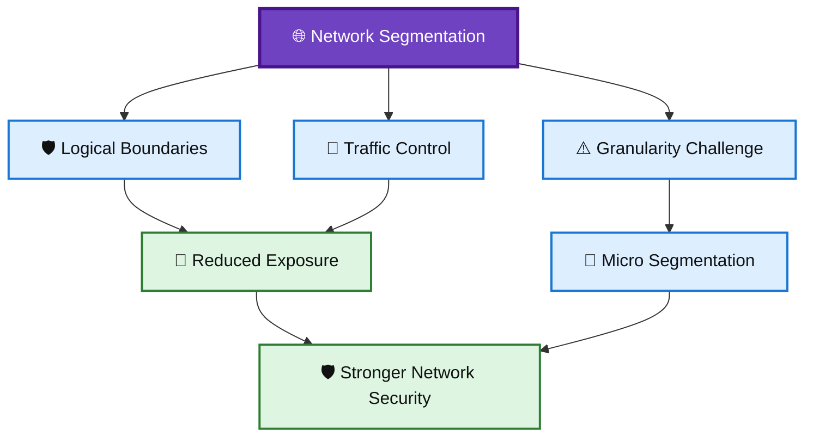

# 🛡️ WATCHTOWER — Quiz 10

> **Quiz 10** — Network Segmentation

---

## 📋 Quiz Overview

This quiz covers three key concepts related to network segmentation:

1. 🌐 The main purpose of network segmentation
2. 🔀 How traditional network segmentation handles traffic
3. ⚠️ A limitation of traditional network segmentation

---

# 🌐 Question 1

### What is the main purpose of network segmentation in cybersecurity?

- [ ] To block all incoming Internet traffic
- [x] **To create logical distinctions between different parts of a network**
- [ ] To make it easier for attackers to access the network

### ✅ Correct Answer

**To create logical distinctions between different parts of a network**

### 💡 Why?

Network segmentation divides a network into logical sections so that different parts of the environment can be separated and controlled independently.

It helps organizations:

- 🌐 Create logical network boundaries
- 🔐 Control communication between network areas
- 🛡️ Limit the impact of security incidents
- 🚧 Reduce unnecessary access between systems

### 🎨 Network Segmentation Diagram

---

# 🔀 Question 2

### How does traditional network segmentation handle traffic between network segments?

- [x] **It forces all traffic to flow through a central point**
- [ ] It allows unrestricted communication between all network segments
- [ ] It removes the need for network security controls

### ✅ Correct Answer

**It forces all traffic to flow through a central point**

### 💡 Why?

Traditional network segmentation commonly uses centralized network devices or control points to manage traffic moving between separate segments.

This approach provides a defined location where traffic can be inspected and controlled.

### 🎨 Traditional Segmentation Flow

---

# ⚠️ Question 3

### What is one of the downsides of traditional network segmentation?

- [ ] It makes it easy to control traffic within segments
- [x] **It makes it difficult to control traffic within segments**
- [ ] It enforces strict communication between all segments

### ✅ Correct Answer

**It makes it difficult to control traffic within segments**

### 💡 Why?

Traditional segmentation creates larger network boundaries, but controlling traffic at a highly granular level inside those segments can be difficult.

This is one reason more granular approaches, such as micro segmentation, are useful when organizations need finer control over communication.

### 🎨 Traditional vs. Granular Control

---

# 📚 Key Takeaways

| # | Concept | Key Point |
|---|---|---|
| 1 | 🌐 Network Segmentation | Creates logical distinctions between different parts of a network. |
| 2 | 🔀 Traditional Segmentation | Uses centralized control points to manage traffic between segments. |
| 3 | ⚠️ Limitation | Traditional segmentation can make granular traffic control within segments difficult. |

---

## 🧩 Network Segmentation Connection

---

## 📝 Quick Revision

> **Remember:**  
> **Separate → Control → Limit**
>
> 🌐 Separate different parts of the network  
> 🔀 Control traffic between network segments  
> 🛡️ Limit unnecessary communication and exposure

---

**Repository:** `WATCHTOWER`  
**Quiz:** `Quiz 10`  
**Focus:** Network Segmentation
