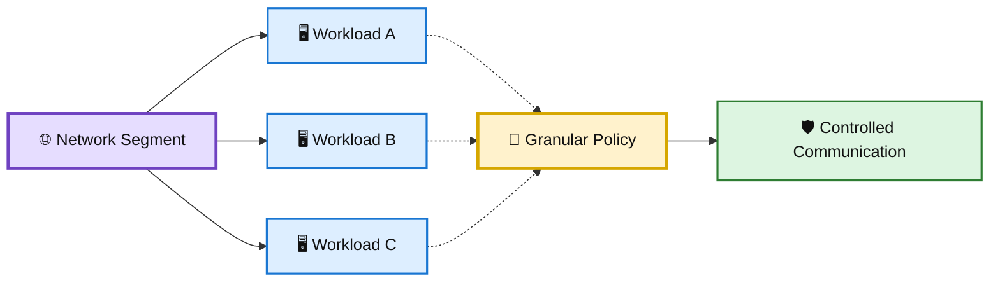
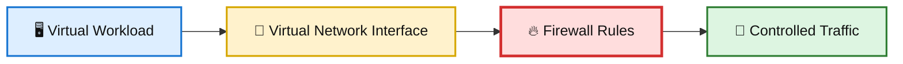
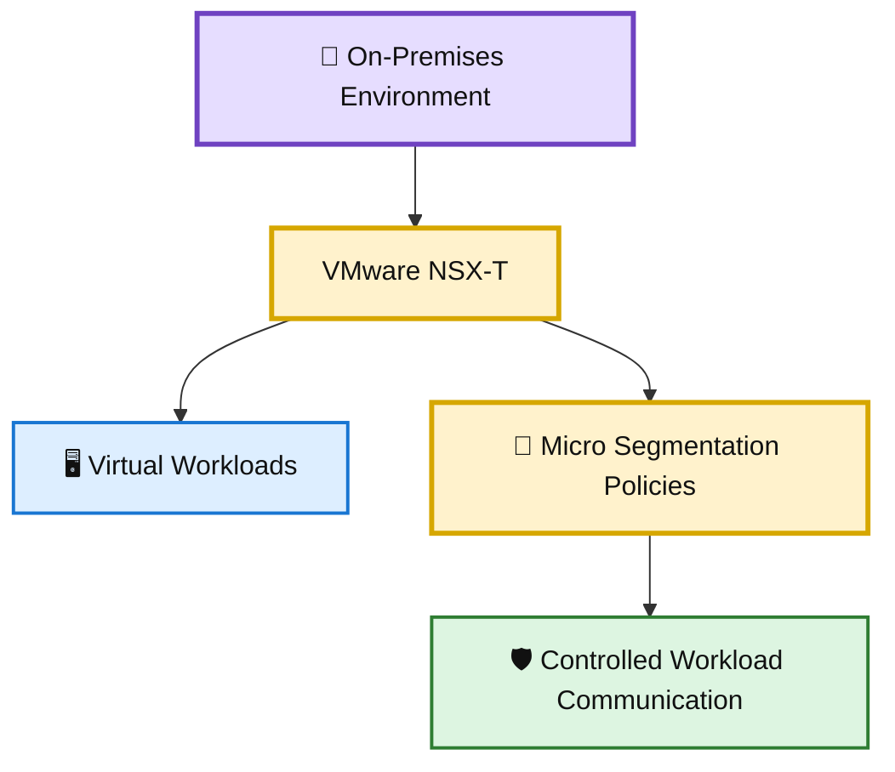
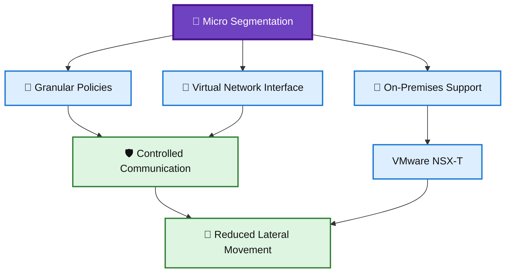

# 🛡️ WATCHTOWER — Quiz 11

> **Quiz 11** — Micro Segmentation

---

## 📋 Quiz Overview

This quiz covers three key concepts related to micro segmentation:

1. 🎯 The primary issue addressed by micro segmentation
2. 🔐 How micro segmentation differs from traditional segmentation
3. 🏢 An on-premises technology that provides micro segmentation capabilities

---

# 🎯 Question 1

### In the context of micro segmentation, what is the primary issue that it aims to address?

- [ ] Increasing the efficiency of network communication
- [ ] Minimizing the use of virtual machines
- [x] **Controlling communication within a network segment**

### ✅ Correct Answer

**Controlling communication within a network segment**

### 💡 Why?

Micro segmentation provides granular control over communication within a network environment rather than relying only on broad network boundaries.

It helps organizations:

- 🎯 Control communication at a granular level
- 🔐 Apply security policies closer to workloads
- 🚧 Limit unnecessary lateral communication
- 🛡️ Reduce the potential impact of a compromised system

### 🎨 Micro Segmentation Control

---

# 🔐 Question 2

### What distinguishes micro segmentation from traditional segmentation?

- [ ] Micro segmentation primarily applies to physical servers.
- [ ] Micro segmentation utilizes layer three switches.
- [x] **Micro segmentation enforces firewall rules at the virtual network interface level.**

### ✅ Correct Answer

**Micro segmentation enforces firewall rules at the virtual network interface level.**

### 💡 Why?

Micro segmentation moves security enforcement closer to individual virtual workloads by applying firewall rules at the virtual network interface level.

This enables more granular control than broad network segmentation alone.

### 🎨 Micro Segmentation Enforcement

---

# 🏢 Question 3

### Which technology or solution offers micro segmentation capabilities for on-premises environments?

- [x] **VMware NSX-T**
- [ ] AWS Security Groups
- [ ] Network-attached storage (NAS) solutions

### ✅ Correct Answer

**VMware NSX-T**

### 💡 Why?

VMware NSX-T provides network virtualization and security capabilities for on-premises environments, including micro segmentation.

It can help organizations:

- 🏢 Protect on-premises workloads
- 🔐 Apply granular security policies
- 🌐 Control workload-to-workload communication
- 🛡️ Reduce lateral movement within the environment

### 🎨 On-Premises Micro Segmentation

---

# 📚 Key Takeaways

| # | Concept | Key Point |
|---|---|---|
| 1 | 🎯 Micro Segmentation | Controls communication within a network segment at a granular level. |
| 2 | 🔐 Enforcement | Firewall rules can be enforced at the virtual network interface level. |
| 3 | 🏢 On-Premises Solution | VMware NSX-T provides micro segmentation capabilities for on-premises environments. |

---

## 🧩 Micro Segmentation Connection

---

## 📝 Quick Revision

> **Remember:**  
> **Granular → Interface → Protect**
>
> 🎯 Apply granular communication controls  
> 🔐 Enforce firewall rules close to virtual workloads  
> 🏢 Protect on-premises environments with appropriate micro segmentation solutions

---

**Repository:** `WATCHTOWER`  
**Quiz:** `Quiz 11`  
**Focus:** Micro Segmentation
