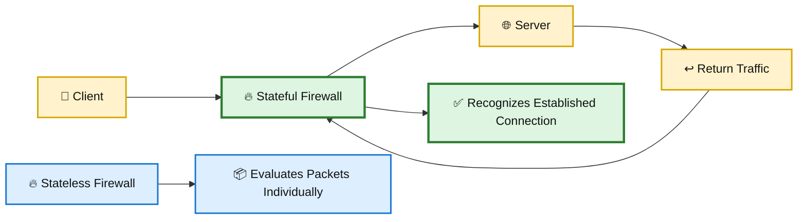
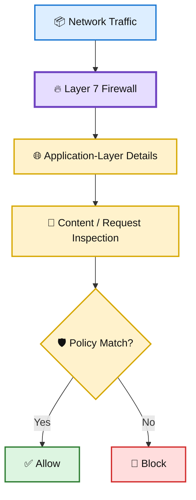
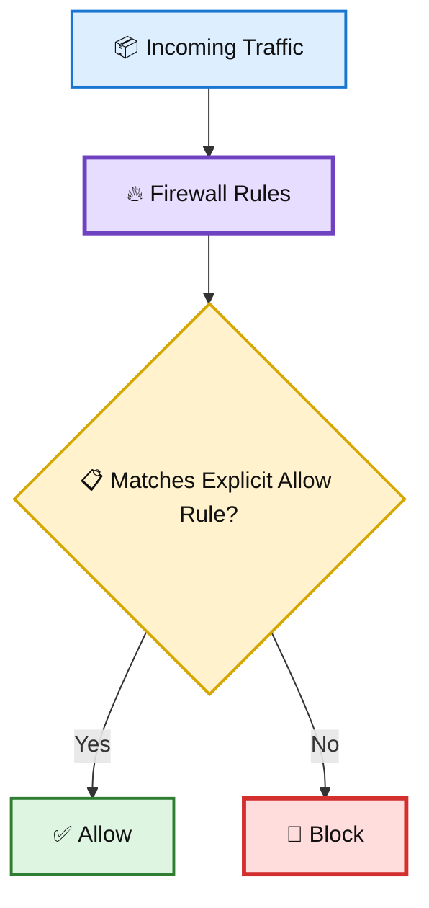
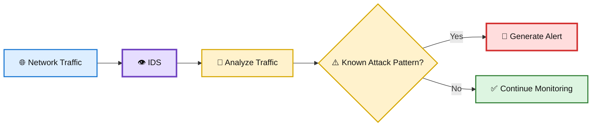
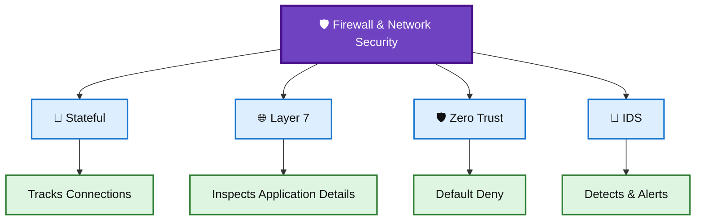

# 🛡️ WATCHTOWER — Quiz 12

> **Quiz 12** — Firewall Concepts

---

## 📋 Quiz Overview

This quiz covers four key firewall and network security concepts:

1. 🔄 Stateful vs stateless firewalls
2. 🌐 Layer 7 firewall inspection
3. 🛡️ Zero Trust default-deny behavior
4. 🚨 Intrusion Detection Systems (IDS)

---

# 🔄 Question 1

### How does a stateful firewall differ from a stateless firewall?

- [x] **A stateful firewall dynamically opens holes for return traffic from known connections, while a stateless firewall does not.**
- [ ] A stateful firewall allows all traffic, while a stateless firewall blocks all traffic.
- [ ] A stateful firewall focuses on deep packet inspection, while a stateless firewall only looks at addresses and ports.

### ✅ Correct Answer

**A stateful firewall dynamically opens holes for return traffic from known connections, while a stateless firewall does not.**

### 💡 Why?

A **stateful firewall** keeps track of active network connections and understands the state of traffic flows. When an outbound connection is established and permitted, the firewall can recognize the corresponding return traffic as part of that known connection.

A **stateless firewall**, by contrast, evaluates packets independently based on configured rules, such as source/destination addresses, ports, and protocols. It does not maintain connection state in the same way.

### 🎨 Stateful vs Stateless

---

# 🌐 Question 2

### What does a Layer 7 (Layer 7) firewall primarily inspect when determining whether to allow or block traffic?

- [x] **The content and application layer details of the traffic**
- [ ] Source and destination IP addresses
- [ ] Network layer information

### ✅ Correct Answer

**The content and application layer details of the traffic**

### 💡 Why?

A **Layer 7 firewall** operates at the application layer. Instead of relying only on lower-level network information, it can inspect application-aware details such as HTTP requests, URLs, headers, methods, and other application-layer characteristics.

This enables more granular security policies based on what the traffic is actually doing.

### 🎨 Layer 7 Inspection

---

# 🛡️ Question 3

### In a zero trust model, what is the default action for traffic that doesn't match any statements in the firewall rule set?

- [ ] Allow the traffic
- [x] **Block the traffic**
- [ ] Forward the traffic for deep packet inspection

### ✅ Correct Answer

**Block the traffic**

### 💡 Why?

A **Zero Trust** approach does not automatically trust traffic simply because it originates from a particular network location. Access should be explicitly authorized according to policy.

For firewall rules, an unmatched request is commonly handled with a **default-deny** approach:

> **If it is not explicitly allowed, it is denied.**

This reduces unintended exposure and supports the principle of least privilege.

### 🎨 Default-Deny Concept

---

# 🚨 Question 4

### What is the key purpose of an intrusion detection system (IDS) in a network?

- [ ] To stop incoming threats and attacks from reaching their targets
- [ ] To dynamically open holes in the firewall for specific connections
- [x] **To observe network traffic, detect patterns matching known exploits, and send alerts**

### ✅ Correct Answer

**To observe network traffic, detect patterns matching known exploits, and send alerts**

### 💡 Why?

An **Intrusion Detection System (IDS)** primarily monitors activity and identifies potentially malicious or suspicious behavior.

An IDS can:

- 👀 Observe network traffic
- 🔎 Detect patterns associated with known attacks or exploits
- 🚨 Generate alerts for security teams
- 📊 Provide visibility into potential security incidents

An IDS is primarily a **detection and alerting** mechanism. An **Intrusion Prevention System (IPS)** goes further by taking active measures to block or prevent detected threats.

### 🎨 IDS Detection Flow

---

# 📚 Key Takeaways

| # | Concept | Key Point |
|---|---|---|
| 1 | 🔄 Stateful Firewall | Tracks connection state and can recognize return traffic from established connections. |
| 2 | 🌐 Layer 7 Firewall | Inspects application-layer content and details. |
| 3 | 🛡️ Zero Trust | Uses explicit authorization and commonly applies a default-deny rule. |
| 4 | 🚨 IDS | Detects suspicious or known malicious patterns and generates alerts. |

---

## 🧩 Firewall & Detection Concepts at a Glance

---

## 📝 Quick Revision

> **Remember:**  
> **Stateful → Track · Layer 7 → Inspect · Zero Trust → Deny by Default · IDS → Detect & Alert**

🔄 **Stateful Firewall** — tracks active connections and recognizes related return traffic.  
🌐 **Layer 7 Firewall** — inspects application-layer details.  
🛡️ **Zero Trust** — requires explicit authorization and supports default-deny behavior.  
🚨 **IDS** — detects suspicious activity and sends alerts.

---

**Repository:** `WATCHTOWER`  
**Quiz:** `Quiz 12`  
**Focus:** Firewall Concepts
