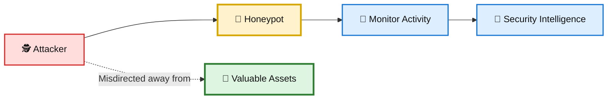
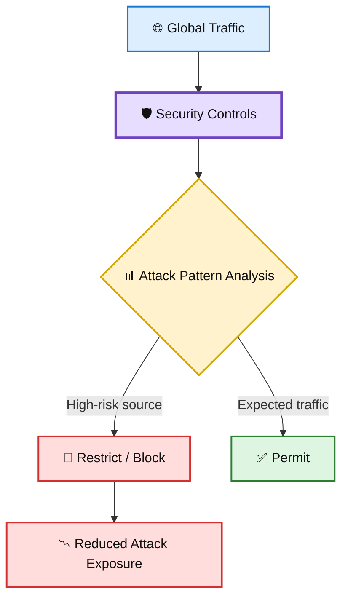
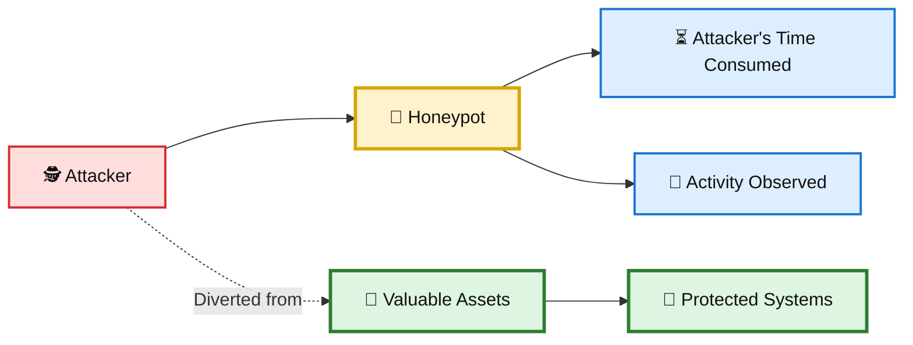

# 🍯 WATCHTOWER — Quiz 13: Honey Pots

> **Quiz 13** — Honey Pots

---

## 📋 Quiz Overview

This quiz covers the purpose of honeypots, lessons from the Honey Train Project, and the concept of misdirection as a defensive security technique.

### 🎯 Learning Objectives

- Understand the primary purpose of a honeypot.
- Recognize how defensive controls can reduce attack exposure.
- Understand how misdirection can divert attackers away from valuable assets.

---

# 🧠 Question 1

### What is the primary purpose of a honeypot in cybersecurity?

- [ ] To create a valuable resource for attackers
- [x] **To mislead attackers and waste their time**
- [ ] To prevent all cyberattacks from occurring

### ✅ Correct Answer

**To mislead attackers and waste their time**

### 💡 Explanation

A **honeypot** is a deliberately deployed system or resource designed to attract attackers. It appears to be a legitimate target, but it is isolated or controlled so that security teams can observe attacker behavior without exposing critical production assets.

Honeypots can therefore:

- 🎯 Attract attackers away from real systems.
- ⏳ Waste an attacker's time and resources.
- 👀 Provide visibility into attacker techniques.
- 🚨 Generate useful security intelligence.

### 🎨 Honeypot Concept

---

# 🧠 Question 2

### What lesson can be drawn from the Honey Train Project regarding cybersecurity practices?

- [ ] All international traffic should be allowed by default
- [x] **Blocking specific countries can eliminate a significant portion of attacks**
- [ ] Honeypots are ineffective in diverting attackers

### ✅ Correct Answer

**Blocking specific countries can eliminate a significant portion of attacks**

### 💡 Explanation

The **Honey Train Project** demonstrated how analyzing attack sources can reveal useful patterns in malicious traffic. Geographic filtering can sometimes reduce a significant amount of unwanted attack traffic when there is a clear operational reason to restrict traffic from particular regions.

This illustrates an important defensive principle:

> **Use observed attack data to make practical security decisions.**

Geographic blocking should be treated as one layer of defense rather than a complete security solution, because attackers can use proxies, VPNs, compromised systems, and other infrastructure to obscure their origin.

### 🎨 Defensive Filtering

---

# 🧠 Question 3

### In the context of honeypots, what is the significance of "misdirection"?

- [ ] Providing valuable data to attackers
- [ ] Analyzing legitimate attacks for useful data
- [x] **Diverting attackers away from valuable assets**

### ✅ Correct Answer

**Diverting attackers away from valuable assets**

### 💡 Explanation

**Misdirection** is a defensive technique in which attackers are encouraged to interact with a controlled or less valuable target instead of the organization's real assets.

In the context of honeypots, this means directing attacker attention toward the honeypot while protecting the systems and data that actually matter.

### 🎨 Misdirection Flow

---

# 📚 Key Takeaways

| # | Concept | Key Point |
|---|---|---|
| 1 | 🍯 Honeypot | Misleads attackers, wastes their time, and provides security visibility. |
| 2 | 🌍 Honey Train Project | Attack-source analysis can support practical filtering decisions. |
| 3 | 🎭 Misdirection | Diverts attackers away from valuable assets toward controlled targets. |

---

## 📝 Quick Revision

> **Remember:**  
> **Honeypot → Mislead · Honey Train → Analyze Attack Patterns · Misdirection → Divert**

🍯 **Honeypot** — a controlled decoy designed to attract and observe attackers.  
🌍 **Attack-source analysis** — can help identify effective defensive filtering opportunities.  
🎭 **Misdirection** — keeps attacker attention away from valuable production assets.

---

**Repository:** `WATCHTOWER`  
**Quiz:** `Quiz 13`  
**Focus:** Honey Pots
