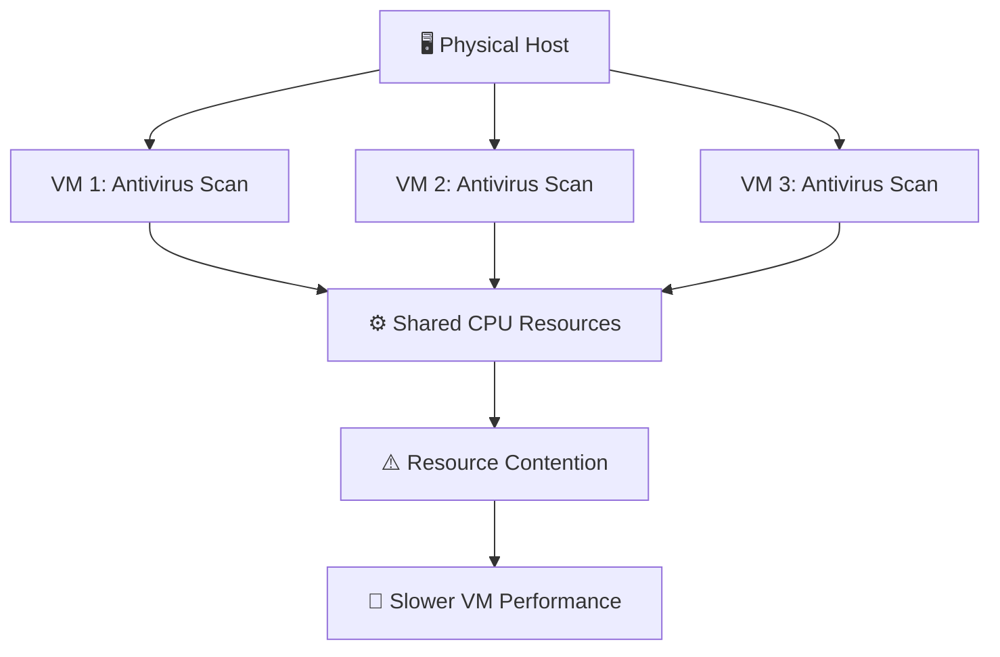
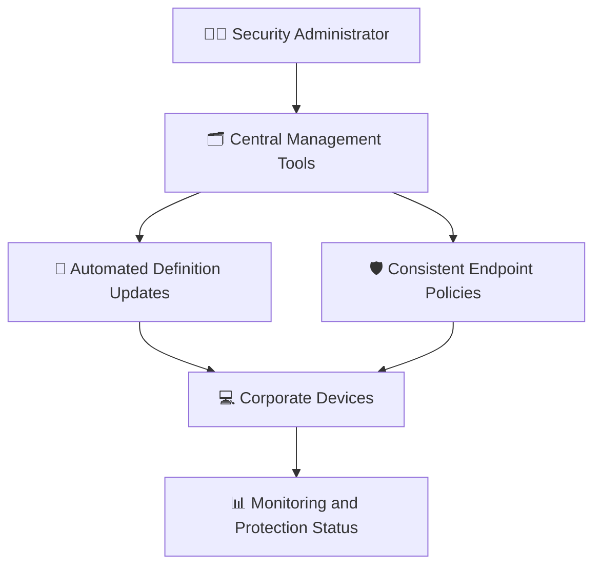
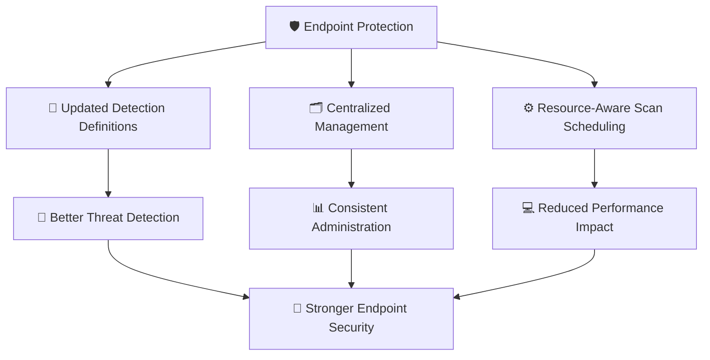

# 🧠 WATCHTOWER — Quiz 14: Antivirus / Anti-Malware / Anti-Spyware

> **Quiz 14** — Antivirus / Anti-Malware / Anti-Spyware

---

## 📋 Quiz Overview

| Field | Details |
|---|---|
| Topic | Antivirus, anti-malware, and anti-spyware |
| Questions | 2 |
| Difficulty | Beginner |
| Focus | Antivirus scan performance in virtualized environments and enterprise antivirus management |
| Security Domain | Endpoint protection |

---

## 🎯 Quiz Objective

> **Objective:** Understand how antivirus scans can affect shared host resources and identify important capabilities of corporate antivirus solutions.

---

## ❓ Question 1

### What potential issue can arise when running resource-intensive antivirus scans on multiple virtual machines sharing the same physical host?

- **A.** All virtual machines will work more efficiently due to shared resources.
- **B.** The physical host's CPU may become overwhelmed, slowing down all virtual machines.
- **C.** Antivirus scans are disabled in virtualized environments to prevent resource conflicts.

### ✅ Correct Answer

> **B. The physical host's CPU may become overwhelmed, slowing down all virtual machines.**

### 💡 Why?

Virtual machines share the physical host's CPU and other resources. When several resource-intensive antivirus scans run at the same time, they can compete for those resources and reduce performance across multiple virtual machines.

Administrators can reduce this risk by scheduling scans at different times, monitoring host utilization, and configuring scan policies to avoid unnecessary resource spikes.

### 🏰 Shared Host Resource Contention

---

## ❓ Question 2

### What critical factor should administrators consider when choosing an antivirus solution for corporate use?

- **A.** Automated virus definition updates and management tools
- **B.** Availability of free licensing for commercial use

### ✅ Correct Answer

> **A. Automated virus definition updates and management tools**

### 💡 Why?

Automated virus definition updates help endpoint protection recognize newly identified threats. Management tools allow administrators to monitor protection status, apply consistent policies, and manage antivirus deployments across the organization.

For corporate environments, centralized administration and timely updates are important for maintaining consistent protection across many devices.

### 🏰 Enterprise Antivirus Management

---

## 🧩 Concept Connection

Antivirus effectiveness depends on both protecting endpoints and managing that protection without unnecessarily disrupting system availability.

---

## 📚 Key Takeaways

1. **Shared resources:** Multiple virtual machines use the same physical host resources.
2. **Scan scheduling:** Simultaneous intensive scans can create CPU contention and slow down virtual machines.
3. **Automated updates:** Current virus definitions help antivirus tools identify known and newly documented threats.
4. **Management tools:** Centralized administration supports consistent configuration and monitoring across corporate endpoints.
5. **Security and availability:** Antivirus protection should be maintained while managing its performance impact on business systems.

---

## 📝 Quick Revision

| Concept | Remember |
|---|---|
| Virtualization | VMs share the physical host's CPU and other resources. |
| Antivirus scan contention | Concurrent intensive scans can slow multiple VMs. |
| Virus definition updates | Automated updates keep detection data current. |
| Corporate management | Management tools help administer and monitor protection across endpoints. |

---

**Repository:** `WATCHTOWER`  
**Quiz:** `Quiz 14`  
**Focus:** Antivirus / Anti-Malware / Anti-Spyware
