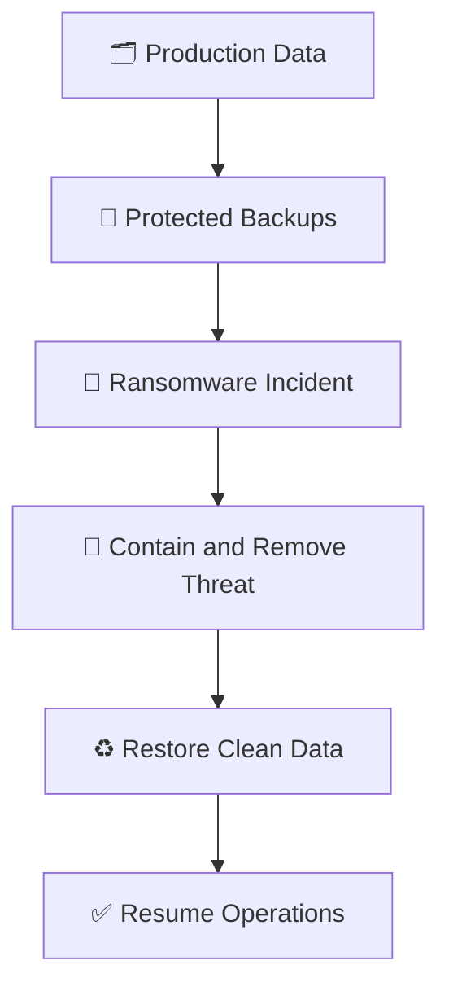
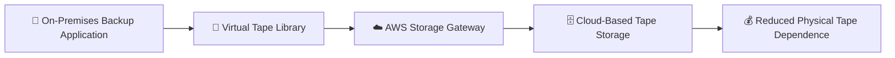
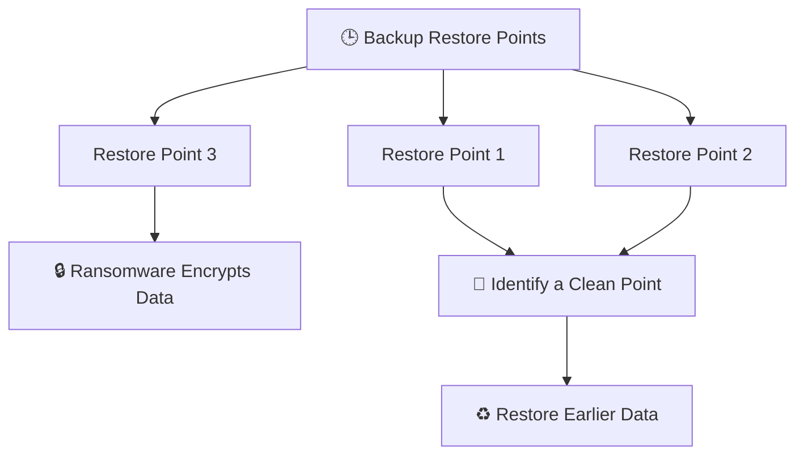
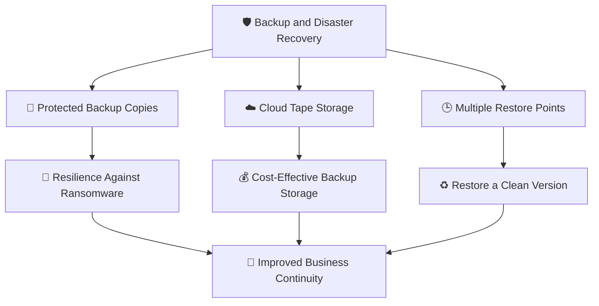

# 🧠 WATCHTOWER — Quiz 15: Backups and Disaster Recovery

> **Quiz 15** — Backups and Disaster Recovery

---

## 📋 Quiz Overview

| Field | Details |
|---|---|
| Topic | Backups and Disaster Recovery |
| Questions | 3 |
| Difficulty | Beginner |
| Focus | Ransomware resilience, cloud backup storage, and recovery points |
| Security Domain | Business continuity and disaster recovery |

---

## 🎯 Quiz Objective

> **Objective:** Understand how backups and disaster recovery help protect data from ransomware and support reliable recovery after a security incident.

---

## ❓ Question 1

### In the context of cybersecurity, why is understanding backups and disaster recovery important?

- **A.** To safeguard data against ransomware attacks
- **B.** To streamline cloud storage solutions
- **C.** To enhance the performance of virtual machines

### ✅ Correct Answer

> **A. To safeguard data against ransomware attacks**

### 💡 Why?

Ransomware can encrypt or make organizational data unavailable. Reliable backups provide copies of data that can be restored after an attack, helping reduce data loss and downtime. Backups should be protected from unauthorized modification or deletion and restoration should be tested regularly.

### 🏰 Backup and Recovery Flow

---

## ❓ Question 2

### What is the primary advantage of the AWS Storage Gateway's “Tape Gateway” feature?

- **A.** It offers immediate data recovery from on-premises backups.
- **B.** It provides a low-cost solution for storing backups in the cloud.
- **C.** It eliminates the need for a disaster recovery site.

### ✅ Correct Answer

> **B. It provides a low-cost solution for storing backups in the cloud.**

### 💡 Why?

AWS Storage Gateway Tape Gateway presents a virtual tape library to existing backup applications while storing virtual tapes durably in AWS. It allows organizations to use familiar tape-based backup workflows and move tape data to cloud storage, reducing reliance on physical tape infrastructure. It does not guarantee immediate recovery or remove every need for disaster recovery planning.

### 🏰 Tape Gateway Concept

---

## ❓ Question 3

### Why is it important to have multiple restore points with backup solutions, especially in the context of ransomware attacks?

- **A.** To improve data transfer speeds during recovery
- **B.** To ensure seamless integration with virtual machines
- **C.** To recover older versions of data in case of ransomware encryption

### ✅ Correct Answer

> **C. To recover older versions of data in case of ransomware encryption**

### 💡 Why?

Multiple restore points let an organization select a clean version of its data from before ransomware encrypted or corrupted it. If the latest backup already contains encrypted files, an earlier known-good recovery point may be needed. Retention policies, isolated or immutable backups, and regular restore testing help make recovery more dependable.

### 🏰 Choosing a Clean Restore Point

---

## 🧩 Concept Connection

Backups, cloud-based tape storage, and multiple restore points support different parts of a resilient recovery strategy.

---

## 📚 Key Takeaways

1. **Ransomware protection:** Reliable backups help restore data after ransomware incidents.
2. **Backup security:** Protect backup copies against unauthorized access, alteration, and deletion.
3. **AWS Tape Gateway:** Supports existing tape-based backup workflows using virtual tapes stored in AWS.
4. **Cloud storage:** Tape Gateway can reduce dependence on physical tape infrastructure and provide a cloud-based storage option.
5. **Multiple restore points:** Retained versions make it possible to recover data from before encryption or corruption.
6. **Restore testing:** Regularly test recovery procedures to verify that backups can be restored successfully.
7. **Disaster recovery planning:** Backups are one part of a broader plan for restoring systems and business operations.

---

## 📝 Quick Revision

| Concept | Remember |
|---|---|
| Backups and ransomware | Backups help restore data after an attack. |
| AWS Tape Gateway | Uses virtual tapes to support cloud-based tape backup workflows. |
| Multiple restore points | Help recover a clean version of data from before encryption. |
| Recovery readiness | Protect backups and test restores regularly. |

---

**Repository:** `WATCHTOWER`  
**Quiz:** `Quiz 15`  
**Focus:** Backups and Disaster Recovery
