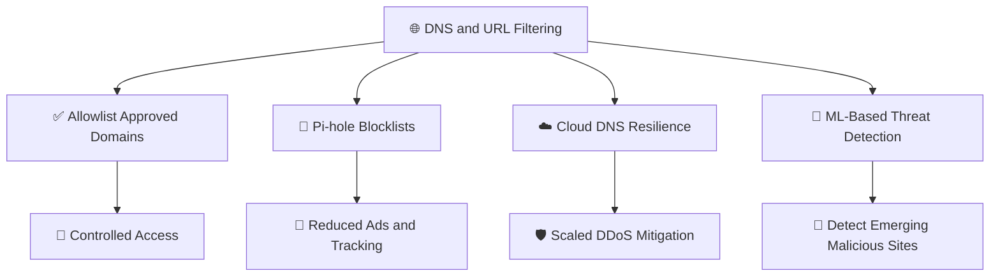

# 🧠 WATCHTOWER — Quiz 16: DNS and URL Filtering

> **Quiz 16** — DNS and URL Filtering

---

## 📋 Quiz Overview

| Field | Details |
|---|---|
| Topic | DNS and URL Filtering |
| Questions | 4 |
| Focus | Allowlisting, DNS filtering, DDoS resilience, and real-time threat detection |
| Security Domain | Network Security |

---

## 🎯 Quiz Objective

> **Objective:** Understand how DNS and URL filtering controls access to domains, blocks unwanted tracking, and helps protect services against malicious activity.

---

## ❓ Question 1

### In the context of DNS and URL filtering, what is the primary purpose of a white list approach?

- **A.** To block all known malicious domains
- **B.** To specify certain domains that should be reachable
- **C.** To block all categories of websites

### ✅ Correct Answer

> **B. To specify certain domains that should be reachable**

### 💡 Explanation

A **whitelist** (allowlist) explicitly identifies domains that users or systems are permitted to access. Depending on the policy, domains not on the approved list are denied by default. This can provide strong control in tightly managed environments, although the allowlist must be maintained as business needs change.

---

## ❓ Question 2

### What is the key benefit of using DNS Pi-hole as a filtering tool?

- **A.** It allows all DNS queries without filtering
- **B.** It detects DDoS attacks and prevents them at the DNS level
- **C.** It compares DNS queries to known malicious IP addresses
- **D.** It blocks advertising and tracking domains from DNS queries

### ✅ Correct Answer

> **D. It blocks advertising and tracking domains from DNS queries**

### 💡 Explanation

Pi-hole acts as a DNS sinkhole for domains on its blocklists. When a device requests a blocked advertising or tracking domain, Pi-hole can prevent the domain from resolving normally. This reduces many unwanted requests across devices that use it as their DNS resolver; it is not a general-purpose DDoS mitigation service.

---

## ❓ Question 3

### What is one advantage of using a cloud DNS service like AWS Route 53 to protect against DDoS attacks?

- **A.** It uses on-premises hardware for DDoS mitigation
- **B.** It blocks all DNS requests from external sources
- **C.** It can recognize and mitigate DDoS attack patterns at scale
- **D.** It prioritizes malicious DNS requests over legitimate ones

### ✅ Correct Answer

> **C. It can recognize and mitigate DDoS attack patterns at scale**

### 💡 Explanation

Cloud DNS services are built on distributed infrastructure and can help absorb and mitigate certain DNS-based and infrastructure-level attack patterns at scale. AWS Route 53 is integrated with AWS DDoS protection capabilities, including AWS Shield. Protection depends on the service configuration and the type of attack; it does not mean every attack is automatically prevented.

---

## ❓ Question 4

### Which approach is recommended for DNS and URL filtering to provide real-time protection from new malicious websites?

- **A.** White list approach
- **B.** Black list approach
- **C.** Machine learning-based filtering

### ✅ Correct Answer

> **C. Machine learning-based filtering**

### 💡 Explanation

Machine learning-based filtering can evaluate signals and patterns associated with domains and URLs to identify suspicious or newly emerging threats, including sites not yet present on known blocklists. It can complement allowlists and blocklists, though no single approach guarantees detection of every malicious website.

---

## 🧩 Concept Connection

---

## 📚 Key Takeaways

1. **Whitelist / allowlist:** Explicitly permits approved domains.
2. **Pi-hole:** Blocks advertising and tracking domains through DNS filtering.
3. **Cloud DNS:** Distributed services such as Route 53 can support DDoS resilience at scale.
4. **Machine learning filtering:** Can help identify new malicious websites beyond known lists.
5. **Layered protection:** Combine filtering policies, threat intelligence, monitoring, and DDoS defenses for stronger security.

---

## 📝 Quick Revision

| Concept | Remember |
|---|---|
| Whitelist approach | Specifies domains that should be reachable |
| Pi-hole | Blocks advertising and tracking domains from DNS queries |
| Route 53 and DDoS | Can help recognize and mitigate attack patterns at scale |
| Machine learning filtering | Helps identify emerging malicious websites |

---

**Repository:** `WATCHTOWER`  
**Quiz:** `Quiz 16`  
**Focus:** DNS and URL Filtering
