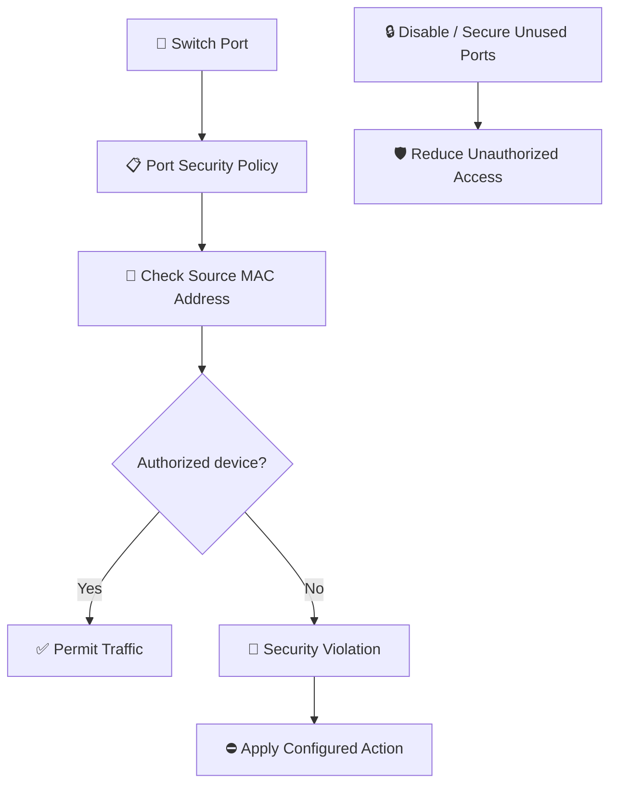

# 🛡️ WATCHTOWER — Quiz 17: Switch Port Security

> **Quiz 17** — Switch Port Security

---

## 📋 Quiz Overview

| Field | Details |
|---|---|
| Topic | Switch Port Security |
| Questions | 4 |
| Difficulty | Beginner–Intermediate |
| Focus | Physical port exposure, MAC address control, and unauthorized device prevention |
| Security Domain | Network Security |

---

## 🎯 Quiz Objective

> **Objective:** Understand how switch port security reduces unauthorized network access by controlling which devices can connect through switch ports.

---

# 🔌 Question 1

### Which security measure helps prevent unauthorized devices from connecting to a network through unused switch ports?

- [ ] To improve network performance
- [x] **To limit unauthorized physical access to network connections**
- [ ] To increase the number of available network connections

### ✅ Correct Answer

**To limit unauthorized physical access to network connections.**

### 💡 Why?

Unused network ports can provide an opportunity for someone to connect an unauthorized device. Disabling unused switch ports and physically securing network equipment reduces this exposure. Administrative controls and physical security work together to prevent unauthorized network access.

---

# 🔌 Question 2

### How can physically disconnecting unused Ethernet ports improve security?

- [x] **It prevents unauthorized access to the network**
- [ ] It boosts network speed and performance
- [ ] It simplifies patch panel management

### ✅ Correct Answer

**It prevents unauthorized access to the network.**

### 💡 Why?

An unused Ethernet connection can be exploited by someone who gains physical access to the port. Disconnecting or disabling unused ports reduces the opportunity to attach a rogue device and gain network connectivity.

---

# 🧷 Question 3

### What role does a device's MAC address play in port security?

- [ ] It determines the speed of the network connection
- [x] **It is used to build a table of authorized devices for each port**
- [ ] It helps troubleshoot network connectivity issues

### ✅ Correct Answer

**It is used to build a table of authorized devices for each port.**

### 💡 Why?

Switch port security can use permitted or learned MAC addresses to limit which devices may send traffic through a switch port. The switch compares the source MAC address of incoming frames against its configured port-security rules. MAC-based controls are useful, but MAC addresses can be spoofed, so they should not be treated as a complete authentication mechanism by themselves.

---

# 🚨 Question 4

### What happens when a rogue device with an unauthorized MAC address is connected to a port with port security enabled?

- [ ] The device is granted network access without restrictions
- [ ] The device is automatically added to the authorized device list
- [ ] The switch sends a warning message to the network administrator
- [x] **The port remains disabled until an administrator re-enables it**

### ✅ Correct Answer

**The port remains disabled until an administrator re-enables it.**

### 💡 Why?

With a port-security violation configured to use the **shutdown** action, the switch places the port into an error-disabled state when an unauthorized MAC address violates the policy. An administrator typically investigates the violation and restores the port. Exact behavior depends on the configured violation mode: other modes may restrict or drop traffic and/or generate alerts without disabling the port.

---

## 🧩 Concept Connection

---

## 📚 Key Takeaways

1. **Secure unused ports:** Disable or disconnect unused Ethernet ports to reduce opportunities for unauthorized connections.
2. **Port security:** Applies controls to devices connecting through switch interfaces.
3. **MAC address control:** Helps identify permitted devices on individual ports.
4. **Rogue device prevention:** Unauthorized MAC addresses can trigger a port-security violation.
5. **Violation modes matter:** A violation may shut down a port, restrict traffic, or drop violating traffic depending on configuration.
6. **Physical security is essential:** Protect switches, patch panels, and network closets from unauthorized access.
7. **Defense in depth:** Combine port security with 802.1X, network segmentation, monitoring, and physical controls where appropriate.

---

## 📝 Quick Revision

| Concept | Remember |
|---|---|
| Unused Ethernet ports | Disable, disconnect, or otherwise secure them |
| Switch port security | Controls which devices can use a switch port |
| MAC address | Used to identify devices against port-security rules |
| Unauthorized MAC address | Triggers a violation response |
| Shutdown violation mode | Can disable the port until it is recovered |
| Defense in depth | Combine switch controls with authentication and physical security |

---

**Repository:** `WATCHTOWER`  
**Quiz:** `Quiz 17`  
**Focus:** Switch Port Security
