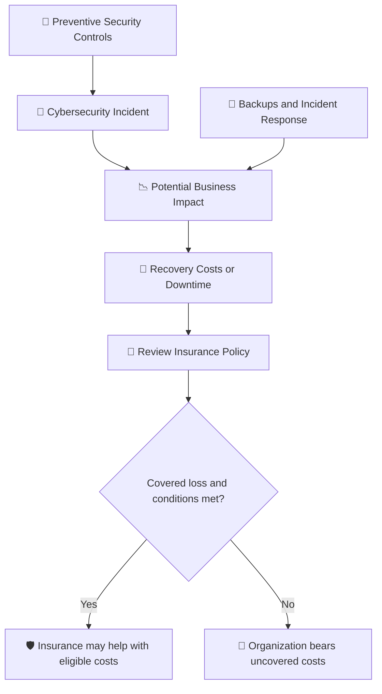

# 🛡️ WATCHTOWER — Quiz 18: Cyber Security Insurance

> **Quiz 18** — Cyber Security Insurance

---

## 📋 Quiz Overview

| Field | Details |
|---|---|
| Topic | Cyber Security Insurance |
| Questions | 5 |
| Difficulty | Beginner–Intermediate |
| Focus | Financial risk transfer, incident-related losses, and business continuity |
| Security Domain | Cyber Risk Management |

---

## 🎯 Quiz Objective

> **Objective:** Understand how cybersecurity insurance can help organizations manage the financial impact of cybersecurity incidents while complementing—not replacing—preventive security controls.

---

# 💼 Question 1

### What is the primary purpose of cybersecurity insurance?

- [ ] To provide funding for IT security projects
- [x] **To mitigate financial risks associated with cybersecurity incidents**
- [ ] To replace the need for cybersecurity measures
- [ ] To cover personal liabilities of employees

### ✅ Correct Answer

**To mitigate financial risks associated with cybersecurity incidents.**

### 💡 Why?

Cybersecurity insurance can help cover eligible costs and liabilities arising from covered incidents, subject to the policy's terms, exclusions, limits, and deductibles. It is a risk-transfer measure that can reduce the financial impact of an incident; it does not prevent attacks or replace security controls.

---

# 💼 Question 2

### Why might a business consider cybersecurity insurance to be a valuable investment?

- [ ] It guarantees prevention of all cyber attacks
- [ ] It provides free cybersecurity software
- [ ] It covers all operational costs of a business
- [x] **It can offer financial relief in the event of incidents like data loss or downtime due to cyber attacks**

### ✅ Correct Answer

**It can offer financial relief in the event of incidents like data loss or downtime due to cyber attacks.**

### 💡 Why?

A covered incident may lead to costs such as incident response, forensic investigation, recovery, legal support, notification, and business interruption. Cybersecurity insurance may help with eligible expenses under the policy, but coverage is not automatic and does not guarantee full reimbursement for every loss.

---

# 💼 Question 3

### How is the cost of cybersecurity insurance typically perceived?

- [ ] Prohibitively expensive
- [x] **Relatively inexpensive because it's rarely used**
- [ ] Fixed and non-negotiable
- [ ] Based on the number of employees

### ✅ Correct Answer

**Relatively inexpensive because it's rarely used.**

### 💡 Why?

In the context of this quiz, the intended answer reflects insurance as a financial safeguard that may be worthwhile relative to the potential cost of a major incident. In practice, premiums are not fixed: insurers assess factors such as organization size, industry, security posture, coverage limits, claims history, and policy terms. Cyber insurance costs can vary substantially.

---

# 💼 Question 4

### In which situation might cybersecurity insurance be particularly beneficial?

- [x] **During a distributed denial of service attack causing significant downtime**
- [ ] When a company decides to stop investing in cybersecurity defenses
- [ ] For covering the costs of office supplies
- [ ] When the company is expanding its physical office space

### ✅ Correct Answer

**During a distributed denial of service attack causing significant downtime.**

### 💡 Why?

A DDoS attack can disrupt access to business services and lead to interruption-related losses. If the event and resulting losses fall within the policy's coverage, cybersecurity insurance may help offset eligible financial impacts. Organizations should review policy wording and exclusions carefully and maintain technical DDoS protections and incident-response plans.

---

# 💼 Question 5

### What potential consequence of a cybersecurity incident can cybersecurity insurance help alleviate?

- [ ] The cost of hiring new IT staff
- [x] **Financial strain due to data loss or operational downtime**
- [ ] The need to develop new software
- [ ] The cost of office renovations

### ✅ Correct Answer

**Financial strain due to data loss or operational downtime.**

### 💡 Why?

Data loss and service outages can create recovery expenses, lost revenue, and other business costs. Depending on the policy, cybersecurity insurance may help with covered losses and recovery expenses. Reliable backups, tested disaster recovery, access controls, monitoring, and incident response remain essential.

---

## 🧩 Concept Connection

---

## 📚 Key Takeaways

1. **Financial risk transfer:** Cybersecurity insurance can reduce the financial impact of covered cyber incidents.
2. **Not prevention:** Insurance does not stop attacks and must not replace cybersecurity controls.
3. **Business interruption:** Eligible losses from incidents such as DDoS attacks may be covered, depending on policy terms.
4. **Policy conditions matter:** Limits, deductibles, exclusions, and required security practices affect coverage.
5. **Defense in depth:** Combine insurance with strong security controls, tested backups, disaster recovery, and incident response.

---

## 📝 Quick Revision

| Concept | Remember |
|---|---|
| Primary purpose | Mitigate financial risks from cybersecurity incidents |
| Business value | May provide financial relief for covered losses and downtime |
| Insurance cost | Varies according to risk profile and policy terms |
| DDoS incident | Coverage may help with eligible interruption-related losses |
| Data loss or downtime | Can create financial strain that eligible coverage may alleviate |
| Security strategy | Insurance complements, but never replaces, preventive controls |

---

**Repository:** `WATCHTOWER`  
**Quiz:** `Quiz 18`  
**Focus:** Cyber Security Insurance
