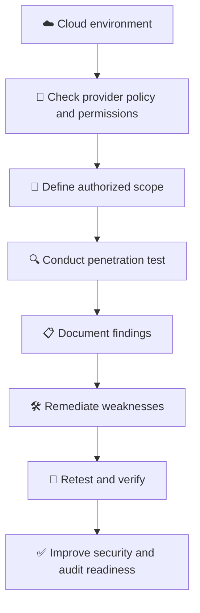

# 🛡️ WATCHTOWER — Quiz 19: Penetration Testing

> **Quiz 19** — Penetration Testing

---

## 📋 Quiz Overview

| Field | Details |
|---|---|
| Topic | Penetration Testing |
| Questions | 4 |
| Difficulty | Beginner–Intermediate |
| Focus | Vulnerability discovery, independent testing, compliance readiness, and cloud testing coordination |
| Security Domain | Security Assessment |

---

## 🎯 Quiz Objective

> **Objective:** Understand how authorized penetration testing helps identify security weaknesses, supports audit readiness, and must be planned carefully in cloud environments.

---

# 🔍 Question 1

### What is the primary objective of penetration testing?

- [x] **To uncover vulnerabilities and weaknesses in a network**
- [ ] To detect compliance audit failures
- [ ] To gain access to a trusted network

### ✅ Correct Answer

**To uncover vulnerabilities and weaknesses in a network.**

### 💡 Why?

Penetration testing simulates authorized attacks to discover and validate security weaknesses in systems, applications, and networks. Findings help an organization understand realistic attack paths and prioritize remediation. Testing must be authorized, scoped, and conducted safely.

---

# 🧪 Question 2

### Why is it advisable to use different penetration testing providers consistently?

- [ ] To confuse potential hackers
- [ ] To avoid the cost of hiring the same provider repeatedly
- [x] **To ensure all vulnerabilities are identified**

### ✅ Correct Answer

**To ensure all vulnerabilities are identified.**

### 💡 Why?

Different testers may use different techniques, tools, experience, and perspectives, so changing providers periodically can reveal issues that another team may have missed. However, no test can guarantee that every vulnerability will be found; recurring testing, remediation, and retesting are important.

---

# 📋 Question 3

### How can penetration testing benefit organizations preparing for compliance audits?

- [ ] By eliminating the need for audits altogether
- [x] **By identifying and addressing potential weaknesses before the audit**
- [ ] By enhancing the organization's reputation regardless of the audit results

### ✅ Correct Answer

**By identifying and addressing potential weaknesses before the audit.**

### 💡 Why?

Penetration testing can uncover technical weaknesses that an organization can remediate before an audit. Reports and retest evidence may support the security-assessment process, but penetration testing does not replace a formal compliance audit or guarantee compliance.

---

# ☁️ Question 4

### What should organizations consider when planning penetration testing in cloud environments?

- [ ] They should perform tests without coordination with the cloud provider for better results.
- [ ] They should avoid penetration testing in the cloud to maintain security.
- [x] **They should coordinate penetration testing with their cloud services provider due to potential gaps in cloud security.**

### ✅ Correct Answer

**They should coordinate penetration testing with their cloud services provider due to potential gaps in cloud security.**

### 💡 Why?

Cloud providers have rules and scope boundaries for security testing. Organizations should review the provider's current penetration-testing policy, confirm which services and activities are permitted, obtain any required approvals, and define a safe test scope. Responsibilities differ between the provider and customer under the shared responsibility model.

---

## 🧩 Concept Connection

---

## 📚 Key Takeaways

1. **Identify weaknesses:** Penetration testing evaluates whether vulnerabilities can be exploited within an authorized scope.
2. **Use fresh perspectives:** Different providers may uncover different issues, but no test guarantees discovery of every vulnerability.
3. **Prepare for audits:** Remediate findings before an audit; penetration testing does not replace formal compliance audits.
4. **Coordinate cloud tests:** Follow the cloud provider's current policies and confirm permitted scope and activities.
5. **Close the loop:** Document, prioritize, remediate, and retest findings.

---

## 📝 Quick Revision

| Concept | Remember |
|---|---|
| Primary objective | Uncover vulnerabilities and weaknesses |
| Different testing providers | Bring varied methods and perspectives |
| Compliance audits | Find and address weaknesses before the audit |
| Cloud penetration testing | Follow provider policies and coordinate the scope |
| After testing | Remediate findings and retest |

---

**Repository:** `WATCHTOWER`  
**Quiz:** `Quiz 19`  
**Focus:** Penetration Testing
