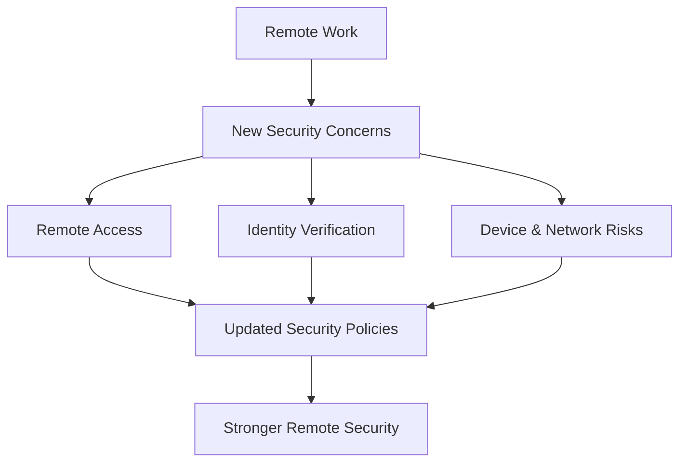

# 🧠 Quiz 4 — Remote Work & Cybersecurity

> **Course:** Introduction to Cybersecurity  
> **Quiz:** 4  
> **Topic:** Remote Work & Cybersecurity  
> **Total Questions:** 3

---

## 📝 Question 1

**How has the transition from office work to remote work due to a global pandemic affected cybersecurity?**

- ❌ It has made cybersecurity easier to manage.
- ❌ It has eliminated the need for cybersecurity.
- ✅ **It has introduced new security concerns.**
- ❌ It has not changed cybersecurity in any way.

### ✅ Correct Answer

**It has introduced new security concerns.**

### 💡 Explanation

Remote work expands the environment that organizations need to protect. Employees may access company resources from home networks, personal or less-controlled devices, and locations outside the traditional corporate perimeter, creating additional cybersecurity risks.

---

## 📝 Question 2

**What challenge does remote work pose when an employee, like Jane Doe, is locked out of their account?**

- ❌ There's no way to unlock the account remotely.
- ❌ The process is the same as if she were in the office.
- ✅ **Verifying the employee's identity becomes more difficult.**
- ❌ Remote workers cannot be locked out of their accounts.

### ✅ Correct Answer

**Verifying the employee's identity becomes more difficult.**

### 💡 Explanation

When an employee is working remotely, support staff cannot rely on face-to-face verification. The organization therefore needs appropriate identity-verification procedures before resetting credentials or restoring account access.

---

## 📝 Question 3

**What is a critical step that organizations must take in response to the increase in remote workers?**

- ❌ Eliminate all cybersecurity policies as they are no longer necessary.
- ✅ **Update security policies to include appropriate measures for remote workers and ensure their identity can be validated.**
- ❌ Ban remote work entirely to avoid security issues.

### ✅ Correct Answer

**Update security policies to include appropriate measures for remote workers and ensure their identity can be validated.**

### 💡 Explanation

Security policies need to reflect the risks introduced by remote work. Organizations should establish appropriate controls and procedures for remote access, identity verification, authentication, devices, and handling security incidents.

---

## 📊 Quiz Summary

| # | Topic | Correct Answer |
|---|---|---|
| 1 | Impact of remote work | **It has introduced new security concerns.** |
| 2 | Remote account lockout | **Verifying the employee's identity becomes more difficult.** |
| 3 | Remote-work security policies | **Update security policies to include appropriate measures for remote workers and ensure their identity can be validated.** |

---

## 🔐 Key Takeaways

- Remote work introduces **additional cybersecurity concerns**.
- Remote support requires reliable **identity verification**.
- Security policies should be updated for **remote-work scenarios**.
- Organizations should use appropriate **authentication and access controls**.
- Security procedures should account for employees working outside the traditional office environment.

---

---

> **Next:** Roleplay 2 — to be completed after Quiz 4.
