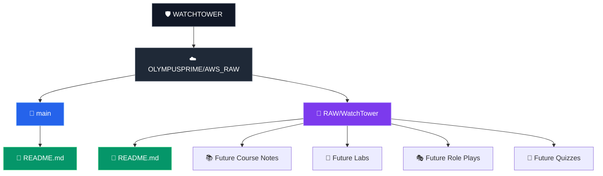
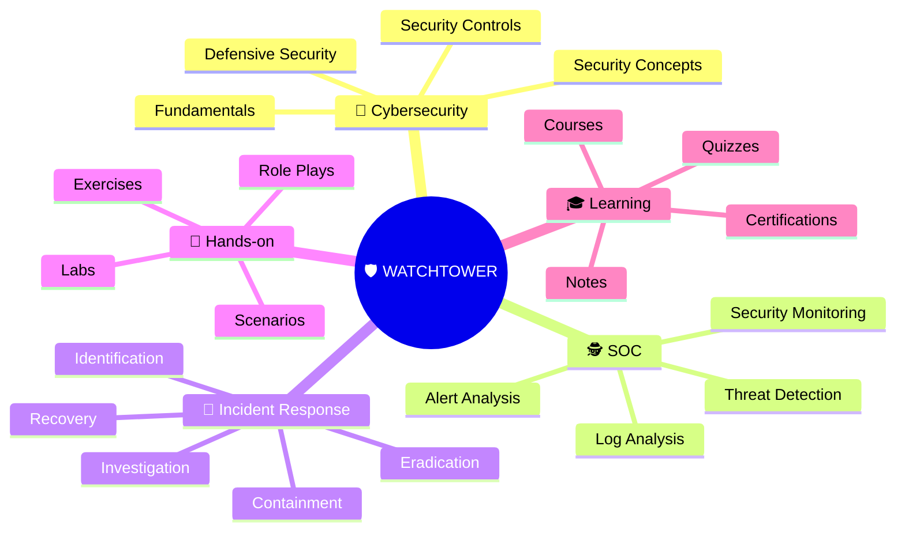
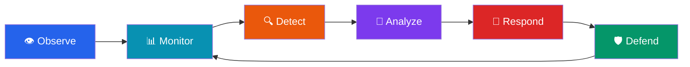

# 🛡️ WATCHTOWER

<p align="center">
  
  
  
  
</p>

<p align="center">
  <strong>🔐 Cybersecurity Learning & SOC Knowledge Hub</strong>
</p>

<p align="center">
  <em>Observe • Detect • Analyze • Respond • Defend</em>
</p>

---

## 🌐 About WATCHTOWER

**WATCHTOWER** is a cybersecurity learning and documentation project within the **PROMETHEUS-N** ecosystem.

The project focuses on developing practical knowledge across **cybersecurity fundamentals, Security Operations Center (SOC) concepts, security monitoring, threat detection, incident response, and defensive security practices**.

> 👁️ A watchtower provides visibility.  
> 🔍 Cybersecurity turns visibility into detection.  
> 🚨 Detection enables response.  
> 🛡️ Response strengthens defense.

---

## 🏷️ Project Badges

<p align="center">
  
  
  
  
  
  
</p>

---

## 🎯 Repository Objectives


---

## 📚 Current Course

### 🎓 Introduction to Cyber Security — 2 Hour Crash Course

<p align="center">
  
  
  
  
</p>

### 👨‍🏫 Instructor Resources

<p align="center">
  <a href="https://www.linkedin.com/in/rickcrisci">
    
  </a>
  <a href="https://www.trainertests.com/">
    
  </a>
  <a href="https://www.youtube.com/">
    
  </a>
</p>

> 📌 Instructor resources are provided as course references for further cybersecurity learning.

---

## 📊 Course Statistics

<p align="center">
  
  
  
  
  
</p>

---

## 🗂️ Repository Structure

The **main branch** is intended to remain clean, with the project landing page maintained through `README.md`.

### 🌳 Branch & File Architecture



### 📁 Current Branch Layout

```text
AWS_RAW/
│
├── 🌿 main
│   └── 📄 README.md
│
└── 🌿 RAW/WatchTower
    └── 📄 README.md
```

> 💡 The `RAW/WatchTower` branch currently serves as the working location for WATCHTOWER documentation. Additional cybersecurity learning material can be added there as the project develops.

---

## 🧭 Cybersecurity Learning Map



---

## 🔄 WATCHTOWER Security Workflow



---

## 🗺️ Project Roadmap

### 📚 Foundation

- [x] 🛡️ Create WATCHTOWER project
- [x] 📖 Add cybersecurity course information
- [x] 📊 Document course statistics
- [ ] 📝 Document course lessons
- [ ] 🧠 Complete knowledge checks

### 🧪 Practical Learning

- [ ] 🔬 Add hands-on cybersecurity labs
- [ ] 🎭 Document role-play scenarios
- [ ] 🔍 Practice threat detection
- [ ] 📊 Practice security monitoring
- [ ] 🚨 Practice incident-response scenarios

### 🏗️ SOC Knowledge Base

- [ ] 🕵️ SOC fundamentals
- [ ] 📋 Security event & alert analysis
- [ ] 📜 Log analysis
- [ ] 🔎 Threat intelligence fundamentals
- [ ] 🚨 Incident-response lifecycle
- [ ] 🛡️ Defensive security concepts

### 🎓 Certifications

- [ ] 📚 Identify relevant cybersecurity certifications
- [ ] 📝 Track certification preparation
- [ ] 🏆 Track completed certifications

---

## 📌 Project Principles

<p align="center">
  
  
  
  
  
  
</p>

---

## 🏢 Project Information

<p align="center">
  
  
  
  
  
  
</p>

---

## ⚠️ Educational Use

This repository is primarily a **personal learning and documentation project**.

Course materials remain the property of their respective instructors and platforms. The repository is intended for **original notes, documentation, learning exercises, and personal educational use**.

---

## 🛡️ WATCHTOWER Motto

<p align="center">

### 👁️ Observe
### 🔍 Detect
### 🧠 Analyze
### 🚨 Respond
### 🛡️ Defend

**Learn. Monitor. Detect. Respond. Defend.**

</p>

---

<p align="center">
  🛡️ <strong>WATCHTOWER</strong> • PROMETHEUS-N • Cybersecurity Learning
</p>
