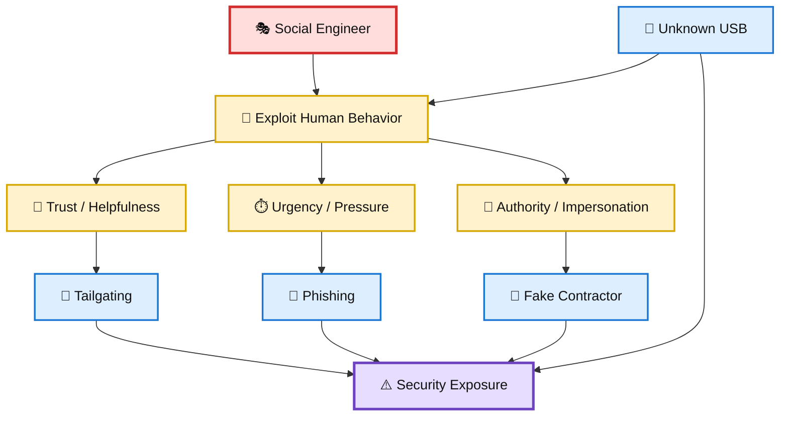
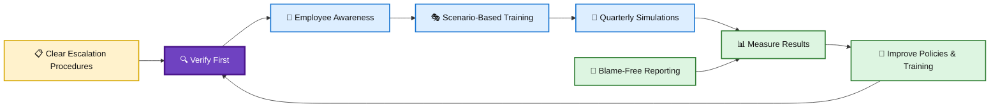

# 🎭 WATCHTOWER — Role Play 1: Social Engineering

> **Role Play 1** — Social Engineering  
> **Role:** Venkat Nishit — Security Awareness Lead  
> **Consultant:** Jennifer — Cybersecurity Consultant

---

## 📋 Scenario

You are a **Security Awareness Lead at a growing company**.

Recent incidents include:

- 🚪 An unknown person **tailgated into the building**.
- 🏢 A fake contractor **accessed a network closet**.
- 💾 Employees **plugged in unknown USB devices**.
- 🎣 Multiple managers **clicked on phishing emails**.

Leadership has asked you to evaluate the company's **human security risks** and strengthen its defenses.

Jennifer, an experienced cybersecurity consultant specializing in social engineering and human risk, guides the discussion.

Her core objective is to help the organization move from **"trust first"** to **"verify first."**

---

## 🎯 Role Play Goals

1. Identify common social engineering tactics such as **tailgating, impersonation, phishing, and baiting**.
2. Explain how human behaviors such as **helpfulness and urgency** create security risk.
3. Evaluate **physical and digital vulnerabilities** within an organization.
4. Recommend practical mitigation strategies, including **policy and training improvements**.
5. Develop approaches to build a **culture of verification without creating hostility**.

---

# 🎬 Role Play Conversation

## 👩‍💼 Jennifer — Cybersecurity Consultant

> Hi Venkat. Thanks for taking the time to work through this with me.
>
> You've already identified several incidents involving both physical and digital access. What's interesting is that none of these incidents necessarily required an attacker to exploit a sophisticated technical vulnerability.
>
> **Let's start with the basics. Looking at the four incidents — tailgating, the fake contractor entering the network closet, unknown USB devices, and managers clicking phishing emails — what do you see as the common human weakness connecting these incidents?**

<h3>👨‍💻 Venkat Nishit — Security Awareness Lead</h3>

The common weakness is <strong>human trust and a lack of verification</strong>. Employees may trust people who appear legitimate, especially when they seem to have authority, a contractor badge, or an urgent reason for needing access.

Social engineering exploits behaviors such as helpfulness, politeness, urgency, and the assumption that someone else has already verified the request.

We need to encourage employees to <strong>verify before granting access, sharing information, opening links, or connecting unknown devices</strong>.

---
## 👩‍💼 Jennifer

> If I showed up tomorrow wearing a contractor badge and carrying a clipboard, do you think anyone in your building would challenge me?

<h3>👨‍💻 Venkat Nishit</h3>

I would expect the employee to politely challenge the person and verify their authorization before allowing them access. They shouldn't assume someone is legitimate just because they have a contractor badge or appear to be in a hurry.

The employee could ask for identification, verify the person's authorization with reception or the relevant team, and follow the company's visitor-access procedure.

The goal isn't to confront or accuse anyone, but to move from a <strong>"trust first" approach to a "verify first" culture</strong>.

---
### 👩‍💼 Jennifer

> Exactly, you've nailed it. Building that "verify first" culture is key, but the reality is, social engineers exploit politeness and hesitation. Employees often avoid questioning someone for fear of seeming impolite or confrontational.
>
> **What do you think might help your team feel more comfortable challenging individuals in these situations?**

<h3>👨‍💻 Venkat Nishit</h3>

I would make it clear that employees are expected to challenge suspicious situations and that this is supported by management.

We can provide simple scripts for politely questioning someone, regular awareness training, and clear procedures for verifying visitors and contractors.

We should also reinforce that employees will not be penalized for raising a genuine security concern. This can help create a culture where verification is normal rather than confrontational.

---
## 👩‍💼 Jennifer

> You're absolutely on the right track. Empowering employees with scripts and clear procedures is a huge step. And making sure they know management has their back? That's critical.
>
> Out of curiosity, how would you handle a scenario where someone resists being challenged or tries to pressure the employee into letting them through?

<h3>👨‍💻 Venkat Nishit</h3>

I would instruct the employee to remain calm and not allow the person through without proper verification.

They should politely explain that access requires authorization and contact security, reception, or the appropriate manager to verify the person's identity and purpose.

If the person continues to pressure or intimidate them, the employee should disengage, report the incident, and follow the company's escalation procedure.

---
### 👩‍💼 Jennifer

> That's a solid approach. Staying calm and sticking to procedure is really important in these situations. And having escalation steps ensures employees know exactly what to do if things escalate.
>
> **Do you think your current training or policies are specific enough to prepare employees for this type of scenario, or is there room for improvement?**

<h3>👨‍💻 Venkat Nishit</h3>

I would say that there is room for improvement. While our current training covers general security awareness, we should make it more scenario-based and practical.

I would introduce regular simulations for <strong>tailgating, impersonation, phishing, and suspicious devices</strong>, along with clear procedures for verification and escalation.

This would help employees build confidence in handling real-world social engineering attempts.

---
## 👩‍💼 Jennifer

> That's a fantastic idea! Scenario-based training and simulations make a huge difference because they let people practice in a safe environment.
>
> Tailoring these to real-world risks your team might face is even better.
>
> **How often are you thinking of running these simulations?**

<h3>👨‍💻 Venkat Nishit</h3>

I would run these simulations <strong>quarterly</strong>, with additional targeted exercises when a new threat or incident emerges.

This gives employees regular practice without creating training fatigue.

I would also rotate the scenarios so we cover <strong>phishing, tailgating, impersonation, and baiting</strong>, and use the results to improve our training and policies.

---
### 👩‍💼 Jennifer

> Quarterly simulations are a great balance—frequent enough to stay sharp, but not overwhelming. Rotating scenarios keeps things fresh and covers all the bases.
>
> Plus, using results to fine-tune training? That's a smart feedback loop.
>
> It sounds like you're building a really strong foundation here.
>
> **Is there anything else you'd like to discuss to strengthen your security culture further?**

<h3>👨‍💻 Venkat Nishit</h3>

I would also strengthen our security culture by introducing a simple <strong>"verify first" policy</strong>, regular security awareness reminders, and an easy way for employees to report suspicious activity without fear of blame.

I'd track recurring issues from simulations and real incidents, then use those findings to continuously improve our policies and training.

---
### 👩‍💼 Jennifer

> That's a great strategy! A "verify first" policy paired with ongoing reminders really normalizes secure behavior.
>
> And creating a blame-free reporting process? That's key to encouraging vigilance and participation.
>
> Tracking issues and refining based on real data is just icing on the cake. It sounds like you've got a solid plan to turn your team into a strong security-aware culture.
>
> **Anything else you'd like to cover, or are we in a good place to wrap up?**

<h3>👨‍💻 Venkat Nishit</h3>

We're in a good place to wrap up. I'd summarize the key actions as:

<ul>
<li>Establish a <strong>"verify first" culture</strong>.</li>
<li>Provide <strong>scenario-based training</strong>.</li>
<li>Run <strong>quarterly simulations</strong>.</li>
<li>Maintain clear <strong>verification and escalation procedures</strong>.</li>
<li>Encourage <strong>blame-free reporting</strong>.</li>
<li>Use simulation and incident data to <strong>continuously improve</strong> the security awareness program.</li>
</ul>

---
# 🧩 Social Engineering Risk Flow

---

# 🛡️ Recommended Defense Model

---

# 📚 Key Lessons

| Area | Lesson |
|---|---|
| 👥 Human Risk | Attackers frequently exploit trust, helpfulness, urgency, and authority. |
| 🚪 Physical Security | Employees should verify unfamiliar individuals instead of assuming legitimacy. |
| 💻 Digital Security | Suspicious emails and unknown devices should be treated cautiously. |
| 🎭 Awareness | Scenario-based training makes security behavior practical and memorable. |
| 🔎 Verification | A "verify first" culture reduces reliance on assumptions. |
| 🚨 Escalation | Employees need simple, clearly defined escalation procedures. |
| 🧪 Simulations | Quarterly simulations provide recurring practice without excessive training fatigue. |
| 📊 Continuous Improvement | Simulation and incident results should feed back into policies and training. |
| 🤝 Culture | Blame-free reporting encourages employees to raise concerns early. |

---

## 📝 Quick Revision

> **TRUST → QUESTION → VERIFY → ESCALATE → IMPROVE**

- 🤝 Don't automatically trust unfamiliar people or requests.
- 🔎 Verify identity and authorization.
- 🛡️ Follow established security procedures.
- 🚨 Escalate pressure, intimidation, or suspicious behavior.
- 🧪 Practice through realistic simulations.
- 📊 Learn from incidents and continuously improve.
