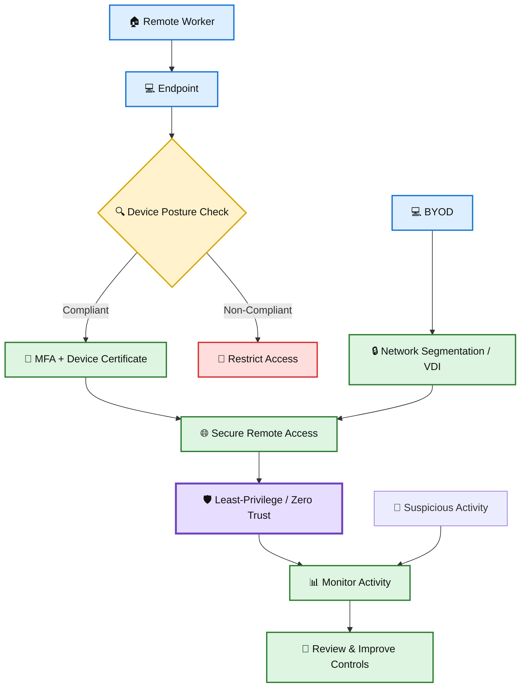

# 🎭 WATCHTOWER — Role Play 2: Remote Workers and VPNs

> **Role Play 2** — Remote Workers and VPNs  
> **Role:** Venkat Nishit — Security Awareness Lead  
> **Security Architect:** Jennifer

---

## 📋 Scenario

Your company shifted to mostly remote work.

Security leadership is concerned about:

- 🔐 Help desk password reset validation
- 💻 Employees using personal devices
- 🌐 VPN exposure to compromised home computers
- 🏠 Lack of physical security controls at home

You are tasked with reviewing and strengthening the **remote work security policy**.

Jennifer will challenge your assumptions about **VPNs and remote access safety**.

---

## 🎯 Role Play Goals

1. Identify security gaps introduced by remote work environments.
2. Explain the risks of **Layer 2 VPN access from unmanaged devices**.
3. Compare **BYOD vs. company-managed devices**.
4. Evaluate **Virtual Desktop Infrastructure (VDI)** as a mitigation strategy.
5. Recommend stronger identity verification methods for remote help desk requests.

---

# 🎬 Role Play Conversation

### 👩‍💼 Jennifer — Security Architect

> If an employee connects their personal, virus-infected home computer to your Layer 2 VPN, what have you just done to your internal network?

### 👨‍💻 Venkat Nishit — Security Awareness Lead

> By allowing a virus-infected personal device to connect through a Layer 2 VPN, we may have effectively extended our internal network to a compromised endpoint. That could allow malware to move laterally across the network, access internal resources, or compromise other systems.
>
> So, a VPN connection by itself doesn't make the device trustworthy—we need to **validate the device's security posture and identity before granting network access**.

---

### 👩‍💼 Jennifer — Security Architect

> Exactly! A VPN might be like a locked gate, but if the device you're letting in is carrying a problem, you've just invited it inside. So, what controls do you think could help validate a device's security posture before it connects?

### 👨‍💻 Venkat Nishit — Security Awareness Lead

> I would use device posture checks such as endpoint detection and response (EDR), up-to-date antivirus and patches, disk encryption, and firewall status. I'd also use device certificates and MFA to verify both the device and the user.
>
> For unmanaged or BYOD devices, I'd consider network segmentation or VDI so they have limited access to internal resources.

---

### 👩‍💼 Jennifer — Security Architect

> That's a really solid approach! Device posture checks combined with MFA and certificates can build a strong verification layer. And yeah, segmenting the network or using VDI is brilliant for limiting exposure from unmanaged devices.
>
> Do you think your current policies are robust enough to enforce these measures effectively?

### 👨‍💻 Venkat Nishit — Security Awareness Lead

> Our current policies provide a good foundation, but I'd strengthen them with mandatory device compliance checks, MFA, clear BYOD requirements, and defined access restrictions.
>
> We should also regularly review and test these controls to make sure they are actually being enforced, rather than relying only on policy documentation.

---

### 👩‍💼 Jennifer — Security Architect

> Absolutely, regular testing is key! Policies are only as strong as their enforcement. BYOD requirements and mandatory compliance checks will really tighten things up.
>
> How are you planning to handle resistance from employees who might see these measures as intrusive or inconvenient?

### 👨‍💻 Venkat Nishit — Security Awareness Lead

> I'd handle the resistance by explaining the security reasons and clearly communicating what data is collected and why. I'd also provide alternatives, such as company-managed devices or VDI, where possible.
>
> The goal would be to balance security with usability and involve employees in the process so the controls feel practical rather than intrusive.

---

### 👩‍💼 Jennifer — Security Architect

> Spot on! Transparency and offering alternatives can really ease pushback. When employees feel included and understand the "why," they're way more likely to cooperate.
>
> Sounds like you're on the right track! Anything else on your mind about tightening remote access security?

### 👨‍💻 Venkat Nishit — Security Awareness Lead

> I'd also strengthen remote access with a **Zero Trust approach**, enforcing least-privilege access and continuous authentication.
>
> I'd review VPN access regularly, monitor for unusual activity, and provide ongoing security awareness training so employees understand the risks of remote work.

---

### 👩‍💼 Jennifer — Security Architect

> That's awesome! Zero Trust is like the ultimate remote work safeguard—continuous authentication and least-privilege access are game-changers. And security awareness training? Absolutely critical.
>
> You've got a really well-rounded plan here. I think your remote work security policy is shaping up to be rock solid!

### 👨‍💻 Venkat Nishit — Security Awareness Lead

> Ok thank you

---

### 👩‍💼 Jennifer — Security Architect

> You're welcome! It was great discussing this with you. Best of luck strengthening your remote work security policy—you're on the right path. Take care!

---

# 🧩 Remote Work Security Flow

---

# 🛡️ Key Security Controls

| Area | Recommended Control |
|---|---|
| 💻 Device Security | EDR, antivirus, patching, firewall, disk encryption |
| 🔐 Identity | MFA and device certificates |
| 🌐 Remote Access | Zero Trust and least-privilege access |
| 🧩 BYOD | Network segmentation or VDI |
| 📊 Monitoring | Review VPN access and monitor unusual activity |
| 📋 Policy | Mandatory compliance checks and clear BYOD requirements |
| 👥 User Adoption | Explain security requirements and provide practical alternatives |
| 🧪 Assurance | Regularly test and review enforcement |

---

## 📝 Quick Revision

> **VERIFY → COMPLY → AUTHENTICATE → LIMIT → MONITOR → IMPROVE**

- 🔍 **Verify** the device and user's identity.
- ✅ **Check compliance** before granting access.
- 🔐 **Authenticate** continuously with strong controls.
- 🛡️ **Limit access** using least privilege and segmentation.
- 📊 **Monitor** remote activity for suspicious behavior.
- 🔄 **Improve** policies and controls through regular testing.
