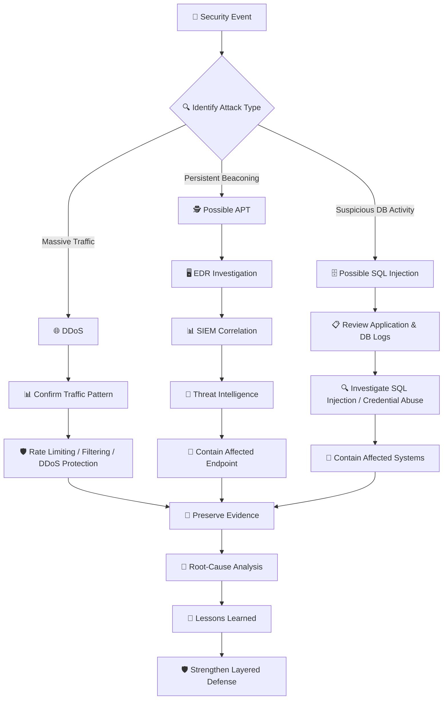

# 🎭 WATCHTOWER — Role Play 3: Common Attack Types

> **Role Play 3** — Common Attack Types  
> **Role:** Venkat Nishit — Security Operations Manager  
> **Incident Response Strategist:** Jennifer

---

## 📋 Scenario

You are the **Security Operations Manager** at a mid-sized company.

In the past 48 hours:

- 🌐 Your public website went offline due to massive traffic spikes.
- 🔎 Network monitoring detected an unknown device beaconing outbound at 3 a.m.
- 🗄️ A developer reported suspicious database behavior on a customer portal.

Leadership wants answers.

Jennifer will walk you through identifying what type of attack you may be facing and how to respond strategically.

---

## 🎯 Role Play Goals

1. Differentiate between **DDoS, Advanced Persistent Threat (APT), and SQL Injection** attacks.
2. Explain the objective and impact of each attack type.
3. Identify early warning signs of long-term network compromise.
4. Recommend immediate containment and mitigation strategies.
5. Develop layered defense strategies to reduce future risk.

---

# 🎬 Role Play Conversation

### 👩‍💼 Jennifer — Incident Response Strategist

> If your website suddenly receives 50 times its normal traffic and becomes unavailable, is that a success problem — or an attack?

### 👨‍💻 Venkat Nishit — Security Operations Manager

> A sudden increase followed by service unavailability strongly suggests a **DDoS attack**. I would first confirm the traffic pattern using monitoring and logs, then apply mitigation such as rate limiting, traffic filtering, and DDoS protection while keeping the service available.

---

### 👩‍💼 Jennifer — Incident Response Strategist

> Absolutely spot on! A sudden surge like that does scream **DDoS — Distributed Denial of Service**. The aim is to flood the website with so much traffic that legitimate users can't access it.
>
> Your approach of confirming the pattern through monitoring is key because it helps differentiate between an attack and legitimate high traffic. Rate limiting and traffic filtering are great immediate steps. You could also consider engaging a DDoS mitigation service for added support.
>
> What would you prioritize next after initial containment?

### 👨‍💻 Venkat Nishit — Security Operations Manager

> After initial containment, I would prioritize **root-cause analysis and evidence preservation**. I would review traffic sources, affected systems, logs, and indicators of compromise to determine whether the DDoS was isolated or potentially a distraction for something more sophisticated.
>
> I would also strengthen monitoring and update the incident response plan based on the lessons learned.

---

### 👩‍💼 Jennifer — Incident Response Strategist

> That's a really solid plan! Root-cause analysis is crucial not just for understanding the attack but also for spotting any hidden threats, like whether the DDoS was a distraction for something sneakier. Preserving evidence ensures you've got the data for forensics or even legal action later. Strengthening monitoring and tweaking your response plan based on lessons learned is exactly how you turn a crisis into a long-term win.
>
> Are there any specific tools or techniques you'd like to explore for these steps?

### 👨‍💻 Venkat Nishit — Security Operations Manager

> I would use **SIEM and EDR** tools to centralize and correlate security data. I would also use network-flow analysis to identify unusual traffic, secure logs and keep timestamps synchronized for forensic integrity, and leverage threat-intelligence feeds to identify known malicious IPs or indicators.
>
> I would also continuously improve our detection rules based on the incident.

---

### 👩‍💼 Jennifer — Incident Response Strategist

> You're absolutely nailing it! SIEM and EDR tools are fantastic for centralizing and correlating data, making it easier to spot patterns across your environment. Network-flow analysis is a sharp move for pinpointing unusual traffic, especially in DDoS scenarios. Securing logs and keeping timestamps synchronized? That's an investigator's dream, ensuring integrity for forensics. And leveraging threat-intelligence feeds keeps you ahead of the curve by identifying and blocking known threats proactively.
>
> How do you feel about applying these strategies to the other incidents, like the outbound beaconing or suspicious database activity?

### 👨‍💻 Venkat Nishit — Security Operations Manager

> For the unknown outbound beaconing device, I would investigate the endpoint with **EDR** and tie it to **SIEM** data to pinpoint what is happening and what is behind it. I would check threat intelligence for the destination and determine whether it is communicating with known malicious infrastructure.
>
> For the suspicious database activity, I would dive into application and database logs and verify whether the activity could indicate **SQL injection** or abuse of credentials.
>
> I would contain affected systems where necessary while preserving evidence for the investigation.

---

### 👩‍💼 Jennifer — Incident Response Strategist

> That's a fantastic application of your strategies! Investigating the beaconing device with EDR and tying it to SIEM data is a great way to pinpoint what's going on and who or what is behind it. Checking threat intelligence for the destination could reveal if it's communicating with known malicious infrastructure. For the database, diving into logs and verifying the activity is exactly what's needed to confirm whether it's someone exploiting a vulnerability like SQL injection or abusing credentials. Your focus on containment while preserving evidence is spot-on.
>
> How do you feel your team's preparedness stacks up against handling these types of incidents?

### 👨‍💻 Venkat Nishit — Security Operations Manager

> Our team has a solid foundation, but we should continuously improve our preparedness through **regular incident-response exercises and simulations**.
>
> We should review and refine playbooks, make sure responsibilities are clear, measure response times, and document lessons learned after every exercise or real incident.

---

### 👩‍💼 Jennifer — Incident Response Strategist

> That's an outstanding mindset! Regular exercises and simulations really keep your team sharp and ready for anything. Reviewing and refining playbooks ensures everyone's clear on their roles, and measuring response times is such a practical way to track progress and identify gaps. Learning from each exercise builds that muscle memory, so when a real incident hits, your team responds like clockwork.
>
> You're clearly on the right track — anything else you're considering to further bolster your defenses?

### 👨‍💻 Venkat Nishit — Security Operations Manager

> I would further strengthen our defenses through **continuous monitoring, threat intelligence, vulnerability management, patching, least-privilege access, network segmentation, and tested backups**.
>
> I would also use regular tabletop exercises and incident-response simulations to validate our playbooks and improve response capabilities.

---

### 👩‍💼 Jennifer — Incident Response Strategist

> That's a really strong plan! Layering continuous monitoring, threat intelligence, vulnerability management, patching, least privilege, segmentation, and tested backups gives you defense in depth.
>
> Combining those controls with regular exercises means the team can continuously improve rather than only reacting when an incident occurs.

### 👨‍💻 Venkat Nishit — Security Operations Manager

> Agreed. The goal is to detect incidents early, contain them quickly, preserve evidence, recover safely, and use every incident as an opportunity to improve our security posture.

---

### 👩‍💼 Jennifer — Incident Response Strategist

> Exactly. You've connected the attack identification, incident response, investigation, containment, and long-term defensive strategy very well. Great work!

---

# 🧩 Common Attack Response Flow

---

# 🛡️ Key Security Controls

| Area | Recommended Control |
|---|---|
| 🌐 Availability | DDoS protection, rate limiting, traffic filtering |
| 🖥️ Endpoint | EDR and endpoint monitoring |
| 📊 Detection | SIEM, network-flow analysis, centralized logging |
| 🔎 Intelligence | Threat-intelligence feeds and IOC monitoring |
| 🗄️ Application | Secure coding, input validation, parameterized queries |
| 🔐 Identity | MFA, least privilege, credential monitoring |
| 🧱 Network | Segmentation and controlled communication paths |
| 📋 Response | Incident-response playbooks and escalation procedures |
| 🧾 Forensics | Evidence preservation and synchronized timestamps |
| 🧪 Assurance | Tabletop exercises, simulations, and response-time metrics |

---

## 📝 Quick Revision

> **DDoS → AVAILABILITY**  
> **APT → PERSISTENCE**  
> **SQL INJECTION → DATABASE MANIPULATION**

- 🌐 **DDoS:** Floods a service to make it unavailable.
- 🕵️ **APT:** Maintains long-term unauthorized access.
- 🗄️ **SQL Injection:** Exploits database-backed applications to read or alter data.
- 📊 **SIEM:** Correlates security events across the environment.
- 🖥️ **EDR:** Investigates and responds to endpoint activity.
- 🔎 **Threat Intelligence:** Helps identify known malicious infrastructure.
- 🧾 **Evidence Preservation:** Supports forensic investigation.
- 🔄 **Lessons Learned:** Improves future incident response.

