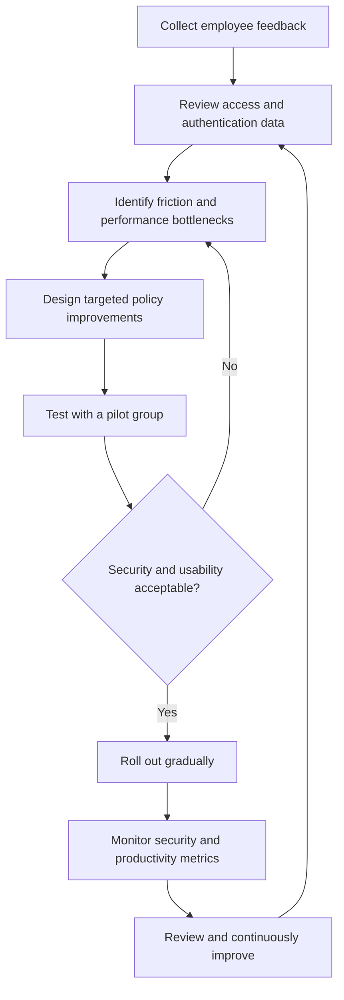

# 🎭 WATCHTOWER — Role Play 10: Are We Becoming Too Paranoid?

> **Role Play 10** — Are We Becoming Too Paranoid?  \
> **Role:** Venkat Nishit — IT Advisor  \
> **Executive:** Erika — CEO

---

## 📋 Scenario

Over the past six months, the security team has strengthened the company’s security posture by:

- 🔐 Implementing Multi-Factor Authentication (MFA).
- 🧱 Tightening firewall rules between servers.
- 👤 Reducing user permissions according to least privilege.
- 📊 Increasing security monitoring and logging.
- 🚨 Automating the isolation of suspicious systems.

Employees are now complaining:

- “Why do I have to authenticate again?”
- “Why can’t I access this system anymore?”
- “Why is everything slower?”

The CEO, Erika, calls you in as the IT Advisor. She supports security, but is concerned that the new controls may be frustrating employees, slowing workflows, and affecting productivity. Your task is to explain why the controls matter and propose ways to make them more effective and less disruptive without weakening essential protection.

---

## 👥 Roles

### 👩‍💼 Erika — CEO

Erika is focused on productivity, employee experience, and business continuity. She is concerned about employee frustration and business slowdowns, and supports security—but not at any cost. Her central question is: **“Are we overdoing this?”**

### 👨‍💻 Venkat Nishit — IT Advisor

Venkat explains the business value of security controls, connects technical safeguards to business risks, and recommends measurable improvements that balance protection with usability.

---

## 🎯 Role Play Goals

1. Clearly explain the principles of **Zero Trust**.
2. Justify **MFA and identity verification** in business terms.
3. Explain **least privilege** and how it limits risk.
4. Describe how **microsegmentation** helps contain compromised systems.
5. Explain **automated monitoring and response**.
6. Recommend practical improvements to reduce friction without removing necessary safeguards.
7. Define metrics to evaluate both security effectiveness and employee productivity.

---

# 🎬 Role Play Conversation

### 👩‍💼 Erika — CEO

> I’m getting complaints that our new security measures are slowing everyone down. Are we going too far?

### 👨‍💻 Venkat Nishit — IT Advisor

> I understand the concern, Erika. Security controls should protect the business without creating unnecessary friction. The measures we introduced address real risks: stolen passwords, excessive access, lateral movement between systems, and threats that go unnoticed. The goal is not to add obstacles for employees; it is to reduce the chance that one compromised account or device turns into a major incident.
>
> We should review where the friction is occurring, distinguish essential security checks from unnecessary prompts, and improve the employee experience while keeping risk-based protections in place.

---

### 👩‍💼 Erika — CEO

> I appreciate the explanation, but aren’t our employees trustworthy? Why do we need to keep verifying them?

### 👨‍💻 Venkat Nishit — IT Advisor

> Trust is important, but Zero Trust means we do not grant access solely because someone is inside the company network or has authenticated once. We verify identity and evaluate access based on context, device health, requested resource, and risk.
>
> MFA helps protect accounts even if a password is stolen. We can make verification less disruptive by using approved single sign-on, trusted-device signals, and risk-based authentication where appropriate. High-risk activity should trigger stronger verification, while routine low-risk activity should remain as seamless as our policies allow.

---

### 👩‍💼 Erika — CEO

> Some employees say they can no longer access systems they used before. Doesn’t restricting their permissions make it harder for them to do their jobs?

### 👨‍💻 Venkat Nishit — IT Advisor

> Least privilege means each employee receives only the access needed for their role—not unrestricted access to every system. This reduces accidental changes, misuse of privileges, and the damage an attacker can cause if an account is compromised.
>
> We should review access-denial reports with department owners, confirm legitimate business requirements, and create a clear, timely approval process for additional access. Permissions should be role-based, documented, and reviewed regularly. The answer is to correct inappropriate restrictions quickly, not to give everyone broad access by default.

---

### 👩‍💼 Erika — CEO

> We’ve also tightened firewall rules between servers. If one system is compromised, how much difference does that really make?

### 👨‍💻 Venkat Nishit — IT Advisor

> It can make a significant difference. Network segmentation and microsegmentation limit which systems can communicate with one another. If an attacker compromises one workload, carefully designed rules can prevent unnecessary connections to other servers and sensitive data.
>
> We should map legitimate application dependencies before changing policies, allow only required traffic, test changes in a pilot, and monitor blocked connections for false positives. That way, we reduce lateral movement and contain incidents without unexpectedly interrupting business applications.

---

### 👩‍💼 Erika — CEO

> I’m also worried that increased monitoring and automatic isolation could interrupt work. What if a legitimate system is flagged by mistake?

### 👨‍💻 Venkat Nishit — IT Advisor

> Monitoring helps us detect suspicious activity earlier, while automated isolation can limit the spread of a real incident. But automation must be proportionate to the risk and designed with safeguards.
>
> We should tune detection rules, establish severity thresholds, test response playbooks, and define when isolation is automatic versus when analyst confirmation is required. We should also provide an escalation path to restore legitimate access quickly. We can measure false positives, time to detect, time to contain, and business impact to continually improve the process.

---

### 👩‍💼 Erika — CEO

> I appreciate the explanation. If we’re not going to remove the protections, what would you suggest as the next step to tackle these pain points without compromising security?

### 👨‍💻 Venkat Nishit — IT Advisor

> I recommend a measured improvement plan. First, gather employee feedback and review help-desk tickets to identify the most disruptive authentication prompts, access denials, and performance bottlenecks. Next, work with application owners and security teams to identify the root causes rather than relaxing controls broadly.
>
> We can optimize MFA and single sign-on where appropriate, correct role-based permissions, review network policies against real application dependencies, and tune monitoring rules. I would test these changes with a pilot group before rolling them out company-wide.
>
> We should monitor system performance and measure authentication delays, access issues, user satisfaction, policy violations, and security incidents. The goal is not to reduce security; it is to make security smarter and less disruptive while preserving the protections that matter.

---

### 👩‍💼 Erika — CEO

> That’s a fantastic plan! I’m all for making security smarter and less disruptive. Gathering feedback, optimizing MFA, and testing changes with a pilot group sound practical. Let’s make this a priority—security and productivity shouldn’t feel like a trade-off. Keep me updated on the progress, alright?

### 👨‍💻 Venkat Nishit — IT Advisor

> Absolutely, Erika. I’ll keep you updated on the pilot’s progress, including employee feedback, authentication performance, and any security concerns. Once we validate the improvements, I’ll share the results and recommend the next steps to ensure we maintain strong security without disrupting productivity.

---

### 👩‍💼 Erika — CEO

> Perfect! I’m really glad we’re tackling this thoughtfully. Let’s aim for that sweet spot where security is rock-solid yet seamless for our team. Thanks for your proactive approach—I’m looking forward to seeing the results!

---

## 🛡️ Security Control Summary

| Control | Security Purpose | How to Reduce Unnecessary Friction |
|---|---|---|
| Zero Trust | Verify each access request using identity and context | Use clear policies and risk-based checks |
| MFA | Protect accounts when passwords are compromised | Use single sign-on and tune prompt frequency appropriately |
| Least privilege | Limit access to what each role requires | Review access denials and provide timely approvals |
| Segmentation / microsegmentation | Restrict lateral movement between systems | Map dependencies and pilot policy changes |
| Monitoring and logging | Detect suspicious activity and support investigations | Tune alerts to reduce noise and false positives |
| Automated isolation | Contain high-risk systems during an incident | Use tested playbooks, thresholds, and escalation paths |

---

## 🔄 Security Improvement Workflow

---

## 📊 Pilot Success Metrics

| Metric | What It Tells Us |
|---|---|
| Authentication delay / prompt frequency | Whether sign-in friction is improving |
| Access-denial tickets and resolution time | Whether legitimate work access is being restored promptly |
| Employee satisfaction feedback | Whether controls are usable in daily workflows |
| Application performance and availability | Whether security changes are affecting business services |
| False-positive rate | Whether detection rules are flagging legitimate activity |
| Time to detect and contain incidents | Whether monitoring and response remain effective |
| Security incidents and policy violations | Whether the organization remains protected as usability improves |

---

## 📋 Operational Checklist

- [ ] Collect employee feedback and help-desk trends.
- [ ] Review MFA prompts, sign-in delays, and single sign-on opportunities.
- [ ] Validate role-based access and resolve legitimate access gaps.
- [ ] Map application dependencies before changing segmentation rules.
- [ ] Tune monitoring rules and investigate false positives.
- [ ] Review automated-isolation thresholds and escalation procedures.
- [ ] Test proposed changes with a pilot group.
- [ ] Measure both security effectiveness and employee experience.
- [ ] Roll out validated changes gradually.
- [ ] Communicate results and next steps to leadership.
- [ ] Review controls regularly as applications, threats, and business needs change.

---

## 🧠 Key Takeaways

- **Zero Trust is not about distrusting employees; it is about verifying access appropriately.**
- **MFA** reduces the risk of account compromise when passwords are stolen.
- **Least privilege** reduces unnecessary access and limits the impact of compromised accounts.
- **Network segmentation and microsegmentation** help contain threats and restrict lateral movement.
- **Monitoring and automated response** improve detection and containment, but must be tuned to avoid unnecessary disruption.
- Employee feedback and operational metrics help identify where security controls need improvement.
- A pilot rollout helps validate changes before they affect the entire organization.
- Security and productivity should be measured together; usability improvements must not create unacceptable security gaps.

---

## 🏁 Final Assessment

> **The objective is not less security—it is smarter security.**

A mature security program protects the organization while enabling employees to work effectively. By applying Zero Trust, MFA, least privilege, segmentation, and well-tuned monitoring—and by measuring both security outcomes and employee experience—the organization can reduce risk without making security an unnecessary obstacle.

**Listen → Measure → Optimize → Pilot → Validate → Improve**

---

**Role Play 10 | Are We Becoming Too Paranoid?**
