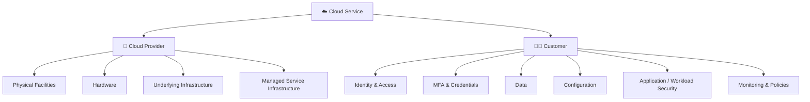

# 🎭 WATCHTOWER — Role Play 4: Servers and Managed Services

> **Role Play 4** — Servers and Managed Services  \
> **Role:** Venkat Nishit — Systems Architect  \
> **Cloud Security Advisor:** Jennifer

---

## 📋 Scenario

Your company currently runs:

- 🖥️ On-premises SQL Server
- 📧 On-premises Exchange
- 🗄️ Physical servers in a secured server room

Leadership is considering moving to managed cloud services such as **AWS RDS, Azure SQL, and Microsoft 365**.

Leadership believes:

> **“The cloud is more secure.”**

You are tasked with evaluating how security responsibilities change when moving from on-premises infrastructure to managed cloud services.

Jennifer will challenge your assumptions about the **Shared Responsibility Model**.

---

## 🎯 Role Play Goals

1. Identify which security responsibilities move from the customer to the cloud provider.
2. Identify which responsibilities remain with the customer.
3. Explain how the **Shared Responsibility Model** applies to managed services.
4. Identify risks caused by cloud misconfiguration.
5. Recommend controls such as **least privilege, MFA, security audits, automated security checks, and continuous monitoring**.

---

# 🎬 Role Play Conversation

### 👩‍💼 Jennifer — Cloud Security Advisor

> If you migrate your SQL Server to a managed cloud service, what security responsibilities disappear — and which ones are still completely yours?

### 👨‍💻 Venkat Nishit — Systems Architect

> When migrating SQL Server to a managed cloud service, physical infrastructure responsibilities such as data-center security, hardware maintenance, physical networking, and underlying infrastructure management move to the cloud provider.
>
> However, responsibilities such as **user access, IAM, MFA, credentials, data protection, service configuration, network rules, and application security remain with us**.
>
> So, the cloud provider secures the **underlying infrastructure**, while we remain responsible for **how the service is configured, accessed, and used**.

---

### 👩‍💼 Jennifer — Cloud Security Advisor

> Exactly, you've nailed it! The cloud provider takes care of the heavy lifting when it comes to the physical and infrastructure layers. But all those elements tied to access, data, and configuration are still completely on you.
>
> It's like they handle the foundation, but you're still in charge of the locks and what happens inside. Now, have you thought about how misconfigurations in these areas could create risks even in the cloud?

### 👨‍💻 Venkat Nishit — Systems Architect

> Misconfigurations can still create serious risks in the cloud. For example, incorrect IAM permissions, weak credentials, missing MFA, overly permissive firewall rules, or publicly exposed data can allow unauthorized access.
>
> So, even though the cloud provider secures the underlying infrastructure, we are still responsible for securely configuring and managing our cloud resources.

---

### 👩‍💼 Jennifer — Cloud Security Advisor

> Absolutely, you're spot on! Misconfigurations are one of the top reasons for cloud-related breaches. Even with the provider handling the infrastructure, if something like overly permissive access or exposed data happens, it can totally compromise security.
>
> Regular audits, strong IAM policies, and automated security checks can really help mitigate those risks. Anything specific you'd like to explore around managing these responsibilities?

### 👨‍💻 Venkat Nishit — Systems Architect

> I’d focus on **regular security audits, strong IAM policies, least-privilege access, MFA, and automated security checks** to detect and prevent misconfigurations.
>
> I’d also continuously monitor cloud resources and review configurations to ensure our security responsibilities are being properly managed.

---

### 👩‍💼 Jennifer — Cloud Security Advisor

> That's a solid approach! Regular audits combined with least-privilege access and MFA really strengthen your defenses. Automated checks and continuous monitoring are like your safety net to catch issues early.
>
> With those practices in place, you're setting yourself up for really effective cloud security management. Anything else you want to dive into, or do you feel good about this plan so far?

### 👨‍💻 Venkat Nishit — Systems Architect

> Yes, I feel good about the plan. Regular audits, least-privilege access, MFA, automated security checks, and continuous monitoring will help us identify and reduce security risks while maintaining strong control over our cloud environment.

---

### 👩‍💼 Jennifer — Cloud Security Advisor

> That's fantastic to hear! You've got a really robust mindset for tackling cloud security. With this plan in place, you're well on your way to maintaining a secure and well-managed cloud environment. Great work today!

---

# 🧩 Shared Responsibility Model

---

# 🔐 On-Premises vs Managed Cloud

| Responsibility | On-Premises | Managed Cloud Service |
|---|---|---|
| 🏢 Physical data center | Customer | Provider |
| 🖥️ Physical servers | Customer | Provider |
| 🔧 Hardware maintenance | Customer | Provider |
| 🌐 Physical networking | Customer | Provider |
| ⚙️ Underlying infrastructure | Customer | Provider |
| 👤 User identities | Customer | Customer |
| 🔐 IAM / permissions | Customer | Customer |
| 🔑 MFA / credentials | Customer | Customer |
| 🗄️ Data protection | Customer | Customer |
| ⚙️ Service configuration | Customer | Customer |
| 📊 Monitoring | Customer | Shared / Customer |
| 🔄 Patching | Customer / depends on workload | Provider / depends on service |

---

# ⚠️ Cloud Misconfiguration Risks

| Risk | Potential Impact |
|---|---|
| 🔑 Weak credentials | Account compromise |
| 👤 Excessive IAM permissions | Unauthorized resource access |
| 🚫 Missing MFA | Increased account takeover risk |
| 🌐 Overly permissive network rules | Unwanted exposure |
| 🗄️ Publicly exposed data | Data disclosure |
| ⚙️ Incorrect service configuration | Security control bypass |
| 📊 Insufficient monitoring | Delayed detection |

---

# 🛡️ Key Security Controls

| Area | Recommended Control |
|---|---|
| 🔐 Identity | MFA and least-privilege IAM |
| 🔎 Assurance | Regular security audits |
| ⚙️ Configuration | Automated security checks |
| 📊 Detection | Continuous monitoring |
| 👤 Access | Regular access reviews |
| 📝 Visibility | Logging and alerting |
| 🧱 Network | Strong network access controls |

---

## 📝 Quick Revision

> **Provider → Secures the underlying infrastructure**  
> **Customer → Secures identities, data, access, and configuration**

- ☁️ Managed services reduce infrastructure-management responsibilities.
- 🔐 They do **not** eliminate customer security responsibilities.
- ⚙️ Misconfiguration remains a major cloud security risk.
- 👤 IAM, MFA, and least privilege remain critical.
- 📊 Auditing and continuous monitoring help detect security issues early.
- ⚖️ The exact division of responsibility depends on the service.

---

# 🏁 Key Takeaway

> **Moving to a managed cloud service changes security responsibilities; it does not eliminate them.**

The cloud provider secures the **underlying infrastructure**, while the customer remains responsible for **secure access, data, configuration, and use of the service**.

---

**Role Play 4 | Servers and Managed Services**
