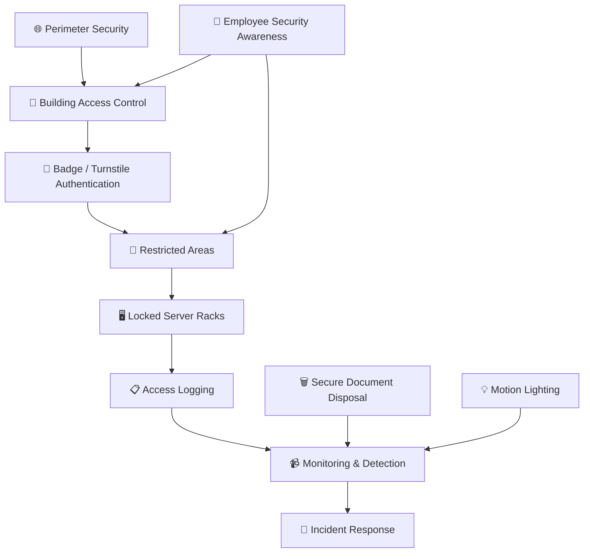

# 🎭 WATCHTOWER — Role Play 5: Operational Security


> **Role Play 5** — Operational Security  \
> **Role:** Venkat Nishit — Security Manager  \
> **Security Strategist:** Jennifer

---

## 📋 Scenario

You are the **Security Manager for a growing company**.

A recent audit revealed:

- 🚪 Employees frequently hold the door open for others.
- 🖥️ The server closet is labeled **“IT Equipment.”**
- 🗑️ Old documents are thrown in regular dumpsters.
- 🔐 Server racks are unlocked during the day.

Leadership assumes cybersecurity is **“mostly firewalls and antivirus.”**

Jennifer will challenge you to rethink **physical security as part of cyber defense**.

---

## 👥 Roles

### 👩‍💼 Jennifer — Security Strategist

Jennifer is a security strategist who believes physical access controls are foundational to cyber defense.

### 👨‍💻 Venkat Nishit — Security Manager

As the Security Manager, Venkat is responsible for evaluating physical-security weaknesses and recommending layered controls that protect the organization's physical and digital environments.

---

## 🎯 Role Play Goals

1. Explain why physical security is foundational to cybersecurity.
2. Identify risks of **tailgating, dumpster diving, and unsecured server racks**.
3. Recommend deterrent controls such as **turnstiles, locked racks, access logging, and motion lighting**.
4. Evaluate the effectiveness of **misleading signage and concealment strategies**.
5. Develop layered physical security improvements that reduce attack opportunities.

---

# 🎬 Role Play Conversation

## 🗣️ Jennifer

> **“Let’s test your thinking — if an attacker gets past the front door, what specific cybersecurity risks immediately become possible?”**

## 👨‍💻 Venkat Nishit

If an attacker gets past the front door, they gain **physical access to the organization's internal environment**, which can create several immediate cybersecurity risks.

They may gain unauthorized access to restricted areas, computers, servers, network equipment, and sensitive information. They could also tamper with hardware, steal data, connect unauthorized devices, gather information about the environment, or attempt to move into more restricted areas through tailgating or social engineering.

The key point is that getting past the front door does not automatically mean the attacker has compromised the network, but it **removes an important security boundary and creates new opportunities to attack both physical and digital assets**.

> 🛡️ **Physical access can become a stepping stone to cyber compromise.**

---

## 🗣️ Jennifer

> **“Exactly! You’ve really broken this down nicely. Physical access opens the door to a whole new world of cyber and physical risks. Think about it this way: once they’re inside, they could bypass firewalls or encryption by directly accessing the hardware. That’s why physical security isn’t just about locks—it’s about protecting the digital fortress too. What do you think is the most vulnerable point in your current setup?”**

## 👨‍💻 Venkat Nishit

The most vulnerable point in our current setup is **uncontrolled physical access to critical areas, especially the server room and server racks**.

The audit has identified several weaknesses, including **tailgating, unlocked server racks, visible IT signage, and improper disposal of sensitive documents**.

I would prioritize securing the server room with **restricted badge access, anti-tailgating controls, locked server racks, access logging, monitoring, and employee security awareness**.

By strengthening these physical controls, we can reduce the opportunity for an attacker to directly access or tamper with our critical infrastructure.

---

## 🗣️ Jennifer

> **“Spot on! You’ve nailed the key vulnerabilities and the right priorities. Securing the server room with badge access and anti-tailgating measures will really tighten control over who gets in—and locked racks add another layer of protection. Access logging and monitoring give you visibility, while employee awareness addresses behaviors like tailgating. Now, about those documents—what steps are you considering to tackle improper disposal?”**

## 👨‍💻 Venkat Nishit

We should implement a **secure document disposal policy**. Sensitive documents should never be thrown into regular dumpsters.

I would introduce **secure shredding or approved document-destruction services**, clearly labeled secure-disposal bins, and procedures for collecting and destroying sensitive documents.

We should also provide **employee security-awareness training** so everyone understands what information must be securely disposed of and conduct regular audits to ensure the policy is followed.

---

## 🗣️ Jennifer

> **“That’s a solid plan! Secure shredding and clearly labeled bins are great practical steps. Pairing that with training ensures employees know the ‘why’ behind the policy, which is just as important as the ‘how.’ Regular audits will keep everyone on their toes. This approach really minimizes the risk of sensitive info ending up in the wrong hands. Out of curiosity, how would you handle the IT signage issue in the server closet?”**

## 👨‍💻 Venkat Nishit

I would remove the **“IT Equipment”** label because it unnecessarily identifies the location of sensitive infrastructure.

Instead, I would use **neutral, non-descriptive signage** while still maintaining proper access controls. The server closet should have restricted badge access, locked racks, access logging, and monitoring.

The goal is to **avoid advertising the location of critical infrastructure without relying on concealment as the primary security control**.

---

## 🗣️ Jennifer

> **“That’s absolutely the right call! Neutral signage keeps things low-profile without compromising security. You’re combining subtle deterrence with strong access controls, which is exactly how layered security should work. It’s all about not making your critical areas an obvious target. Now, if leadership thinks cybersecurity is just firewalls and antivirus, how would you explain the importance of physical security to them?”**

## 👨‍💻 Venkat Nishit

I would explain to leadership that **physical security is a foundational part of cybersecurity**. Firewalls and antivirus protect systems digitally, but they cannot fully protect an organization if an attacker can physically access the building, servers, network equipment, or sensitive information.

Physical access could allow an attacker to **tamper with hardware, steal data, connect unauthorized devices, or gain information that supports further cyber attacks**.

Therefore, we need a **layered security approach** combining physical controls such as badge access, locked server racks, access logging, monitoring, secure disposal, and employee awareness with our existing cybersecurity controls.

**Cybersecurity protects the digital environment, while physical security protects the infrastructure that makes that digital environment possible.**

---

## 🗣️ Jennifer

> **“Perfectly said! That’s exactly the message leadership needs to hear. Physical security and cybersecurity aren’t separate—they’re two sides of the same coin. Without physical protections, even the best digital defenses can crumble. You’re showing a clear understanding of how to integrate these layers, and that’s the key to a strong, resilient security posture. I think you’re on the right track to making some big improvements!”**

## 👨‍💻 Venkat Nishit

Thank you, Jennifer. I agree that physical security and cybersecurity must work together as part of a layered defense strategy. I’ll focus on strengthening physical access controls, protecting critical infrastructure, improving secure disposal practices, and increasing employee awareness to build a stronger and more resilient security posture.

---

## 🗣️ Jennifer — Closing

> **“You’ve got it! Your plan is practical, strategic, and exactly what’s needed to bridge the gap between physical and digital security. With these improvements, you’ll drastically reduce vulnerabilities and create a much more secure environment. It’s been great discussing this with you—your approach is spot-on. Best of luck with implementing these changes, and remember, every layer you add strengthens the overall defense. You’re on the right path!”**

---

## 🛡️ Physical Security Control Summary

| Security Risk | Recommended Control | Security Objective |
|---|---|---|
| Tailgating | Badge readers / turnstiles | Prevent unauthorized entry |
| Tailgating | Employee awareness | Reduce social-engineering opportunities |
| Unauthorized room access | Restricted badge access | Limit access to sensitive areas |
| Server tampering | Locked server racks | Protect physical infrastructure |
| Server-room access | Access logging | Create accountability |
| Unauthorized activity | Monitoring / CCTV where appropriate | Detect suspicious activity |
| Dumpster diving | Secure shredding | Protect sensitive information |
| Poor visibility | Neutral signage | Avoid advertising critical infrastructure |
| Physical intrusion | Motion-activated lighting | Improve deterrence and detection |

---

## ⚠️ Key Risks Identified

### 🚪 Tailgating

Employees holding doors open for others can allow unauthorized individuals to enter controlled areas without presenting their own credentials.

### 🗑️ Dumpster Diving

Discarded documents can expose sensitive organizational information that may support reconnaissance, social engineering, or further attacks.

### 🖥️ Unsecured Server Racks

Unlocked racks create opportunities for physical tampering, unauthorized device access, service disruption, theft, or damage.

### 🏷️ Revealing Signage

A label such as **“IT Equipment”** can unnecessarily identify the location of sensitive infrastructure.

---

## 🏰 Layered Physical Security Model



---

## 🔐 Defense-in-Depth Approach

```text
               PHYSICAL SECURITY
                       │
        ┌──────────────┼──────────────┐
        │              │              │
        ▼              ▼              ▼
   DETERRENCE       PREVENTION     DETECTION
        │              │              │
   Lighting        Turnstiles      Monitoring
   Signage         Badge Access    Access Logs
   Visibility      Locked Racks    Alerts
        │              │              │
        └──────────────┼──────────────┘
                       ▼
                  RESPONSE
                       │
              Investigation
              Containment
              Remediation
```

---

## 🛡️ Recommended Security Controls

- 🚪 Controlled entry points
- 🪪 Badge-based access
- 🚧 Turnstiles / anti-tailgating controls
- 🔐 Locked server rooms
- 🖥️ Locked server racks
- 📋 Physical access logging
- 📹 Monitoring / CCTV where appropriate
- 💡 Motion-activated lighting
- 🗑️ Secure document destruction
- 👥 Security awareness training
- 🔎 Regular access reviews
- 🚨 Physical security incident response

---

## 📋 Operational Security Checklist

- [ ] Identify all restricted areas
- [ ] Review building entry controls
- [ ] Assess tailgating risks
- [ ] Verify badge access controls
- [ ] Review physical access logs
- [ ] Confirm server rooms are restricted
- [ ] Confirm server racks are locked
- [ ] Review monitoring coverage
- [ ] Verify sensitive documents are securely destroyed
- [ ] Review visitor-management procedures
- [ ] Remove unnecessary information from public signage
- [ ] Conduct employee security-awareness training
- [ ] Perform periodic physical-security audits
- [ ] Review and update physical-security procedures

---

## 🧠 Key Takeaways

- **Physical security is a foundational layer of cybersecurity.**
- Firewalls and antivirus cannot fully protect systems from an attacker with physical access.
- **Tailgating** can bypass controlled entry points.
- **Dumpster diving** can expose sensitive organizational information.
- **Unlocked server racks** create opportunities for physical tampering and disruption.
- Sensitive documents should be securely destroyed.
- Critical infrastructure should be physically protected and access-controlled.
- **Neutral signage is supplementary and should never replace proper access controls.**
- Effective security uses **defense in depth**.
- Access should be **restricted, logged, monitored, and regularly reviewed**.
- Employee awareness is an important part of operational security.
- Physical and digital security should be treated as **two connected layers of the same defense strategy**.

---

## 🏁 Final Assessment

> **Physical security is part of cybersecurity.**

A secure organization must protect the **people, facilities, hardware, information, and digital systems** that make up its environment.

The strongest approach is layered:

**Deter → Prevent → Detect → Respond**

When physical and logical security controls work together, the organization significantly reduces the attack opportunities available to adversaries.

---

**Role Play 5 | Operational Security**
