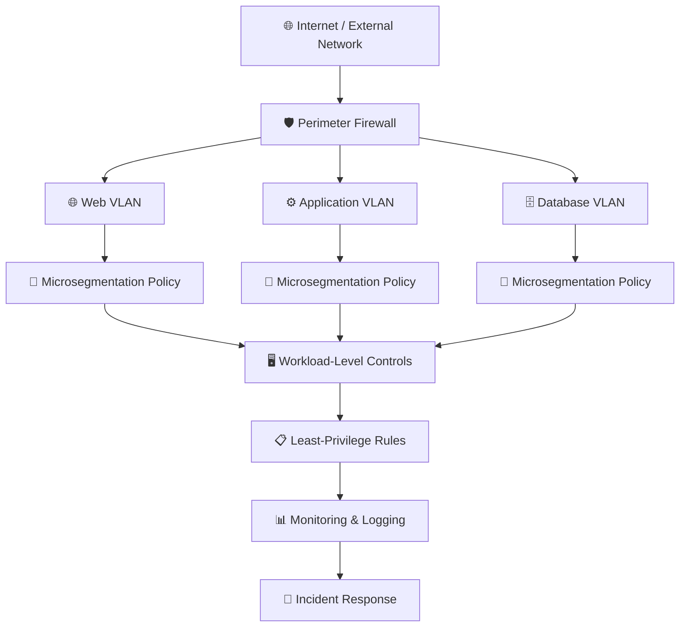

# 🎭 WATCHTOWER — Role Play 6: Network Segmentation and Microsegmentation


> **Role Play 6** — Network Segmentation and Microsegmentation  \
> **Role:** Venkat Nishit — Security Architect  \
> **Security Strategist:** Jennifer

---

## 📋 Scenario

You are the **Security Architect reviewing your company's network design**.

The current environment contains:

- 🌐 Web servers in one VLAN.
- ⚙️ App servers in another VLAN.
- 🗄️ Database servers in a third VLAN.
- 🛡️ A perimeter firewall controlling traffic between VLANs.

A penetration test revealed that once a web server was compromised, the attacker could freely communicate with other web servers in the **same VLAN**.

Jennifer will challenge you to rethink traditional network segmentation and explore **microsegmentation as a control against lateral movement**.

---

## 👥 Roles

### 👩‍💼 Jennifer — Security Strategist

Jennifer is a network security strategist with deep experience in **zero trust, segmentation, and lateral-movement prevention**.

### 👨‍💻 Venkat Nishit — Security Architect

As the Security Architect, Venkat is responsible for identifying segmentation weaknesses and recommending controls that reduce lateral movement and limit the blast radius of a compromise.

---

## 🎯 Role Play Goals

1. Explain traditional VLAN-based segmentation.
2. Identify the limitations of **Layer 2 segmentation**.
3. Explain microsegmentation at the **workload or virtual network interface level**.
4. Compare centralized and distributed firewall enforcement.
5. Explain how least-privilege communication reduces lateral movement.
6. Evaluate how microsegmentation reduces the **blast radius** after compromise.

---

# 🎬 Role Play Conversation


### 👩‍💼 Jennifer — Security Strategist

> If two compromised servers are in the same VLAN, why might your firewall never even see that traffic?

<div align="right">


### 👨‍💻 Venkat Nishit — Security Architect

> Because traffic between two servers in the same VLAN is switched directly at Layer 2, it may never traverse the perimeter firewall.
>
> The firewall typically filters traffic between different network segments, so it cannot inspect or block lateral traffic within the same VLAN.
>
> This is a key limitation of traditional VLAN-based segmentation because an attacker who compromises one server may be able to communicate directly with other systems in that segment.
>
> 🛡️ **Layer 2 segmentation does not automatically provide workload-level isolation.**

</div>

---


### 👩‍💼 Jennifer — Security Strategist

> Exactly! Traffic within the same VLAN is handled by the switch at Layer 2, so it can bypass the perimeter firewall entirely. That creates an opportunity for lateral movement. What strategies would you consider to address this limitation?

<div align="right">


### 👨‍💻 Venkat Nishit — Security Architect

> I would address this by implementing **microsegmentation** and enforcing security policies at the individual workload or virtual network interface level.
>
> We can define rules that allow only required communication between specific servers and block unnecessary **east-west traffic**.
>
> I would also use **host-based or distributed firewalls, network access control lists, and least-privilege rules** to restrict communication within the VLAN.
>
> This would reduce the attacker's ability to move laterally even if one server is compromised.

</div>

---


### 👩‍💼 Jennifer — Security Strategist

> That's a fantastic approach! Microsegmentation really helps limit lateral movement by enforcing granular policies, and least-privilege rules minimize unnecessary access. Do you foresee any challenges in implementing microsegmentation in your current environment?

<div align="right">


### 👨‍💻 Venkat Nishit — Security Architect

> The main challenges would be **policy complexity, visibility, and operational overhead**.
>
> We would need to understand application dependencies and define granular rules without accidentally blocking legitimate traffic.
>
> There may also be compatibility issues with legacy systems and additional monitoring and management requirements.
>
> I would address these challenges by starting with a small set of critical workloads, mapping their communication patterns, testing policies in a controlled environment, and gradually expanding microsegmentation.
>
> This approach reduces disruption while improving security step by step.

</div>

---


### 👩‍💼 Jennifer — Security Strategist

> You've really thought this through! Starting small and mapping dependencies reduces the risk of breaking legitimate applications while improving visibility. How would you measure the success of your microsegmentation rollout?

<div align="right">


### 👨‍💻 Venkat Nishit — Security Architect

> I would measure success using both **security and operational metrics**.
>
> Key security metrics would include:
>
> - Reduction in unauthorized east-west traffic.
> - Fewer successful lateral-movement paths.
> - Percentage of workloads covered by microsegmentation policies.
> - Number of unnecessary network connections blocked.
>
> I would also monitor application availability, policy violations, false positives, and performance impact to ensure security improvements are not disrupting legitimate business traffic.
>
> Regular reviews and penetration testing would help validate that the segmentation is actually reducing the **blast radius after a compromise**.

</div>

---


### 👩‍💼 Jennifer — Security Strategist

> That's a solid and well-rounded way to measure success! Tracking both security and operational metrics ensures you're improving protection without hurting functionality. Anything else you'd like to tackle about segmentation or microsegmentation before we wrap up?

<div align="right">


### 👨‍💻 Venkat Nishit — Security Architect

> Before we wrap up, I'd also consider **continuous monitoring and policy optimization**.
>
> As the environment changes, new workloads and dependencies may appear, so segmentation policies should be reviewed and updated regularly.
>
> I'd also ensure that the team has clear documentation, ownership, and incident-response procedures for segmentation-related events.
>
> This keeps microsegmentation effective and manageable as the network evolves.

</div>

---


### 👩‍💼 Jennifer — Security Strategist

> Absolutely! Continuous monitoring and regular policy updates are essential to keeping microsegmentation aligned with a dynamic environment. Clear documentation and ownership make a huge difference in maintaining effectiveness and ensuring everyone knows their role in incident response. You've really nailed the key considerations here. Great job tackling such an important topic!

---

## 🛡️ Network Segmentation Control Summary

| Security Risk | Recommended Control | Security Objective |
|---|---|---|
| Same-VLAN lateral movement | Microsegmentation | Limit workload-to-workload communication |
| Layer 2 traffic bypassing perimeter firewall | Distributed / host-based firewall | Enforce controls closer to workloads |
| Excessive east-west traffic | Least-privilege policies | Allow only required communication |
| Compromised workload | Workload-level isolation | Reduce blast radius |
| Unknown application dependencies | Traffic discovery and mapping | Build accurate security policies |
| Policy violations | Monitoring and logging | Detect unauthorized communication |
| Legacy-system compatibility | Gradual deployment | Reduce operational disruption |
| Policy drift | Continuous review | Keep segmentation effective |

---

## ⚠️ Key Risks Identified

### 🔀 Same-VLAN Lateral Movement

Systems within the same VLAN can communicate directly through Layer 2 switching without necessarily passing through a perimeter firewall.

### 🛡️ Perimeter Firewall Limitation

A perimeter firewall is effective at controlling traffic between segments, but it does not automatically control communication between workloads inside the same segment.

### 🧩 Application Dependencies

Microsegmentation policies can accidentally disrupt legitimate application communication if dependencies are not identified before enforcement.

### ⚙️ Policy Complexity

Highly granular policies require continuous management, monitoring, documentation, and periodic optimization.

---

## 🏰 Layered Network Segmentation Model



---

## 🔐 Defense-in-Depth Approach

```text
                    NETWORK SECURITY
                           │
          ┌────────────────┼────────────────┐
          │                │                │
          ▼                ▼                ▼
      SEGMENTATION     MICROSEGMENTATION   DETECTION
          │                │                │
      VLANs           Workload Policies   Monitoring
      Firewalls       Distributed FW      Logging
      ACLs            Least Privilege     Alerts
          │                │                │
          └────────────────┼────────────────┘
                           ▼
                      CONTAINMENT
                           │
                  Limit Lateral Movement
                           │
                           ▼
                     REDUCE BLAST RADIUS
```

---

## 🛡️ Recommended Security Controls

- 🌐 Network segmentation using VLANs or equivalent network boundaries
- 🛡️ Perimeter firewall controls
- 🔐 Microsegmentation policies
- 🖥️ Host-based or distributed firewalls
- 📋 Network access control lists
- 🚫 Least-privilege east-west communication
- 📊 Traffic discovery and monitoring
- 📝 Centralized logging
- 🧩 Application dependency mapping
- 🧪 Controlled policy testing
- 🔄 Continuous policy optimization
- 🚨 Segmentation-aware incident response

---

## 📋 Microsegmentation Implementation Checklist

- [ ] Discover workloads and application dependencies
- [ ] Map east-west traffic patterns
- [ ] Identify critical workloads
- [ ] Define least-privilege communication policies
- [ ] Identify legacy-system constraints
- [ ] Test policies in a controlled environment
- [ ] Deploy microsegmentation gradually
- [ ] Monitor policy violations
- [ ] Monitor application availability
- [ ] Measure blocked and unauthorized traffic
- [ ] Review false positives and performance impact
- [ ] Perform regular security reviews
- [ ] Validate controls through penetration testing
- [ ] Continuously optimize segmentation policies

---

## 🧠 Key Takeaways

- **VLAN segmentation provides logical network separation, but it does not automatically prevent lateral movement within the same VLAN.**
- Same-VLAN traffic can remain at **Layer 2** and bypass a perimeter firewall.
- **Microsegmentation** applies granular security policies closer to individual workloads.
- **Distributed and host-based firewalls** can enforce controls where perimeter firewalls cannot.
- **Least privilege** should apply to workload-to-workload communication.
- Application dependencies must be understood before enforcing granular policies.
- Microsegmentation can significantly reduce the **blast radius** of a compromised workload.
- Security policies should be monitored, documented, tested, and continuously optimized.
- Effective segmentation follows a **defense-in-depth** approach.
- Network security should be designed with the principle: **Assume breach. Design for containment.**

---

## 🏁 Final Assessment

> **Assume breach. Design for containment.**

Traditional VLAN segmentation is an important security boundary, but it should not be treated as complete protection against lateral movement.

A stronger architecture combines:

**Segment → Microsegment → Enforce Least Privilege → Monitor → Contain**

When network segmentation, workload-level controls, distributed enforcement, monitoring, and incident response work together, the organization can significantly limit attacker movement and reduce the impact of a compromised system.

---

**Role Play 6 | Network Segmentation and Microsegmentation**
