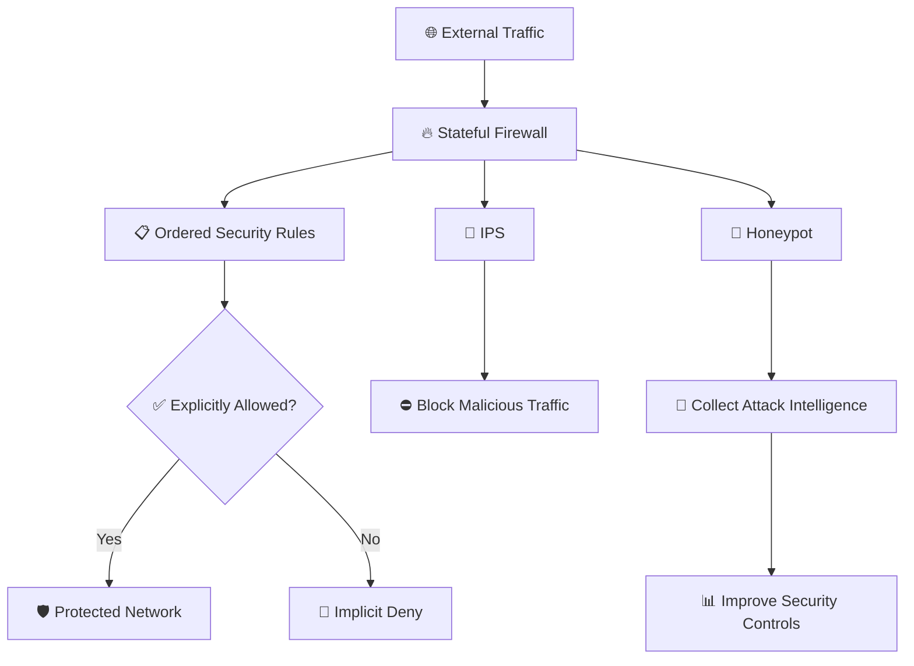

# 🎭 WATCHTOWER — Role Play 7: Firewalls and Honeypots


> **Role Play 7** — Firewalls and Honeypots  
> **Role:** Venkat Nishit — Security Architect  
> **Security Strategist:** Jennifer

---

## 📋 Scenario

You are the **Security Architect for a mid-sized company**.

Recent security issues include:

- 🔥 Firewall rules have grown messy over time.
- ⚠️ The default firewall rule is currently **"allow all."**
- 🛡️ The security team wants to deploy either an **IDS or IPS**.
- 🍯 Leadership is considering adding a **honeypot** to study attack patterns.

Jennifer wants to evaluate whether you truly understand how **perimeter defenses should be designed**.

---

## 👥 Roles

### 👩‍💼 Jennifer — Perimeter Security Specialist

Jennifer is a perimeter security specialist with deep experience in incident response.

She believes misconfigured firewalls cause more breaches than zero-day exploits.

> *"Most compromises aren't sophisticated — they're allowed."*

She challenges assumptions and focuses on practical, defensible architecture.

### 👨‍💻 Venkat Nishit — Security Architect

As the Security Architect, Venkat is responsible for reviewing the company's perimeter security design, identifying weaknesses, and recommending controls that reduce exposure and improve detection.

---

## 🎯 Role Play Goals

1. Differentiate between **stateless and stateful firewalls**.
2. Explain **rule-order processing** and why first-match logic matters.
3. Describe the **Zero Trust model** and implicit-deny principles.
4. Compare **IDS vs IPS** — alerting versus active blocking.
5. Evaluate when and why to deploy a **honeypot** for intelligence and misdirection.

---

# 🎬 Role Play Conversation


### 👩‍💼 Jennifer — Perimeter Security Specialist

> Let's start simple — if your firewall's default rule is **"allow all,"** do you actually have a security boundary?

<div align="right">


### 👨‍💻 Venkat Nishit — Security Architect

> No, not really. An **"allow all"** default rule defeats much of the firewall's purpose. I would use an implicit-deny approach, explicitly allow only required traffic, review the rule order because of first-match processing, and apply Zero Trust principles rather than trusting traffic by default.

</div>

---


### 👩‍💼 Jennifer — Perimeter Security Specialist

> Exactly! With an "allow all" rule, you're basically rolling out the welcome mat for potential threats. So, when you say you'd use an implicit-deny approach, how would you prioritize and structure your firewall rules to make sure legitimate traffic gets through while keeping bad actors out?

<div align="right">


### 👨‍💻 Venkat Nishit — Security Architect

> I'd prioritize **specific allow rules first**, ordered from most specific to least specific, followed by an **implicit deny** rule. I'd regularly review and remove unnecessary rules to keep the firewall secure and manageable.

</div>

---


### 👩‍💼 Jennifer — Perimeter Security Specialist

> That's spot on! Prioritizing specific rules and keeping things clean is key to avoiding unintended access. Now, when it comes to rule evaluation, do you think a **stateful firewall** or a **stateless one** would handle this setup more effectively? Why?

<div align="right">


### 👨‍💻 Venkat Nishit — Security Architect

> A **stateful firewall** would be more effective because it tracks active connections and can distinguish legitimate response traffic from unsolicited traffic.

</div>

---


### 👩‍💼 Jennifer — Perimeter Security Specialist

> Absolutely right! Stateful firewalls really shine in scenarios where context matters, like keeping track of session states. Stateless ones, on the other hand, are kind of like traffic cops following a strict rulebook without asking any questions. Now, let's pivot a bit — if you were to deploy an **IDS or IPS** alongside this firewall, how would you decide which one to go with?

<div align="right">


### 👨‍💻 Venkat Nishit — Security Architect

> I'd choose an **IPS** because it can actively block malicious traffic, while an IDS mainly detects and alerts. For a perimeter defense, prevention plus detection gives stronger protection.

</div>

---


### 👩‍💼 Jennifer — Perimeter Security Specialist

> You nailed it! An IPS adds that active blocking capability, which is awesome for stopping threats in their tracks. One last question — if leadership is thinking about deploying a **honeypot**, how would you justify it to them in terms of value and risk?

<div align="right">


### 👨‍💻 Venkat Nishit — Security Architect

> I'd justify a honeypot as a **low-risk intelligence tool**. It can attract attackers, reveal their techniques and attack patterns, and improve our defenses without exposing production systems.

</div>

---


### 👩‍💼 Jennifer — Perimeter Security Specialist

> Exactly! Honeypots can be a goldmine for intelligence while keeping attackers away from the real assets. You've got a solid grasp on this. Great work today! Keep applying that structured approach to every security challenge you face.

---

## 🛡️ Firewalls and Honeypots Control Summary

| Security Risk | Recommended Control | Security Objective |
|---|---|---|
| Overly permissive firewall policy | Implicit deny / default deny | Reduce unauthorized access |
| Unnecessary or duplicate rules | Regular rule review and cleanup | Reduce configuration risk |
| Incorrect rule ordering | Specific rules before broad rules | Prevent unintended access |
| Lack of connection awareness | Stateful firewall | Track and validate active sessions |
| Malicious traffic reaching protected systems | IPS | Detect and actively block threats |
| Limited attack intelligence | Honeypot | Collect attacker behavior and techniques |
| Excessive trust in network location | Zero Trust principles | Verify access rather than trust by default |
| Compromised perimeter defenses | Layered security controls | Improve defense in depth |

---

## ⚠️ Key Risks Identified

### 🔥 Overly Permissive Firewall Rules

An **"allow all"** default policy can expose systems to unnecessary network access and weakens the firewall's role as a security boundary.

### 🔀 Incorrect Rule Ordering

When a firewall uses first-match processing, a broad rule placed before a specific rule can unintentionally permit or deny traffic.

### 🔓 Missing Implicit Deny

Without a default-deny posture, traffic that has not been explicitly authorized may still be allowed.

### 🚨 Detection Without Prevention

An IDS can identify and alert on suspicious activity, but it does not normally block the traffic itself. An IPS adds active prevention.

### 🍯 Honeypot Exposure

A honeypot can provide valuable intelligence, but it must be isolated and carefully monitored so that it does not become a path into production systems.

---

## 🏰 Perimeter Defense Model



---

## 🔐 Defense-in-Depth Approach

```text
                       PERIMETER SECURITY
                              │
             ┌────────────────┼────────────────┐
             │                │                │
             ▼                ▼                ▼
        FIREWALL            IPS            HONEYPOT
             │                │                │
       Access Control    Active Blocking   Intelligence
             │                │                │
             └────────────────┼────────────────┘
                              ▼
                       DEFENSE IN DEPTH
                              │
                              ▼
                     REDUCE ATTACK IMPACT
```

---

## 🛡️ Recommended Security Controls

- 🔐 Use **implicit deny / default deny** as the final firewall policy.
- 📋 Place specific firewall rules before broader rules where first-match processing applies.
- 🧹 Regularly remove obsolete, duplicate, and overly permissive rules.
- 🔥 Prefer **stateful inspection** when connection context is required.
- 🚨 Deploy an **IPS** when active blocking is required and operational risk is acceptable.
- 🔎 Use an IDS where visibility and alerting are the primary objectives.
- 🍯 Isolate honeypots from production systems.
- 📊 Monitor and analyze honeypot activity.
- 🛡️ Apply Zero Trust principles instead of relying solely on network location.
- 📝 Log firewall and IPS decisions for investigation and auditing.
- 🔄 Review security policies regularly as the environment changes.

---

## 📋 Perimeter Security Implementation Checklist

- [ ] Identify all current firewall rules.
- [ ] Review the current default policy.
- [ ] Identify unnecessary or obsolete rules.
- [ ] Remove duplicate and overly broad permissions.
- [ ] Order rules from specific to general where appropriate.
- [ ] Implement an implicit-deny final rule.
- [ ] Validate whether stateful inspection is required.
- [ ] Determine whether IDS or IPS best fits the environment.
- [ ] Define IPS blocking and exception policies.
- [ ] Design honeypot isolation before deployment.
- [ ] Enable logging and monitoring.
- [ ] Review alerts and firewall events regularly.
- [ ] Test firewall behavior after policy changes.
- [ ] Periodically reassess the overall perimeter architecture.

---

## 🧠 Key Takeaways

- **Implicit deny** ensures that only explicitly authorized traffic is permitted.
- **Firewall rule order** matters when rules are processed using first-match logic.
- **Stateful firewalls** track connection context and can distinguish legitimate response traffic from unsolicited traffic.
- **Stateless firewalls** evaluate packets independently against configured rules.
- **IDS** primarily detects and alerts on suspicious activity.
- **IPS** can actively block malicious traffic.
- **Honeypots** provide threat intelligence by attracting and observing suspicious activity.
- Honeypots should be **isolated from production assets**.
- **Zero Trust** avoids assuming that traffic is trustworthy simply because of its network location.
- A strong perimeter uses **defense in depth** rather than relying on a single control.

---

## 🏁 Final Assessment

> **Most compromises aren't sophisticated — they're allowed.**

A defensible perimeter should explicitly authorize legitimate traffic, deny everything else by default, maintain connection awareness where appropriate, actively prevent known malicious traffic, and use deception technologies such as honeypots to improve threat intelligence.

**Allow What Is Needed → Deny Everything Else → Detect → Block → Learn**

---

**Role Play 7 | Firewalls and Honeypots**
