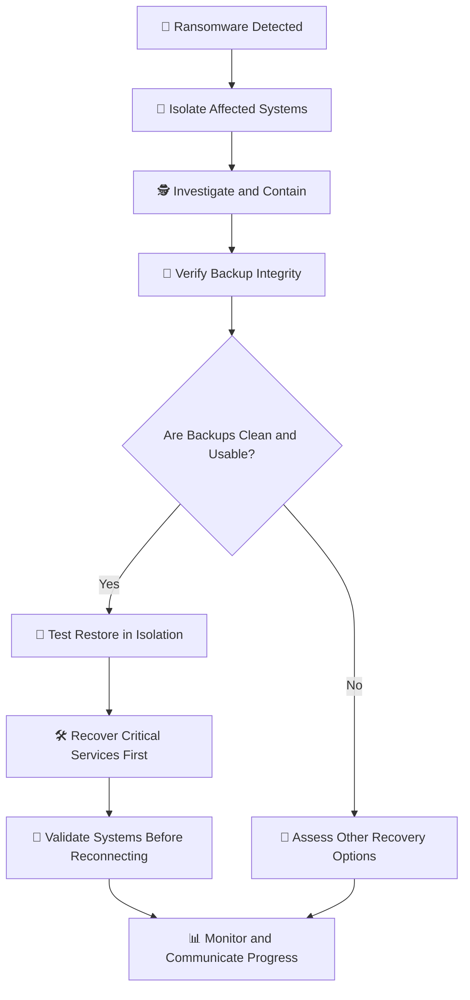

# 🎭 WATCHTOWER — Role Play 8: We've Been Hit With Ransomware — Now What?


> **Role Play 8** — Ransomware Recovery  
> **Role:** Venkat Nishit — IT Advisor  
> **CEO:** Erika

---

## 📋 Scenario

It is **8:15 AM**, and the company is experiencing a ransomware incident.

- Employees cannot access shared files.
- The accounting database is encrypted.
- A ransom note appears on multiple systems demanding payment in cryptocurrency.
- You are the **IT Security Advisor**.
- The company CEO, Erika, has called an emergency meeting.

Erika is not deeply technical. She is extremely concerned about **business continuity, downtime, and reputation**, and wants to know how quickly the company can recover and whether it must pay the ransom.

---

## 👥 Roles

### 👩‍💼 Erika — CEO

Erika is focused on business continuity, downtime, and the company's reputation. She needs clear, practical answers and is pressing for immediate decisions during the incident.

### 👨‍💻 Venkat Nishit — IT Advisor

As the IT Advisor, Venkat is responsible for guiding the initial response, coordinating technical recovery, validating backups, prioritizing critical services, and communicating risks and progress to leadership.

---

## 🎯 Role Play Goals

1. Explain how **backups** protect against ransomware.
2. Differentiate **backups** from **disaster recovery**.
3. Describe why **multiple restore points** are critical.
4. Explain **cloud-based disaster recovery** in simple terms.
5. Recommend a ransomware response strategy without immediately paying the ransom.

---

# 🎬 Role Play Conversation


### 👩‍💼 Erika — CEO

> We've been hit with ransomware. Are we about to lose everything?

<div align="right">


### 👨‍💻 Venkat Nishit — IT Advisor

> Not necessarily. We can recover if our backups are intact. I'll isolate affected systems, investigate the attack, and verify our backups before restoring clean data to minimize downtime.

</div>

---


### 👩‍💼 Erika — CEO

> Alright, but how confident are we in these backups? Are they recent enough, and do we know they weren't compromised too? I need to be absolutely sure we can rely on them before we proceed. Time is critical here.

<div align="right">


### 👨‍💻 Venkat Nishit — IT Advisor

> I'll check backup timestamps, integrity, and offline or immutable copies to ensure they're clean and recent. We'll test a restore in an isolated environment before bringing systems back online.

</div>

---


### 👩‍💼 Erika — CEO

> That sounds like a smart approach. Just to be clear, how quickly can we get things back to normal? I need to communicate a recovery timeline to the team.

<div align="right">


### 👨‍💻 Venkat Nishit — IT Advisor

> Recovery time depends on the damage and backup readiness. I'll prioritize critical systems, restore clean backups, and test them before reconnecting. I'll share a realistic timeline once we confirm the recovery point and recovery time objectives (**RPO and RTO**).

</div>

---


### 👩‍💼 Erika — CEO

> Alright, I appreciate that you're being thorough, but we need to move fast. Can you confirm that we won't need to pay this ransom? I'm really concerned about the potential reputational damage if this drags on.

<div align="right">


### 👨‍💻 Venkat Nishit — IT Advisor

> We shouldn't rush into paying. I'll prioritize restoring from verified, clean backups, involve our incident-response team, and assess legal and regulatory obligations. Payment doesn't guarantee recovery, so we'll explore safe recovery options first.

</div>

---


### 👩‍💼 Erika — CEO

> Great points, and you're absolutely right — paying the ransom isn't a guarantee. Let's stick with recovery from backups, but keep me updated every step of the way. We need to get this under control quickly.

<div align="right">


### 👨‍💻 Venkat Nishit — IT Advisor

> I'd keep leadership updated with a clear recovery plan, verified progress, and realistic timelines. We'll restore critical services first, communicate transparently, and avoid promising a recovery time until the backups are validated.

</div>

---


### 👩‍💼 Erika — CEO

> Perfect, that's exactly what I need. Keep the communication flowing and focus on getting those critical systems back up. Let's tackle this head-on and minimize the impact. Thanks for stepping up.

<div align="right">


### 👨‍💻 Venkat Nishit — IT Advisor

> Thank you, Erika. I'll coordinate with the incident-response team, prioritize critical systems, and keep leadership informed until recovery is complete.

</div>

---


### 👩‍💼 Erika — CEO

> Fantastic. I trust you'll handle this. Let's turn this around quickly and effectively. Keep me in the loop, and let me know if you hit any roadblocks. Thanks again for taking charge.

<div align="right">


### 👨‍💻 Venkat Nishit — IT Advisor

> Absolutely, Erika. I'll provide regular updates on recovery progress, escalate blockers immediately, and ensure we restore services securely.

</div>

---


### 👩‍💼 Erika — CEO

> Great, I appreciate the proactive approach. Let's get this resolved and move forward stronger. Thanks for your commitment!

---

## 🛡️ Ransomware Recovery Control Summary

| Security Risk | Recommended Control | Security Objective |
|---|---|---|
| Ransomware spreading across systems | Isolate affected devices and segments | Contain the incident |
| Backups encrypted or compromised | Offline or immutable backups | Preserve recoverable copies |
| Backups too old or incomplete | Multiple restore points and retention policies | Reduce data loss |
| Unverified recovery data | Integrity checks and isolated restore tests | Avoid restoring compromised systems |
| Extended business interruption | Prioritized recovery plan | Restore critical services first |
| Unclear recovery expectations | Defined RPO and RTO | Set measurable recovery targets |
| Pressure to pay ransom immediately | Incident-response process and recovery assessment | Make an informed decision |
| Stakeholders lack information | Regular, factual status updates | Maintain coordination and trust |

---

## ⚠️ Key Risks Identified

### 🔒 Backup Compromise

If backups are accessible from compromised systems, ransomware may encrypt or delete them too. Offline, immutable, and access-restricted copies improve resilience.

### ⏱️ Uncertain Recovery Time

Recovery depends on the extent of damage, backup integrity, system dependencies, and available recovery resources. Communicate estimates only after assessing these factors.

### 🧪 Restoring Infected Systems

Restoring data without validating it or containing the attacker can reintroduce malware. Test recovery in an isolated environment and confirm systems are clean before reconnecting.

### 💸 Paying the Ransom

Payment does not guarantee a working decryption key, prevent data disclosure, or stop further attacks. Evaluate recovery options with incident responders, legal counsel, and relevant authorities.

### 📣 Poor Incident Communication

Unclear or unrealistic updates can increase confusion and reputational damage. Use a designated communication lead and share verified facts, priorities, blockers, and next steps.

---

## 🏰 Ransomware Incident Response and Recovery Flow



---

## 🔐 Defense-in-Depth Approach

```text
                  RANSOMWARE RESILIENCE
                           │
          ┌────────────────┼────────────────┐
          │                │                │
          ▼                ▼                ▼
      PREVENTION        DETECTION        RECOVERY
          │                │                │
     Least Privilege   Monitoring      Offline Backups
     Patch Management  EDR / Alerts    Immutable Copies
     Access Controls   Incident Team   Restore Testing
          │                │                │
          └────────────────┼────────────────┘
                           ▼
                 BUSINESS CONTINUITY
                           │
                 Validate → Restore
                    → Monitor
```

---

## 🛡️ Recommended Security Controls

- 🔌 **Contain the incident:** isolate affected endpoints and systems to limit spread.
- 🧾 **Preserve evidence:** retain relevant logs and forensic evidence; avoid unnecessary changes to affected systems.
- 👥 **Activate incident response:** involve security, IT operations, leadership, legal, and other required stakeholders.
- 🔐 **Protect backups:** maintain offline or immutable copies with separate access controls.
- 🗂️ **Keep multiple restore points:** retain recovery points that may predate the compromise.
- 🧪 **Test restoration:** validate backup integrity and perform test restores in an isolated environment.
- 🎯 **Prioritize critical services:** use business impact and dependencies to determine recovery order.
- ⏱️ **Define RPO and RTO:** understand acceptable data loss and target recovery time for each service.
- ☁️ **Plan cloud-based disaster recovery:** maintain the ability to recover workloads and data in a separate cloud environment or region when appropriate.
- 📣 **Communicate accurately:** provide regular updates without promising unverified recovery times.
- 🔎 **Validate before reconnecting:** ensure systems are clean, patched, and appropriately secured.
- 🔄 **Review after recovery:** identify the initial access path and improve controls to reduce recurrence.

---

## 📋 Ransomware Recovery Implementation Checklist

- [ ] Activate the incident-response plan.
- [ ] Isolate affected devices and network segments.
- [ ] Preserve relevant logs and evidence.
- [ ] Identify affected systems, data, and business services.
- [ ] Check backup timestamps and available restore points.
- [ ] Confirm backup integrity and access protection.
- [ ] Identify offline or immutable backup copies.
- [ ] Test a restore in an isolated environment.
- [ ] Determine recovery priorities and system dependencies.
- [ ] Confirm the applicable RPO and RTO.
- [ ] Assess cloud-based or alternate-site recovery options.
- [ ] Coordinate decisions with incident responders and legal advisers.
- [ ] Communicate verified status and recovery estimates to leadership.
- [ ] Restore critical services in a controlled order.
- [ ] Validate systems before reconnecting them.
- [ ] Monitor for signs of continued attacker activity.
- [ ] Document lessons learned and update the recovery plan.

---

## 🧠 Key Takeaways

- **Backups** provide copies of data that can be restored after loss or encryption.
- **Disaster recovery** is the broader plan for restoring systems, services, and operations.
- **Multiple restore points** help recover from a time before ransomware affected the data.
- **Offline and immutable backups** are harder for attackers to alter or destroy.
- Backups must be **tested**, not merely assumed to be usable.
- **Cloud-based disaster recovery** can provide an alternate environment for recovering services.
- **RPO** defines the acceptable amount of data loss measured in time.
- **RTO** defines the target time to restore a service.
- Isolating affected systems helps **contain ransomware spread**.
- Restore only after verifying that backups and systems are safe.
- **Paying a ransom does not guarantee recovery** or prevent data disclosure.
- Clear, accurate communication helps leadership make decisions during an incident.

---

## 🏁 Final Assessment

> **Contain the attack. Verify recovery points. Restore safely.**

A ransomware incident requires a coordinated response that protects evidence, limits further damage, validates backups, prioritizes critical services, and communicates realistic recovery expectations. Payment should not be treated as a guaranteed or automatic solution.

**Isolate → Investigate → Verify Backups → Test Restore → Recover → Validate → Monitor**

---

**Role Play 8 | Ransomware Recovery**
