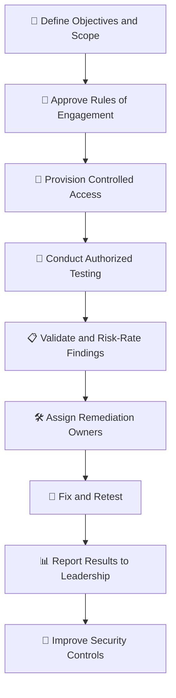

# 🎭 WATCHTOWER — Role Play 9: Why Should We Pay Someone to Hack Us?


> **Role Play 9** — Penetration Testing: Why Should We Pay Someone to Hack Us?  
> **Role:** Venkat Nishit — Security Advisor  
> **Security Strategist:** Jennifer

---

## 📋 Scenario

Your cybersecurity budget proposal includes the following item:

- **Third-Party Penetration Testing — $45,000**

The CEO, Erika, sees the proposal and asks why the company should pay an external provider to attempt to hack its own systems.

The leadership team is concerned about:

- Whether the test is necessary when security controls are already in place.
- Whether testing could expose sensitive data or disrupt operations.
- How the investment creates measurable business value.
- Why the company might rotate penetration-testing providers instead of using one trusted provider indefinitely.

You are the **Security Advisor**. Your responsibility is to explain penetration testing in business-friendly language, show how the risks can be controlled, and justify the investment with practical security outcomes.

---

## 👥 Roles

### 👩‍💼 Jennifer — Security Strategist

Jennifer is a security strategist who focuses on practical security controls, risk reduction, business continuity, and responsible use of the cybersecurity budget. She challenges assumptions and expects clear explanations that connect technical decisions to business outcomes.

> *“If nothing is broken, why are we paying someone to break it?”*

### 👨‍💻 Venkat Nishit — Security Advisor

As the Security Advisor, Venkat explains the purpose and limits of penetration testing, recommends safe engagement controls, and connects testing outcomes to business risk, compliance, and continuous improvement.

---

## 🎯 Role Play Goals

1. Clearly define **penetration testing** in simple language.
2. Explain the difference between **authorized proactive testing** and real attacks.
3. Describe the **business and compliance benefits** of penetration testing.
4. Explain how to reduce operational and data-exposure risks during testing.
5. Justify provider rotation and independent testing.
6. Recommend how findings should be prioritized, remediated, and reported to leadership.

---

# 🎬 Role Play Conversation


### 👩‍💼 Jennifer — Security Strategist

> Why would we pay someone to try to hack our own systems?

<div align="right">


### 👨‍💻 Venkat Nishit — Security Advisor

> **Penetration testing** helps us identify security weaknesses before real attackers exploit them. An authorized tester uses controlled techniques to evaluate our defenses, validate our security controls, and show us where improvements are needed. It gives us an opportunity to fix vulnerabilities proactively rather than discover them during a real incident.

</div>

---


### 👩‍💼 Jennifer — Security Strategist

> I see. But isn't hiring someone to attack us risky? What if they misuse the access or disrupt operations?

<div align="right">


### 👨‍💻 Venkat Nishit — Security Advisor

> That's a valid concern, Jennifer. We can minimize the risk by hiring a reputable, authorized penetration-testing provider, defining a clear scope, and signing an agreement with strict **rules of engagement**. We'll use controlled testing, least-privilege access, and monitoring to avoid disrupting operations. This lets us identify weaknesses safely while protecting business continuity.

</div>

---


### 👩‍💼 Jennifer — Security Strategist

> Alright, that sounds more controlled. But help me understand—if we're doing everything right, why would we still have vulnerabilities? Can't we just stick with what's working?

<div align="right">


### 👨‍💻 Venkat Nishit — Security Advisor

> Even when we follow best practices, vulnerabilities can still exist because technology changes, new threats emerge, and human errors happen. Penetration testing helps us discover hidden weaknesses, validate our existing controls, and fix gaps before attackers exploit them. It's about **continuously improving our security**, not assuming we're already completely secure.

</div>

---


### 👩‍💼 Jennifer — Security Strategist

> Got it. So, it's a proactive approach to stay ahead of threats. But tell me, what's the business benefit of this? How does it justify the cost?

<div align="right">


### 👨‍💻 Venkat Nishit — Security Advisor

> Penetration testing helps us prevent costly security incidents, reduce downtime, protect customer data, and maintain our reputation. It also supports compliance requirements and builds customer trust. The **$45,000 investment** helps us identify and fix weaknesses before attackers exploit them, potentially saving the company much more in recovery costs, financial losses, and reputational damage.

</div>

---


### 👩‍💼 Jennifer — Security Strategist

> Alright, that's a compelling argument. One last question—why are we rotating providers for this? Can't we stick with one we trust?

<div align="right">


### 👨‍💻 Venkat Nishit — Security Advisor

> Rotating providers gives us fresh perspectives because each team uses different tools, techniques, and testing approaches. This helps uncover weaknesses that a familiar provider might miss. We can still retain trusted providers while periodically bringing in independent testers to improve coverage, validate previous findings, and strengthen our overall security posture.

</div>

---


### 👩‍💼 Jennifer — Security Strategist

> That's a smart strategy. You've made a solid case for this. I'm convinced this is a worthwhile investment. Thanks for breaking it down so clearly!

<div align="right">


### 👨‍💻 Venkat Nishit — Security Advisor

> Thank you, Jennifer. I'll ensure the penetration-testing engagement is properly scoped, the findings are prioritized by risk, and remediation is tracked to completion. We'll use the results to continuously improve our security and provide leadership with clear visibility into our progress and the value of this investment.

</div>

---

## 🛡️ Penetration Testing Control Summary

| Security Risk | Recommended Control | Security Objective |
|---|---|---|
| Testing disrupts business services | Approved scope, testing windows, and rules of engagement | Protect availability and business continuity |
| Tester receives excessive access | Least-privilege, time-bound accounts, and controlled access | Limit exposure and misuse |
| Sensitive data is accessed during testing | Data-handling requirements, confidentiality terms, and evidence minimization | Protect customer and business information |
| Testing misses important assets | Confirmed asset inventory and clearly defined scope | Improve coverage |
| Findings remain unresolved | Risk-based remediation owners and deadlines | Reduce exploitable weaknesses |
| One provider repeatedly uses a familiar approach | Periodic independent testing or provider rotation | Gain fresh perspectives |
| Leadership cannot see the value | Executive summary, risk ratings, and tracked remediation metrics | Demonstrate business impact |
| Cloud testing violates provider rules | Review cloud-provider policies and obtain required approvals | Keep testing authorized and compliant |

---

## ⚠️ Key Risks Identified

### ⚠️ Operational Disruption

Aggressive testing can affect production availability if boundaries and timing are not defined. Agree on prohibited activities, escalation contacts, emergency stop conditions, and testing windows before work begins.

### 🔐 Excessive Tester Access

Penetration testers may need temporary access to systems or data. Use named accounts, least privilege, secure credential handling, logging, and prompt access revocation when the engagement ends.

### 🗂️ Sensitive Data Exposure

Testing may reveal confidential information. Define how evidence is collected, stored, shared, retained, and securely deleted. Avoid collecting more data than is necessary to demonstrate a finding.

### 🎯 Incomplete Testing Coverage

A test only assesses the systems and techniques included in its scope. Confirm in-scope assets, environments, identities, applications, and cloud resources, and document exclusions and limitations.

### 🔄 Unresolved Findings

A report has limited value if identified weaknesses are not fixed. Assign each finding an owner, risk rating, target date, and verification method. Retest significant remediations where appropriate.

---

## 🏰 Authorized Penetration Testing Workflow



---

## 🔐 Defense-in-Depth Approach

```text
                    SECURITY ASSURANCE
                            │
          ┌─────────────────┼─────────────────┐
          │                 │                 │
          ▼                 ▼                 ▼
       PREVENTION        DETECTION          VALIDATION
          │                 │                 │
      Firewalls         Monitoring       Penetration Tests
      Secure Configs    Logging          Independent Review
      Access Controls   Alerting         Remediation Tests
          │                 │                 │
          └─────────────────┼─────────────────┘
                            ▼
                    RISK REDUCTION
                            │
                            ▼
                  CONTINUOUS IMPROVEMENT
```

---

## 🛡️ Recommended Security Controls

- 📝 Define a written **scope and rules of engagement** before testing begins.
- ✅ Obtain explicit authorization from the appropriate system owners.
- 🎯 Prioritize critical business services and high-risk assets.
- 🔐 Apply **least privilege** and time-bound access for testing accounts.
- 🕒 Agree on testing windows, rate limits, escalation contacts, and stop conditions.
- 📊 Monitor relevant systems during testing and preserve necessary logs.
- 🗂️ Set clear requirements for handling, storing, and deleting sensitive evidence.
- ☁️ Check cloud-provider policies and obtain any required approvals before cloud testing.
- 📋 Require a report that includes evidence, severity, business impact, and actionable recommendations.
- 🛠️ Assign owners and deadlines for remediation based on risk.
- 🔁 Retest important findings after remediation.
- 🧭 Use independent providers periodically when a fresh perspective adds value.
- 📈 Report meaningful measures such as critical findings, remediation progress, retest results, and risk reduction.

---

## 📋 Penetration Testing Implementation Checklist

- [ ] Define the business objectives and success criteria.
- [ ] Inventory the systems and services to be tested.
- [ ] Confirm scope, exclusions, and testing boundaries with system owners.
- [ ] Select a qualified provider and verify relevant experience.
- [ ] Obtain written authorization and agree on rules of engagement.
- [ ] Define testing windows, emergency contacts, and stop conditions.
- [ ] Establish least-privilege, time-bound access.
- [ ] Agree on sensitive-data handling and evidence-retention requirements.
- [ ] Review cloud-provider policies and approvals where applicable.
- [ ] Monitor testing and escalate unexpected operational impact.
- [ ] Review and risk-rate the findings.
- [ ] Assign remediation owners and target dates.
- [ ] Fix and retest high-risk findings.
- [ ] Report progress and business impact to leadership.
- [ ] Capture lessons learned and plan future independent assessments.

---

## 🧠 Key Takeaways

- **Penetration testing** simulates authorized attacks to discover exploitable weaknesses.
- The goal is to identify and fix security gaps **before real attackers exploit them**.
- Existing firewalls and antivirus tools are important, but they do not guarantee complete security.
- **Written authorization and clear scope** keep testing controlled and legitimate.
- **Rules of engagement** define permitted activities, timing, escalation, and safety boundaries.
- **Least privilege** reduces the risk associated with tester access.
- Testing should protect **business continuity** and sensitive data.
- The **$45,000 cost** should be evaluated against potential incident losses, downtime, recovery costs, and risk reduction.
- **Independent testing** can reveal issues a familiar provider or repeated testing approach may overlook.
- A penetration test is not a guarantee that every vulnerability will be found.
- Findings create value only when they are **prioritized, remediated, and validated**.
- Clear reporting helps leadership understand exposure, progress, and return on security investment.

---

## 🏁 Final Assessment

> **Test with permission. Find the weaknesses. Fix what matters.**

Penetration testing is a proactive security investment, not an attempt to damage the business. When the engagement is authorized, scoped, monitored, and followed by risk-based remediation, it helps validate existing defenses, uncover weaknesses, and improve resilience. Provider rotation can add an independent perspective, while consistent remediation tracking ensures the findings lead to measurable improvements.

**Authorize → Scope → Test → Prioritize → Remediate → Retest → Improve**

---

**Role Play 9 | Penetration Testing**
